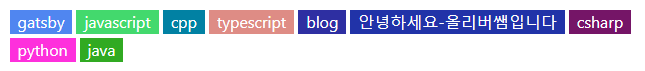

# Gatsby를 선택한 이유

몇 달 전 github.io를 이용해 블로그를 개설해야겠다는 마음을 먹고 Jekyll을 이용해 나름대로 구축했었다. [예전 리포지토리](https://github.com/10cheon00/--deprecated--10cheon00.github.io)

문제는 Jekyll이 Liquid 템플릿으로 페이지를 구성하기 때문에 html로 이루어진 모듈(?)이 이곳저곳에 퍼져 있어 수정하기 까다로웠다. 
테마를 잘못 선택했던 것인지 css파일도 난잡하게 퍼져있어 유지보수하기 어려웠다. 게다가 플러그인에 대한 문서도 찾기 어려워 반쯤 놔버렸다. 

구글링중에 github.io로 호스팅되는 어떤 블로그를 보게 되었는데 이 블로그는 Gatsby로 만들어진 것을 알게 되었다. Gatsby 프레임워크는 React로 만들어졌는데 예전에 Vuejs를 다뤘던 경험이 있어 Jekyll보다는 다루기 쉬울거라 생각했다. 특히나 Jekyll보다 더 깔끔한 공식문서를 제공하고 있어서 막힘없이 진행할 수 있었다.

# 설치

설치과정은 공식문서 뿐만 아니라 다른 블로그들에서 자세하게 설명해주고 있다.

[Getting Started | Gatsby Documentation](https://www.gatsbyjs.com/docs/tutorial/getting-started/part-0/)

[빠르게 Gatsby + Github pages로 블로그 만들기](https://uzzam.dev/6)

# fatal: Couldn't find remote ref refs/heads/main

`npm run deploy`로 main 브랜치에 배포하고 있었다. 하지만 main브랜치에는 정적 파일들이 가득 들어있기에 리포지토리의 기본 브랜치를 다른 브랜치로 변경하여, 정적 파일이 들어있는 브랜치를 숨기고 싶었다.

source 브랜치를 기본 브랜치로 변경하고 gh-pages로 배포가 되도록 했더니, 블로그를 빌드한 후에 저런 에러가 발생했다.

['fatal: Couldn't find remote ref refs/heads/gh-pages' after running:git push origin :gh-pages | Stack Overflow](https://stackoverflow.com/a/71871326)

gh-pages 명령어를 실행하기 전에 `gh-pages-clean`을 한 번 실행한 후에 다시 원래대로 돌려놓으면 된다고 한다. 이렇게 하니까 제대로 배포가 되었다.

추가로 기본 브랜치가 아닌 다른 브랜치에 정적 파일을 배포하니까 github.io에 나타나지 않았는데 리포지토리에 Settings>Pages에서 다른 브랜치를 선택하니까 배포된 페이지가 나타났다.

![Github Pages]](image.png)

# 태그 추가하기

Gatsby Starter Blog theme을 사용해 블로그를 만들다보니 태그 기능이 지원되지 않았다.

[Gatsby.js 블로그 태그 추가하기](https://woojeongmin.com/2021/gatsby-blog/1-tags/)

위 블로그에서 태그를 만드는 방법을 소개하고 있다. 이 방법대로 태그를 만들고 나니, 태그의 색깔을 1가지로만 설정해서 단조롭게 보였다.

태그의 색깔을 지정하는 코드를 따로 두어도 되지만 태그가 늘어날 때마다 색깔을 임의로 지정하여야 하므로 불편해질거라고 생각해 태그 이름에 따라 임의로 색상을 만들 수 있도록 했다.

```js
const hashCode = str => {
  var hash = 0
  for (var i = 0; i < str.length; i++) {
  hash = str.charCodeAt(i) + ((hash << 5) - hash)
  }
  return hash
}

const intToRGB = i => {
  var c = (i & 0x00ffffff).toString(16).toUpperCase()

  return "00000".substring(0, 6 - c.length) + c
}

const stringToRGB = str => {
  return intToRGB(hashCode(str))
}
```

태그 이름을 해시 함수에 넣어 얻은 값을 hex코드의 자리에 맞춰 변형하기만 하면 된다.

```js
// src/templates/blog-post.js
<div className="tags">
  <ul>
    {post.frontmatter.tags
      ? post.frontmatter.tags.map(tag => (
      <li 
        key={kebabCase(tag)} 
        style={{backgroundColor:`#${stringToRGB(tag)}`}}
      >
        <Link to={`/tags/${kebabCase(tag)}`}>{kebabCase(tag)}</Link>
      </li>
      ))
    : null}
  </ul>
</div>
```

이 함수를 `blog-post.js`로 불러와 `<li>`태그의 스타일 값에 넣어주기만 하면 태그 이름에 따라 자동으로 색깔이 결정되어 나타난다.



> 당연히 색깔을 제외한 나머지 css 속성은 따로 작성했다.

똑같이 `src/pages/tags.js`에도 추가하여 모든 태그를 보여줄 때에도 색깔을 적용했다.

```js
// src/pages/tags.js
<div className="tags">
  <h1>Tags</h1>
  <ul className="tags-list">
    {group.map(tag => (
      <li 
        className="tags-list-item" 
        key={tag.fieldValue} 
        style={{backgroundColor:`#${stringToRGB(tag.fieldValue)}`}}
      >
        <Link to={`/tags/${kebabCase(tag.fieldValue)}/`}>
            {tag.fieldValue} ({tag.totalCount})
        </Link>
      </li>
    ))}
  </ul>
</div>
```


# TODO

원래는 깃허브처럼 라이트모드, 다크모드를 토글할 수 있는 기능을 만들어보려고 했었는데 이 부분은 React에 대해 이해가 부족하여 나중에 개발해야겠다.
