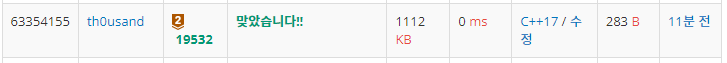

# [19532 수학은 비대면강의입니다](https://www.acmicpc.net/problem/19532)

연립일차방정식을 풀기 위해 x와 y에 임의의 값을 대입하여 식이 성립하는지 검사하면 되는 문제다.

# 내 제출

## 브루트포스

이중 for문으로 x와 y를 전수조사하면 된다.

```cpp
#include <stdio.h>
int main() {
	int a, b, c, d, e, f;
	scanf("%d%d%d%d%d%d", &a, &b, &c, &d, &e, &f);
	for (int y = -999; y < 1000; y++) {
		for (int x = -999; x < 1000; x++) {
			if (a * x + b * y == c && d * x + e * y == f) {
				printf("%d %d", x, y);
				return 0;
			}
		}
	}
}
```

## 선형대수

이번 학기에는 연립방정식의 해를 구하는 방법으로 선형대수를 배웠기 때문에 이 문제에 적용할 수 있었다.

$$ 
\begin{bmatrix} 
a & b\\
d & e
\end{bmatrix}
\begin{bmatrix}
x\\
y
\end{bmatrix}
=
\begin{bmatrix}
c\\
f
\end{bmatrix}
$$

다음과 같은 행렬방정식이 있을 때 식을 전개하면 이렇게 변한다
$$ 
\begin{bmatrix}
x\\
y
\end{bmatrix}
=
\frac{1}{ae-bd}
\begin{bmatrix} 
e & -b\\
-d & a
\end{bmatrix}
\begin{bmatrix}
c\\
f
\end{bmatrix}
$$

$$
x = \frac{ce-bf}{ae-bd}, y = \frac{-cd+af}{ae-bd}
$$

그런데 나눗셈을 하게 된다면 정수가 아닌 실수가 나오게 된다.

하지만 문제에서 x와 y가 정수인 경우만 (항상 나누어 떨어지는 경우만) 답이 됨을 보장하고 있다.


```cpp
#include <stdio.h>
int main() {
	int a, b, c, d, e, f;
	scanf("%d%d%d%d%d%d", &a, &b, &c, &d, &e, &f);
	printf("%d %d", 
        (e*c-b*f)/(a*e - b*d), 
        (-d*c+a*f)/(a*e - b*d));
}
```

