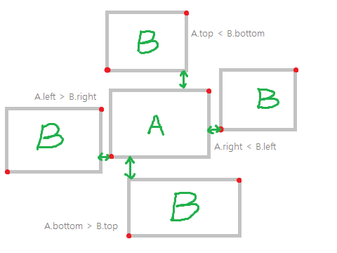

# [3063 게시판](https://www.acmicpc.net/problem/3063)

포스터가 드러나는 영역을 구하는 문제다. 

AABB를 사용하는 문제인데, 보통 AABB는 판별만 하지 영역의 넓이를 구하진 않아서 조금 골치 아픈 문제였다.

두 포스터가 겹쳐졌는지는 간단한 AABB검사만으로도 확인할 수 있다.



두 사각형이 충돌하지 않았을 때는 총 4가지 경우뿐이다.

만약 포스터가 겹쳐졌다면 포스터를 나타내는 좌표값을 이용해 겹쳐진 넓이를 구해야한다.


두 사각형의 각 좌표값에 `max`, `min`을 적용한다. right와 top은 `min`, left와 bottom은 `max`를 적용한다.

기하학적으로 왜 이렇게 해야되는지 설명하고 싶은데 내 지식이 딸려서 잘 안된다. 겹쳐진 사각형은 두 사각형에 공통되는 영역이라서 되나보다.

이렇게 겹쳐진 영역을 구했는데, *다른 포스터가 우리 포스터를 완전히 덮어씌워서 결과적으로 포스터가 보이지 않는 경우*도 생각해야한다.

우리 포스터의 크기에서 겹쳐진 영역의 크기를 뺐을 때 음수가 나온다면 **완전히 덮어씌워졌음**을 의미하므로 그런 케이스는 0을 반환하도록 구성하면 된다.

# 내 제출

```cpp
#include <stdio.h>
struct AABB {
	int b, l;
	int t, r;
};
int abs(int n) {
	return n > 0 ? n : -n;
}
int max(int a, int b) {
	return a > b ? a : b;
}
int min(int a, int b) {
	return a < b ? a : b;
}
int aabb(AABB* a, AABB* b) {
	if (a->l > b->r ||
		a->r < b->l ||
		a->b > b->t ||
		a->t < b->b) {
		return (a->r - a->l) * (a->t - a->b);
	}
	AABB res;
	res.l = max(a->l, b->l);
	res.b = max(a->b, b->b);
	res.r = min(a->r, b->r);
	res.t = min(a->t, b->t);
	int area = 
        (a->r-a->l) * (a->t - a->b) - 
        (res.r - res.l) * (res.t - res.b);
	return area > 0 ? area : 0;
};
int main() {
	int N;
	scanf("%d", &N);
	for (int i = 0; i < N; i++) {
		AABB a, b;
		scanf("%d%d%d%d%d%d%d%d",
			&a.l, &a.b, &a.r, &a.t, &b.l, &b.b, &b.r, &b.t);
		printf("%d\n", aabb(&a, &b));
	}
}
```


충돌체크에서 penetrationDepth를 구하는 공식을 썼었는데 그것 때문에 문제의 핵심을 놓쳐서 1시간이나 걸렸다. :(