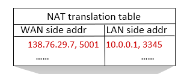

> 2023년 2학기 컴퓨터 네트워크 수업을 듣고 정리한 내용입니다. 수업 교재는 [컴퓨터 네트워킹 하향식 접근 8판](https://product.kyobobook.co.kr/detail/S000061694627)입니다.

# 데이터 영역

- 라우터 내부의 로직
- 라우터로 들어온 패킷이 어느 포트로 나가야할 지 결정
- input port - switch fabric - output port

## Input Port

link layer에서 전달된 datagram을 수신함.

이 때 들어오는 속도가 라우터를 빠져나가는 속도보다 더 빠르면 데이터의 손실이 발생할 수 있음.

이 문제를 해결하기 위해 queue를 활용하여 들어오는 datagram을 저장.

### Input Port Forwarding

input port로 들어온 datagram을 적절한 output port로 내보내는 작업.

datagram의 ip header를 검사하여 forwarding한다.

- destination-based forwarding

  ip destination의 범위를 지정하여 특정 범위 내에 해당하는 datagram은 지정된 port로 나가도록 forwarding하는 것
  
  범위가 중구난방이면 검사하는데 시간이 많이 걸림

- longest prefix matching

  ip destination의 패턴을 검사하여 가장 길게 매칭되는 prefix를 찾아 지정된 port로 나가도록 forwarding하는 것
  
  패턴을 검사하기만 하므로 (AND연산) 굉장히 빠르다
ㅇ
  ex) `11000000 10101000 00000000 ********` 이면 192.168.0.*인 주소들만 포워딩 된다.

## Switching Fabric

input port로 들어온 packet을 output port로 내보낼 때 실제로 데이터를 스위칭하는 역할을 담당.

N개의 패킷과 R개의 input port가 있다면 스위칭에 걸리는 이상적인 시간은 `NR`.

- 메모리

  컴퓨터의 메모리에 저장하여 스위칭하는 방법.

  그러나 컴퓨터의 메모리에 저장해야 하므로 메모리까지 연결된 버스를 이용해야한다.

  스위칭 속도가 컴퓨터의 메모리 대역폭에 제한받음.

- 버스

  하나의 공용 버스를 통해 스위칭하는 방법.

  스위칭 속도가 버스의 대역폭에 제한받음.

  여러 패킷이 동시에 한 버스에 접근할 때 에러가 발생할 수 있음.

- Interconnection (크로스바?)

  스위치를 사용하여 동시에 패킷을 스위칭함.

  datagram의 크기를 고정하여 속도를 향상할 수 있음. 이 때 길이가 긴 datagram은 쪼개어 스위칭해야함.

여러 개의 switching fabric을 사용하여 속도를 더 올릴 수 있다.

## Input Port Queuing

datagram이 input port로 들어오는 속도가 switching fabric으로 나가는 속도보다 더 빠를 경우 queue에 datagram이 쌓인다.

queue가 꽉 차면 오버플로우에 의해 데이터가 손실된다.

queue에 쌓인 데이터가 switching되지 않고 기다릴 경우 delay가 발생한다. (Head of the Line blocking)

## Output Port Queuing

input port와 비슷하게 switching되는 속도가 output port에서 나가는 속도보다 빠를 경우 output port에 datagram이 쌓인다.

queue가 꽉차면 오버플로우에 의해 데이터가 손실된다. 어쩔 수 없이 데이터가 손실된다면 데이터를 손실시키는 전략 필요.

버퍼가 꽉찼을 때 전달되는 패킷을 drop하거나(tail drop), 패킷에 중요도를 부여하여 중요도가 낮은 패킷을 drop(priority drop)

### Queue Management

- FIFO

  패킷이 도착한 순서대로 queue에 삽입한다. 데이터가 송신될 수 있으면 큐에서 패킷을 꺼내 송신한다.
  
- Priority

  우선순위에 따라 두 개의 큐를 사용한다. 우선순위가 높은 큐에서 더 빈번하게 패킷을 꺼내 송신한다.
  각 패킷의 우선순위는 header field를 이용해 판단한다.

- Round Robin
  
  여러 큐에 패킷을 담되, 지정된 시퀀스에 따라 저장 및 송신할 큐를 바꾼다.

- WFQ

  Round Robin처럼 동작하되, 큐에 가중치를 부여하여 시퀀스를 결정한다.
  가중치가 A=$1$, B=${1}\over{3}$, C=$1\over{5}$인 시스템이라면 CCCCCBBBACCCCCBBBA... 형태로 바뀌어 동작한다. 만약 패킷을 보낼 클래스의 큐에 패킷이 없으면 다음 클래스의 큐를 조사하게 된다.

## IP Datagram Format

- Version
  
  Internet Protocol의 버전
  
  보통 IPv4 또는 IPv6

- Header Length
  
  datagram의 header의 크기
  
  크기가 4비트인데, 1비트가 4바이트인 것으로 생각한다.
  
  ex) 0101 -> 5, 5\*4bytes = 20bytes 실제 헤더의 길이 = 20바이트

- Type of Service
  
  diffserv또는 ECN?
  
  패킷의 우선순위 또는 속도를 지정? 그외의 용도?
  
- Total Length

  Header와 payload까지 합한 datagram의 총 길이
  
- Identification

  쪼갠 datagram을 결합하기 위해 각 datagram마다 부여한 고유의 번호
  
- Flags

  쪼갠 datagram중 마지막 파편을 의미
  
- Fragment Offset

  쪼갠 datagram의 순서
  
- Time to live

  네트워크에서 datagram의 생명값?
  
  datagram이 라우터에서 라우터로 이동할 때마다 1씩 감소
  
- Protocol

  IP를 사용한 상위 레이어의 프로토콜
  
- Header checksum

- Source IP Address

- Destination IP Address

Total Length 필드가 16비트이므로 패킷의 최대 길이는 65535바이트. 그러나 일반적으로 1500바이트라고 함

## Subnet

라우터간을 거치지 않고 접근할 수 있는 인터페이스들의 집합

a.b.c.d/n 으로 표현될 때 IP주소의 32비트에서 호스트 영역을 나타내는 하위 n비트를 제외한 나머지 영역을 서브넷 영역이라고 함.

서브넷 영역의 길이는 자유롭게 설정될 수 있음.

ex) `192.168.12/23` 이면 `11000000 10101000 0000110* ********`을 의미하고 *부분은 서브넷의 호스트영역이 된다.

## DHCP

새로운 네트워크에 접속했을 때 DHCP 서버로부터 서브넷 내에서 사용할 IP주소를 동적으로 할당해주는 것

### DHCP Sequence

- DHCP discover

  새로운 네트워크에 접속한 클라이언트는 서브넷에 discover 메세지를 브로드캐스트.

- DHCP offer

  discover 메세지를 수신한 DHCP 서버는 해당 클라이언트에게 임의로 IP 주소를 할당한 다음 offer 메세지를 전송

- DHCP request

  IP 주소를 제공해준 DHCP 서버에게 이 IP주소를 사용하겠다고 브로드캐스트

- DHCP acknowledge
  클라이언트가 IP 주소를 사용하겠다는 메세지를 받았음을 확인한다는 메세지를 전송

DHCP 서버는 클라이언트에게 IP주소 뿐만 아니라 서브넷, 라우터의 주소, DNS 서버 등을 전송

## ISP

서브넷을 할당받으려면 ISP에게 요청해야함.

ISP는 IP 주소를 영역 단위로 쪼개어 각 가입자에게 제공함.

## NAT

외부와는 독립적인 로컬 네트워크를 구성하는 방법

- 외부에 호스트의 IP주소가 노출되지 않음
- 라우터의 주소가 바뀌어도 로컬 네트워크의 주소는 바뀌지 않음
- 호스트의 주소를 바꿀 때 외부에 알리지 않아도 됨

### NAT Forwarding Table

외부 주소를 나타내는 WAN과 로컬 호스트들의 주소를 나타내는 LAN으로 구성.

라우터 내부에서 외부로 나가는 datagram의 경우 source addr을 라우터의 ip로 변환.

라우터 외부에서 내부로 들어오는 datagram의 경우 dest addr을 호스트의 ip로 변환.

단, 외부에서 내부로 들어올 때 호스트를 구분하기 위해 호스트별로 다른 포트를 사용한다.

## IPv6 Datagram format

- Version

  IP 버전

- Priority

  ToS와 유사

- Flow Label

  각각의 패킷 흐름을 구별하는 용도

- Payload length

- Next Header

  확장 헤더 다음에 올 헤더의 종류를 의미

- Hop Limit
- Source IP Address
- Destination IP Address

IPv4와 다르게 헤더 체크섬, flag와 fragment offset, option 필드가 없음

만약 IPv4를 불가피하게 써야 한다면, IPv4의 payload에 IPv6 패킷을 담아 전송한다.

## Flow Table

각 패킷은 flow를 갖는데, flow는 여러 헤더들에 의해 규정된다.

특정 패턴에 부합하는 패킷이라면 지정된 action을 수행한다.

기존에 있었던 방식으로는 destination based forwarding이 있다.

Flow Table은 기존의 방식보다 더 다양한 레이어의 헤더를 검사하여 포워딩 시키고 여러가지 액션을 가능하게 한다.

## Open Flow Table

Match에는 전달되는 포트, link layer의 헤더, network layer의 헤더 그리고 transport layer의 헤더가 사용됨.

Action에는 Forward, drop, modify, encapsulate?가 있음.

Match+action 구조는 라우터 뿐만 아니라 스위치, 방화벽, NAT 등의 여러 인터페이스에서 사용가능.

이러한 Open Flow Table을 구성하는 것은 SDN이 담당

## Middlebox

source와 destination 간에 패킷 포워딩 외의 다른 작업들도 수행할 수 있는 기기들, NAT, 방화벽, 로드밸런서 등.

하드웨어를 지칭하는 단어였으나 소프트웨어로 컨트롤 가능하게 변했음.
