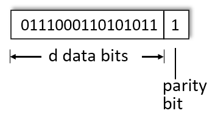
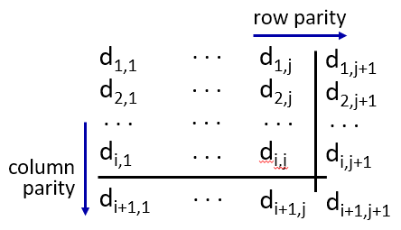
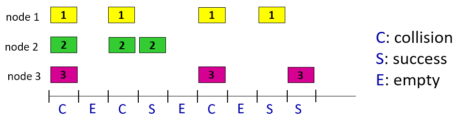
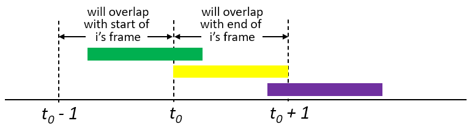
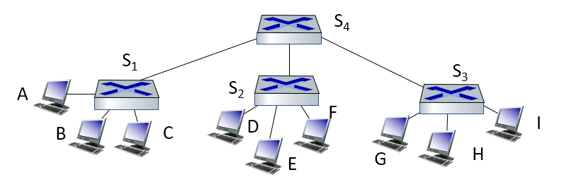
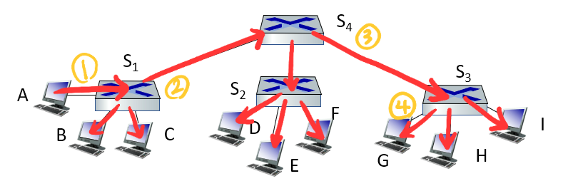
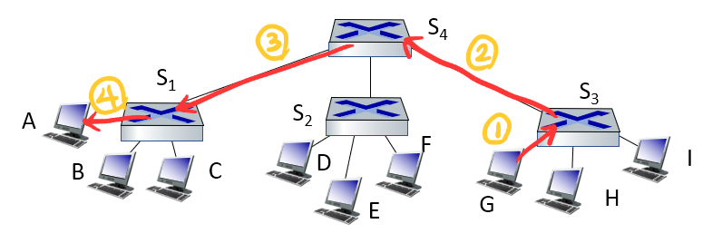

# 링크 레이어의 역할

물리적으로 연결된 두 노드 사이에서 frame을 전달한다. 이 때 물리적으로 연결되었다는 것은 유선 또는 무선으로 연결된 것을 의미한다.

# frame

frame에는 상위 레이어인 네트워크 레이어가 전달하고자 하는 데이터인 datagram 또는 packet이 포함된다. 포함된 정보는 한 노드에서 다른 노드로 전달되는데, 이를 위해서 시작 주소와 도착 주소가 담긴다. 이 주소는 MAC 주소로, 모든 네트워크에서 유일한 주소다.

# Error Detection

frame에 datagram을 캡슐화하는 과정(여러 데이터로 datagram을 감싸는 것)에서 전송 중에 발생할 수 있는 에러를 위해 정정 비트들을 같이 포함시켜서 보낸다. 

## 패리티 체크

### Single parity check



보낼 데이터에서 1의 개수가 홀수라면 0, 짝수라면 1인 비트를 맨 뒤에 붙여 보낸다. 즉 데이터에 등장하는 1을 무조건 홀수 개가 되도록 만들어서 오류를 검사하는 것이다. 그런데 전송 중에 짝수 개의 에러가 발생하면 1의 개수가 여전히 홀수 개이므로, 에러를 발견할 수 없다는 단점이 있다.

### Two dimensional parity check



발견뿐만 아니라 에러를 고치기 위해 데이터를 2차원 평면으로 구성하여 각 행과 열에 패리티 비트를 부여한다.

만약 어느 행에서 에러를 발견했다면, 각 열의 패리티 비트를 확인하여 에러를 정정할 수 있다. 하지만 두 개 이상의 에러가 발생할 경우 정정을 할 수 없다는 단점이 존재한다.

## Checksum

1. 모든 segment를 16비트로 구분한다. 
2. 구분한 데이터를 1의 보수로 바꾼 후 전체 합의 결과를 전송한다. 
3. 수신자 또한 전달받은 데이터를 모두 더한 후 1의 보수를 취한다.
4. 그 값이 0이라면 오류가 없는 것이고 0이 아니라면 오류가 있는 것이다.

```
// sender
Data : A1E3 067B

1010000111100011 0000011001111011 (Binary)
0101111000011100 1111100110000100 (1's Complement)

     0101111000011100 
+    1111100110000100
---------------------
0001 0001000010100000
+  `--------------> 1 (end-round carry)
---------------------
     0001000010100001 (Checksum)
```

```
// receiver
1010000111100011 0000011001111011 0001000010100001 (Received)
                                  (↑ Checksum)
0101111000011100 1111100110000100 1110111101011110 (1's Complement)

     0101111000011100 
+    1111100110000100
---------------------
0001 0001000010100000
+  `--------------> 1 (end-round carry)
---------------------
     0001000010100001
+    1110111101011110 
---------------------
     1111111111111111 == -0 (No error)
```

## Cyclic Redundancy Check

좀 더 강력한 에러 검출을 위해 2진수의 모듈러 연산을 사용하여 보낼 데이터를 나눈 나머지를 데이터 뒤에 붙여 전송한다. 수신자는 이 데이터를 다시 모듈러 연산을 취해 나머지가 0인지 확인하여 오류 유무를 판단한다.

```
Data : 1001001110
Pattern : 110

          110001
    +-----------
110 | 1001001110
       110
      ----------
        11001110
        110
        --------
            1110
            110
            ----
              10

sent data : 1001001110 + 010
```

보낼 데이터의 길이를 $$K$$, 패턴의 길이를 $$R$$이라고 하고 최종적으로 전송할 데이터의 길이를 $$N$$이라고 하면 $$N=K+R$$이 되어야 한다.

즉 위에서 나머지가 `10`으로 나왔지만 실제로 데이터를 전송할 때에는 패턴의 길이 R에 맞춰 `010`을 붙이게 된다.

```
Received data : 1001001110010

          110001001
    +--------------
110 | 1001001110010
       110
      -------------
        11001110010
        110
       ------------
            1110010
            110
           --------
              10010
               110
              -----
                110
                110

== No error
```

# Multiple Access Protocols

여러 호스트들이 한 회선을 공유하고 있을 때, 두 호스트가 동시에 회선을 사용하려고 한다면 충돌(Collision)이 일어난다.

Multiple Access Protocol은 호스트들(노드들)이 어떻게 한 회선(채널)을 공유하고, 충돌을 회피하거나 감지하는 방법이다.

## Channel Partition

채널을 각 노드들에게 분배한다.

TDMA나 FDMA처럼, 타임슬롯을 각 노드에게 분배하거나, 주파수를 분배하는 방법이 있다.

## Random Access Protocols

채널을 분할하지않고 각 노드들에게 자율적으로 사용하도록 열어준다. 이렇게 되면 충돌(Collision)이 무조건 발생하기 때문에 각 노드들은 충돌을 감지하고, 다시 전송하는 알고리즘을 갖고 있어야 한다.

### Slotted ALOHA



TDMA처럼 채널을 똑같은 타임 슬롯으로 분할한다. 각 노드들 또한 정해진 타임 슬롯에 맞는 크기로 frame을 전송해야한다.

노드들이 frame을 전송하기 위해서는 정확한 타임슬롯의 시작 지점에서 전송해야하므로 모든 노드들은 동기화되어야 한다. 

노드가 frame을 전송해야할 때 충돌한다면, 일단 전송을 멈추고, 알고리즘에 의해 정해진 시간만큼 기다렸다가 다시 frame을 전송한다. 

한 노드가 채널을 제한없이 사용하여 frame을 전송할 수 있고, 간단하다는 장점이 있지만, 충돌이 발생하면 일정 시간만큼은 채널이 놀 수 있는 단점이 있다. 그리고 모든 노드가 동기화 되어야 한다는 점도 단점이다. 

> 그렇지만 구조가 단순해서 많이 사용한다.

### Pure ALOHA



Slotted ALOHA와 같지만, frame의 크기가 제한되지 않는다. 따라서 충돌이 더 많이 발생한다. 

### CSMA/CD (Carrier Sense Multiple Access / Collision Detection)

frame을 전송하려는 노드가 채널이 사용중인지 감지하는 알고리즘이다. 

채널에 연결된 NIC는 Rx와 Tx를 통해 frame을 송수신하는데, 전송하려고 할 때 Tx에 뭔가 들어온다 싶으면 전송을 하지 않고 기다린다. 만약 전송하다가 Tx에 뭔가 들어오게 되면 그 즉시 전송을 중지한다. 이 때 NIC는 채널에 jam 신호를 보내 충돌 되었다고 알린다. jam 신호를 받은 다른 노드들 또한 전송을 중지하게 된다. 

충돌을 감지한 NIC는 일정 시간만큼 기다린 후 다시 재전송하는데, 이 때 충돌 횟수를 $$ m $$이라고 하면, $$ K = [0, 1, 2, ... , 2^{m}-1] $$ 중에 랜덤으로 하나를 골라 $$ K * 512 $$bit times 만큼 기다렸다가 전송한다.

## Taking turn

### Polling 

Master 노드가 채널과 연결되어 있고 Slave 노드들은 Master와 연결되어 있다. Master 노드가 Slave 노드에게 데이터를 전송하고 싶은지 물어보고 나서 전송을 허용해주는 형식이다. 

하지만 물어봐야 하는 오버헤드가 있고 Master 노드가 망가지면 전부 연결이 끊어진다.

### Token Passing

제어 토큰을 돌린다. 토큰을 받은 노드는 전송할 데이터가 있으면 토큰과 같이 인접한 노드에게 전송한다. 전송할 데이터가 없으면 그냥 토큰을 넘겨준다.

토큰이 유효하지 않으면 모두 전송을 할 수 없게 되고, 토큰을 기다리느라 지연이 일어난다.

# MAC Address

네트워크 레이어에서 IP 주소가 있듯, 링크 레이어에서는 MAC 주소가 있다. 

MAC 주소는 NIC 카드의 고유 번호를 의미한다. 48비트로 나타내는데, 앞의 24비트는 NIC 제조사, 뒤의 24비트는 제품의 랜카드 정보를 담고 있다. IP 주소는 10진수로 표시했지만 MAC 주소는 16진수로 표시한다. ex. `12-4A-F3-39-DE-9B`

IP 주소는 서브넷에 따라 달라질 수 있지만, MAC 주소는 LAN에 구애받지 않고 고유한 값이다.

# ARP(Address Resolution Protocol)

노드 A가 LAN에 연결되어있는 노드 B의 IP주소는 알고 있는데, B의 MAC 주소는 모를 때 사용한다. 

각각의 노드들은 ARP 테이블을 갖고 있는데, IP 주소, MAC 주소, TTL을 포함한다. TTL이 있는 이유는 LAN 내에서 노드들이 변경될 수 있으므로 일정 시간 이후에는 만료시켜버린다. 대신 주기적으로 ARP을 통해 MAC 주소를 쿼리문으로 조회하기 때문에 테이블이 유지된다.

1. 노드 A는 ARP 쿼리문을 담은 frame을 LAN에 브로드캐스트한다. 이 frame에는 브로드캐스트이기 때문에 모든 노드가 이 쿼리문을 담은 frame을 받게된다.

|항목|값|
|---|---|
|IP src address|A의 IP 주소|
|IP dest address|**B의 IP 주소**|
|MAC src address|A의 MAC 주소|
|MAC dest address|`FF-FF-FF-FF-FF-FF`|

2. LAN의 노드들은 IP dest address가 자신이 아니면 그 frame을 무시한다. 노드 B는 IP dest address가 자신이므로 그 frame에 응답한다.

|항목|값|
|---|---|
|IP src address|B의 IP 주소|
|IP dest address|A의 IP 주소|
|MAC src address|B의 MAC 주소|
|MAC dest address|A의 MAC 주소|

이런 방법으로 ARP 테이블을 구성한다.

## 다른 LAN으로 frame을 전송

같은 LAN의 노드들에게 frame을 전송하는 것은 ARP 테이블에 의해 MAC 주소를 알기 때문에 가능하다. 하지만 다른 LAN에 있는 노드 에게 frame을 전송하려면 라우터가 필요하다.

노드 A와 라우터 R은 같은 LAN에 있고, A는 다른 LAN에 있는 C에게 frame을 전송하려고 한다고 가정한다.

0. 먼저 C로 보내는 IP packet을 구성한다. 

|항목|값|
|---|---|
|IP src address|A의 IP 주소|
|IP dest address|**C의 IP 주소**|

1. IP packet을 frame으로 encapsulate하는데, ARP 테이블에서 찾을 수 없으므로 일단 라우터의 MAC주소를 넣어 라우터에게 떠넘긴다. 

|항목|값|
|---|---|
|IP src address|A의 IP 주소|
|IP dest address|C의 IP주소|
|MAC src address|A의 MAC 주소|
|MAC dest address|**R의 MAC 주소**|

2. 라우터 R은 이 frame을 받고 IP packet을 extract한다. 라우터의 Forwarding Table에 의해, 이 패킷이 C에게 전달되어야 한다는걸 알게 된다. 따라서 C의 MAC주소를 갖는 frame으로 encapsulate한다.

|항목|값|
|---|---|
|IP src address|A의 IP 주소|
|IP dest address|C의 IP주소|
|MAC src address|**R의 MAC 주소**|
|MAC dest address|**C의 MAC 주소**|

주의 깊게 봐야하는 것은 이 때 R의 MAC 주소는 A와 R이 속해있는 LAN의 MAC 주소가 아니라 **C와 R이 속해있는 LAN에 연결되어 있는 NIC카드의 MAC 주소다**. 라우터는 두 LAN을 연결하는 역할이므로 NIC 카드가 최소 두 개 이상 있어야 한다.

3. C에게 frame이 도착하게 된다.

# Ethernet

대부분의 LAN 네트워크는 이더넷으로 구성한다. 이더넷은 버스형 또는 스위치형으로 구성된다.

버스형은 옛날 방식인데, 서로 충돌하기 너무 쉬운 구조다. 요즘엔 스위치로 구성해서 충돌을 피하도록 만들었다.

## Frame 구조

data에는 IP packet이 담길 것이고, CRC는 에러 검출을 위해 추가로 비트를 넣을 것이다.

- [preamble](https://en.wikipedia.org/wiki/Ethernet_frame#Ethernet_packet_%E2%80%93_physical_layer)

  이더넷 frame은 7바이트의 preamble, 그리고 그 앞에 1바이트의 start frame delimiter가 있다. 수신자가 클록을 동기화 시키기 위해 일부러 구성한다.

- dest / src address 

  frame의 송신자, 수신자를 의미하는 MAC 주소다.

- type

  상위 레이어의 프로토콜을 나타낸다. 보통 data에 IP Packet이 들어가기 때문에 IP를 나타내지만 다른 프로토콜을 사용한다면 type값도 달라지게 된다.

이더넷은 핸드쉐이킹이 없는 비연결성을 갖는다. 게다가 수신에 대한 응답도 받지 않는다. unslotted CSMA/CD를 사용한다.

# Switch

LAN에서 각 노드 사이에 존재하여 Ethernet frame을 저장하거나 forwarding한다. 각 frame의 MAC 주소를 확인 후 연결된 링크로 forwarding한다. 

동시에 여러 노드들의 전송을 받기 때문에 충돌이 일어날 수 있다.

노드 A와 노드 B가 동시에 노드 C에게 전송하게 되면 충돌이 일어나는데, 스위치는 한 frame을 저장했다가 나머지 frame의 전송이 끝나면 그 때 저장했던 frame을 전송한다.

## Switch Table

frame이 어디로 향해야 하는지는 스위치 내에 존재하는 Switch 테이블에 의해 정해진다. 스위치는 스스로 이 테이블을 업데이트하여 학습한다. 

ARP 테이블과 비슷하게, Switch 테이블은 MAC주소, Interface, TTL 정보를 포함한다.

1. 노드 A로부터 frame이 전송되면, 그 frame이 전송된 interface와 frame의 src MAC 주소를 테이블에 저장한다.

2. dest MAC 주소가 테이블에 있으면, 그 interface로 frame을 forwarding한다.

    - 이미 interface가 무언갈 전송중이라면 forwarding할 frame을 drop한다. 
    - interface가 아무것도 보내지 않고 있으면 그쪽으로 forwarding한다.

3. 만약 dest MAC 주소가 테이블에 없으면, 모든 interface로 frame을 전송한다. (flood한다.)

## Interconnecting Switches



사진처럼 여러 스위치들이 트리 구조로 형성되어 있을 때, 각각의 스위치들은 저마다 테이블을 구성하고 있다.

$$A$$에서 $$G$$로 frame을 전송하려고 한다. 모든 스위치의 테이블은 비어있다고 가정한다.

1. 먼저 $$A$$는 $$S_1$$에게 frame을 전송한다. $$S_1$$은  $$A$$와 interface를 테이블에 추가한다. 

2. 이 때 $$S_1$$의 테이블에는 $$G$$로 향하는 데이터가 없기 때문에 연결된 모든 노드에게 frame을 flood한다. 따라서 $$B$$, $$C$$, $$S_4$$에게 frame이 전송된다. 

3. $$S_4$$ 또한 자신의 테이블에 $$A$$가 없기 때문에 $$A$$와 $$S_1$$로 향하는 interface를 추가하게 된다. 그리고 $$G$$ 또한 테이블에 없기 때문에  $$S_2$$, $$S_3$$에게 flood한다.

$$S_2$$에 frame이 전달되었고 $$S_2$$의 테이블에 $$A$$가 추가되었다. 또한 $$G$$가 테이블에 없기 때문에 flood하게 된다. 하지만 연결된 노드들은 dest MAC 주소가 $$G$$는 아니기 때문에 무시하게 된다.

4. $$S_3$$에 frame이 전달되고 $$A$$에 대한 데이터가 테이블에 추가된다. 그리고 $$G$$에 대해 테이블에 데이터가 없기 때문에 flood하게 된다. $$S_4$$에 연결된 $$G$$는 자신을 목적지로하는 frame을 전송받게 된다. 



1. 이 시점에서 $$G$$가 이 frame에 대해 응답한다고 하면, 먼저 $$G$$는 $$S_3$$에게 목적지를 $$A$$로 하는 frame을 전송한다.
2. $$S_3$$은 앞서 $$A$$와 $$G$$에 대한 정보가 테이블에 있기 때문에, $$S_4$$로 향하는 링크로 forwarding한다. 그러므로 $$S_4$$에게 frame이 전달된다.
3. $$S_4$$ 또한 앞서 $$A$$에 대한 정보를 테이블에 추가했기 때문에 $$S_1$$에게 frame을 forwarding한다.
4.  $$S_1$$도 같은 방식으로 $$A$$에게 forwarding하게 되고 결과적으로 데이터가 잘 전달된다. 



스위치는 이렇게 전달받은 link interface의 번호와 src MAC 주소로 테이블에 추가하고, flooding을 통해 모든 노드들에게 전송하여 frame을 전달한다.


# VLAN (가상 근거리 통신망)

물리적으로 연결된 세그먼트를 LAN이라고 하는데, 여러 스위치에 물리적으로 연결되어 다른 스위치에 있지만 논리적으로 연결된 세그먼트를 VLAN이라고 한다.

VLAN은 스위치의 포트를 기반으로 한다. 한 스위치에 있는 여러 포트를 나눠 논리적으로 구분한다. 이렇게 하면 스위치 내에서 논리적으로 같은 그룹에 있는 포트들만 접근하게 된다. 이 개념은 게층 관계에서도 동일하게 적용된다. 

## VLAN Frame format

기존에 있던 802.1 Ethernet frame으로는 VLAN을 구성할 수 없어서 802.1Q VLAN Frame을 사용한다.

type이전에 4바이트의 Header 필드를 추가하여 프레임을 식별하는 값과 VLAN ID를 추가한다.

# MPLS (MultiProtocol Label Switching)

IP 주소로 longest match prefix를 통해 forwarding했었다면 이제는 길이가 고정된 하나의 label을 이용해 forwarding한다. Ethernet frame의 Header부분과 Payload 사이에 MPLS Header를 추가하여 전송하게 된다.

MPLS는 MPLS 전용 라우터에 의해 동작한다. IP 주소를 확인하지 않고, MPLS Label만 보고 forwarding한다. 그러려면 MPLS 라우터 또한 별도의 테이블을 구성하고 있어야 한다.

IP는 dest 주소만 보고 forwarding하지만 MPLS는 Label을 보고 forwarding하기 때문에 같은 목적지라도 경로를 다르게 설정할 수 있다. 

