> 2023년 2학기 컴퓨터 네트워크 수업을 듣고 정리한 내용입니다. 수업 교재는 [컴퓨터 네트워킹 하향식 접근 8판](https://product.kyobobook.co.kr/detail/S000061694627)입니다.

# 무선 네트워크의 구성 요소

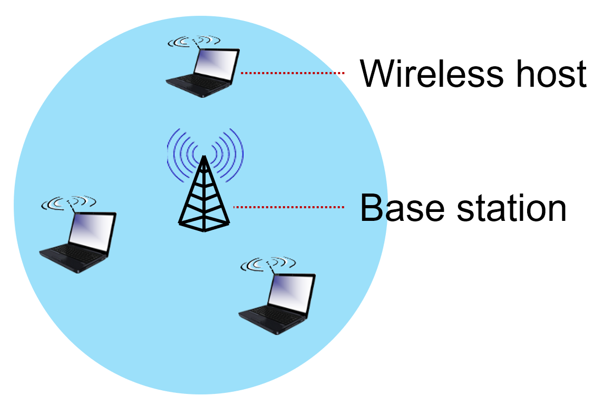

- Wireless host : 무선 기기(노드)
- Base Station : 유선으로 연결된 네트워크를 다른 노드들에게 제공
- Link : 두 노드간 무선으로 연결된 네트워크

무선 네트워크는 두 가지 종류가 있다.

- Infrastructre mode : Base station이 다른 노드들에게 네트워크를 제공하는 것
- Ad-Hoc mode : Base station이 없고, 노드간 무선 네트워크를 구성하는 것

# Hidden Terminal Problem

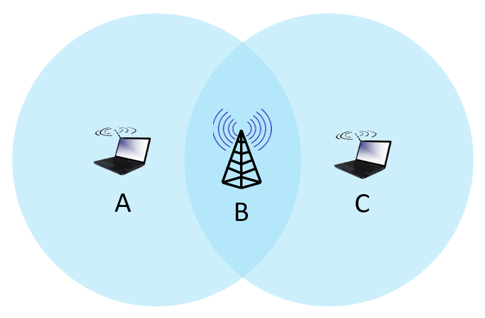

B는 A와 C 모두 범위 내에 있기 때문에 통신이 가능하지만 A는 C와 직접적인 통신이 되지 않는다. 게다가 B에게는 A의 신호가 C의 신호와 같이 들리기 때문에 충돌이 일어날 수 있다. 이 상황에서 A는 C의 신호가 들리지 않고 C 또한 마찬가지이므로 충돌이 없다고 생각하여 계속 신호를 보내게 된다.

# CDMA (Code Division Multiple Access)

각 링크에 연결된 두 노드간에 미리 정해진 코드를 통해 신호를 인코딩 디코딩 하는 것이다.

같은 주파수 대역을 사용하면서 모든 유저가 동시에 채널을 사용할 수 있는 장점이 있다.

## Encoding

각 타임 슬롯마다 보낼 신호에 미리 정해진 코드값을 각각 내적하여 인코딩한다.

```
             t1           t0
data :       -1     |      1
       -------------+------------ 
code :  -1  1  1 -1 |  1  1 -1 -1

-> inner product ->

             t1           t0
data :   1 -1 -1  1 |  1  1 -1 -1
```

## Decoding

인코딩된 신호에 미리 정해진 코드값을 곱한 후 각 타임 슬롯마다 더하여 원래의 신호로 디코딩한다.

```
             t1           t0
data :   1 -1 -1  1 |  1  1 -1 -1
       -------------+------------ 
code :  -1  1  1 -1 |  1  1 -1 -1

-> inner product ->

             t1           t0
data :  -1 -1 -1 -1 |  1  1  1  1

-> sum and divide by code length ->

             t1           t0
sum  :      -4      |      4
       -------------+------------ 
data :  -4 / 4 = -1 |   4 / 4 = 1
```

이 방법은 두 개 이상의 신호가 곱해져도 (잡음이 더해져도) 원래의 신호를 디코딩할 수 있다.

# 802.11

802.11은 무선 통신을 위해 사용하는 표준 규격이다. 

## 구성 요소

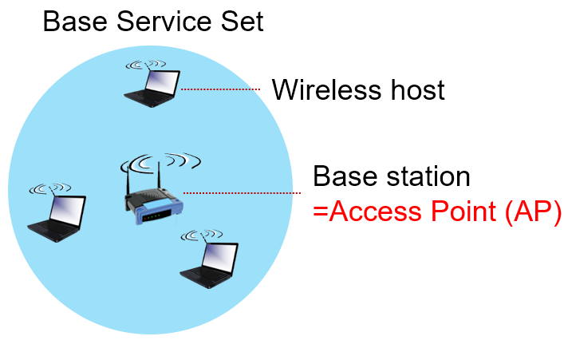

- Access Point : Base Station을 AP라고 명명한다.
- Base Station Set : Infrastructure로 구성되어 무선 네트워크를 제공하는 영역이다.

AP관리자는 각 AP가 사용할 주파수를 설정할 수 있는데, 다른 AP와 동일한 주파수를 사용하면 충돌이 일어날 수 있다. 

## 새로운 노드가 BSS에 접속할 때

1. AP가 브로드캐스트하는 Beacon Frame을 수신한다.
2. AP의 이름인 SSID와 AP의 MAC 주소를 획득한다.
3. AP가 인증을 요구할 경우 인증을 진행한다.
4. DHCP로 IP 주소를 할당받아 네트워크에 참여한다.

## Passive Scanning

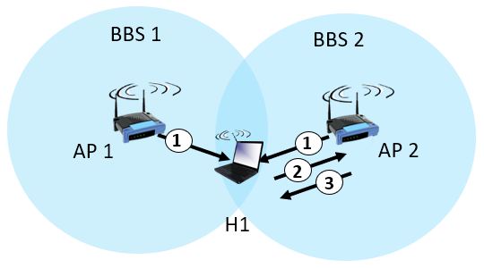

AP가 지속적으로 BSS내에 Beacon Frame을 송신한다. BSS에 접속한 노드는 수신한 frame을 전송한 AP에게 Request Frame을 보내어 핸드쉐이크를 한다.

## Active Scanning

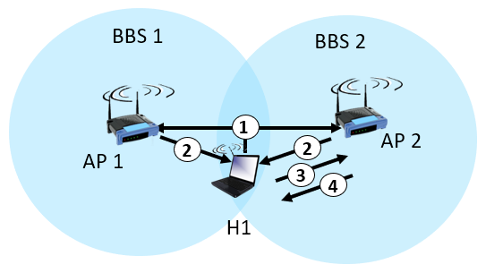

BSS에 접속한 노드가 Request Frame을 브로드캐스트한다. AP가 Request Frame을 수신하면 Response Frame을 송신한다.

여러 AP에게서 Response Frame이 전달되어도 노드 스스로 선택한 AP와 핸드쉐이크를 한다.

## CSMA/CA (Collsion Sense Multiple Access / Collision Avoid)

Hidden Terminal Problem과 같이 무선 연결의 경우 충돌을 감지하기 어렵다. 따라서 데이터 전송 전에 가능한 충돌을 회피하기 위해 기다리는 방법으로 발전하게 되었다. 

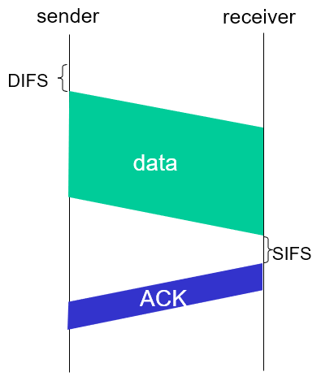

### 송신측

- 채널을 사용한 후 기다려야할 최소 시간(DIFS)이 지난 후에 채널이 유휴상태라고 판단되면 frame을 전송한다.
- 채널을 누가 사용하고 있는것 같다면,

    1. 임의의 시간만큼 기다린다.
    2. 전송한다.
    3. ACK이 없으면 1번으로 돌아가서 더 긴 시간을 기다린다.

### 수신측

수신이 완료되었다면 ACK 신호를 보낸다.

### RTS, CTS frame

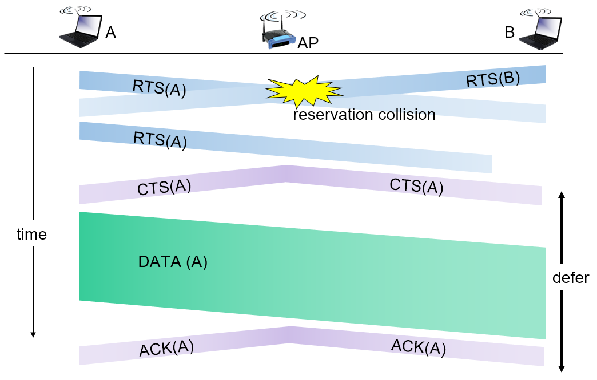

1. 송신측 노드는 먼저 작은 RTS(Request To Send) 신호를 AP에게 전송한다. 이 때 충돌이 발생할 수 있지만 frame의 크기가 작아서 충돌이 거의 없다.
2. RTS 신호를 받은 AP는 CTS(Clear To Send) 신호를 브로드캐스트하여 모든 노드에게 전송하지 말라는 신호를 보낸다.
3. 다른 노드는 모두 전송을 중단하게 되고 송신측 노드만 전송을 하게 된다.
4. 전송이 완료되면 AP는 ACK신호를 브로드캐스트하여 다른 노드들에게 전송이 끝났음을 알린다.

## 802.11 Frame Format

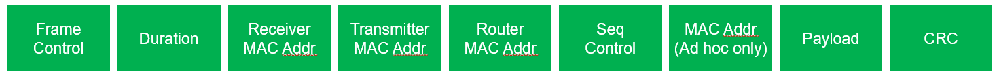

- Receiver MAC Address : frame을 수신하는 노드의 MAC 주소
- Transmitter MAC Address : frame을 송신하는 노드의 MAC 주소
- Router MAC Address : AP와 유선으로 연결된 라우터의 MAC 주소

BSS 내의 무선 네트워크에서는 802.11 WiFi frame으로 통신하지만, BSS바깥의 라우터로 전송될 때는 Ethernet frame으로 바뀌어 전송된다.

## Mobility in same subnet

같은 서브넷에서 한 AP에 연결된 노드가 다른 AP로 이동하게 되면 스위치의 포워딩 테이블 또한 변경되어야 한다. 노드의 MAC 주소를 보고 노드와 연결된 스위치 테이블의 포트를 업데이트하여 노드의 위치를 업데이트하게 된다.

## Power Management

노드가 배터리를 절약하기 위해 절전 모드(Sleep)로 들어가되 AP와 연결은 유지하고 싶은 경우다.

노드가 AP에게 다음 Beacon Frame까지 sleep하겠다고 신호를 보내면, AP는 다음 Beacon Frame까지 그 노드에게 신호를 전송하지 않는다. 대신 노드는 다음 Beacon Frame에 절전 모드에서 깨어난다. 

# Cellular Networks

노드가 이동하여도 수많은 기지국(Base Station = Cell)들 중 하나와 연결되어 네트워크에 참여할 수 있는 것을 Cellular Network라고 한다. 

## 구성 요소

- 모바일 디바이스

  스마트폰이나 노트북과 같은 기기를 말하는데, SIM 카드에 담긴 고유 식별자인 ISMI로 노드를 구분한다.

- Base Station (eNode-B)

  AP와 비슷하게 범위 내의 노드들의 무선 네트워크를 관리한다. 또한 무선 스펙트럼을 스스로 관리하고 노드가 다른 Base Station으로 이동했을 때 상호작용한다.

- HSS (Home Subscriber Service)

  홈 네트워크에 가입한 노드들의 정보를 저장하고 있다.

- S-GW (Serving Gateway), P-GW (PDN Gateway)

  S-GW는 Base Station과 P-GW사이에서 라우팅하여 사용자 정보를 전달한다(?).

  P-GW는 LTE 네트워크와 더 큰 네트워크 사이에서 NAT기능을 제공한다.

- MME (Mobility Manager Entity)

  가입자와 네트워크간 인증을 담당한다. 이 때 가입자의 인증정보를 얻기 위해 HSS에 접근하게 된다.

  또한 노드의 이동성을 관리하여 다른 Base Station으로 이동했는지 추적, 관리한다.

  노드와 P-GW간 터널링의 경로를 설정하는 역할도 담당한다.

## Control Plane

모바일 디바이스가 연결 유지 및 관리를 위해 MME, eNode-B 또는 다른 구성 요소에게 데이터를 전달한다. 

## Data Plane 

새로운 프로토콜를 담은 패킷을 Base Station으로부터 P-GW까지 터널링으로 전달한다.

모바일 디바이스는 링크 레이어에 Packet Data Convergence, Radio Link Control Protocol, Medium Access에 관한 정보를 담아 eNode-B에 전송한다.

eNode-B는 이 정보를 UDP로 캡슐화하여 S-GW에 전송하고, S-GW는 P-GW에 전송한다.

### 흐름

1. Base Station은 동기화 신호를 모든 주파수에 5ms마다 송신한다.
2. 모바일 디바이스는 동기화 신호를 감지하고 여러 정보를 담은 두 번째 동기화 신호를 수신하여 정보를 획득한다.
3. 이 때 여러 Base Station에게서 동기화 신호를 수신했을 경우 한 개의 Base Station만 선택하여 네트워크에 참여한다.

# Mobility

앞서 [Mobility in same subnet](#mobility-in-same-subnet)에서, 한 서브넷안에서 모바일 디바이스가 이동하면서 AP를 바꿀 수 있다고 했었는데, 이건 작은 의미의 Mobility다. 좀 더 큰 의미의 Mobility는 한 ISP안에서, 또는 다른 ISP사이에서도 모바일 디바이스가 이동할 수 있다.

이 기능을 라우터가 혼자 제공하려면 매우 많은 수의 모바일 디바이스에 대한 테이블을 관리해야하므로 이 방법 대신에 먼저 Home Network에 접속해서 모바일 디바이스가 어디에 있는지에 대한 정보를 획득한 후 포워딩 되는 방법을 선택한다.

- Home Network : 사용자가 가입되어있는 네트워크. HSS에 가입자에 대한 정보가 저장되어 있다.
- Visited Network : Home Network가 아닌 다른 네트워크.

## Indirect Routing

1. 모바일 디바이스가 Home Network에서 Visited Network로 이동한다.
2. 모바일 디바이스는 Visited Network의 MME에 연결된다. 
3. MME는 모바일 디바이스의 HSS와 연동하여 현재 모바일 디바이스의 위치를 업데이트한다.

위치가 업데이트 된 후 라우팅은 아래의 절차대로 진행된다.

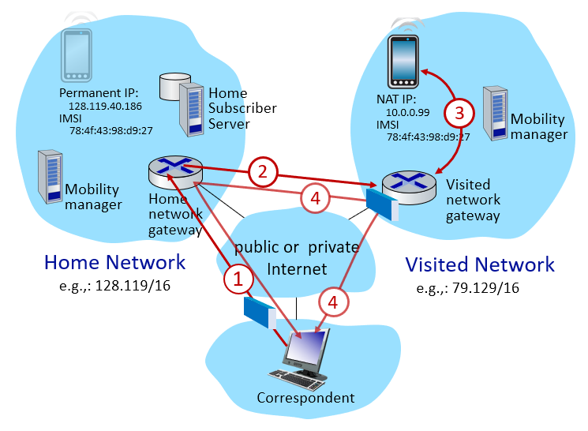

1. 다른 송신자는 현재 모바일 디바이스의 위치를 모르므로, 모바일 디바이스가 가입되어 있는 Home Network로 패킷을 전송한다.
2. Home Network Gateway는 HSS에 저장된 디바이스의 위치에 따라 Visited Network Gateway로 포워딩한다.
3. Visited Network Gateway는 전달받은 패킷을 모바일 디바이스에게 전달한다.
4. 모바일 디바이스의 응답을 다시 전송할 때, Home Network를 경유하여 전송하거나 직접 전송한다.

이렇게 송신자가 모바일 디바이스에게 패킷을 전송할 때 Home Network를 경유하여 전송하는 것을 Triangle Routing이라고 한다. 

## Direct Routing

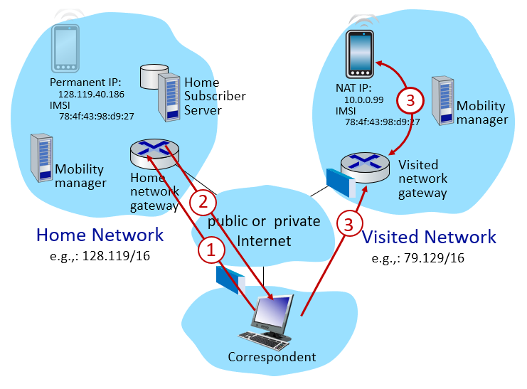

1. 모바일 디바이스가 가입되어있는 Home Network에게 현재 모바일 디바이스가 어디에 있는지 조회하는 패킷을 전송한다.
2. 이에 대한 응답으로 송신자는 모바일 디바이스의 위치를 알게 되었으므로 송신자가 직접 패킷을 전송한다.
3. Visited Network Gateway는 수신된 패킷을 모바일 디바이스에게 전달한다.

## Configuring LTE Elements

### Control Plane

모바일 디바이스가 이동할 때 Visited Network의 MME와 상호작용하여 자신의 IMSI를 통해 네트워크의 인증, 보안 등의 서비스 정보를 얻는다. MME는 모바일 디바이스가 가입된 네트워크의 HSS에 위치를 업데이트한다. 

### Data Plane

모바일 디바이스가 이동했다면 `S-GW <-> Base Station`간 터널에서 모바일 디바이스가 연결된 Base Station으로 패킷이 이동하도록 EndPoint를 변경한다.

`S-GW <-> Home Network P-GW`간 터널에서는 indirect routing을 유지한다.

## Handover in same cellular network

같은 네트워크 내에서 모바일 기기가 Base Station을 변경할 때 아래의 순서대로 진행된다.

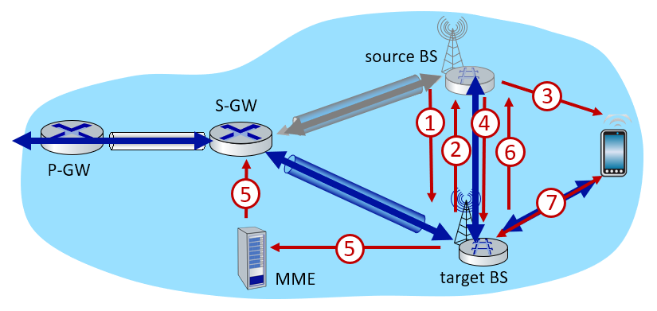

1. 기존에 모바일 디바이스와 연결된 Source Base Station은 새로 연결될 Target Base Station에게 *Handover Request Message*를 전송한다.
2. Target Base Station은 메세지를 수신한 후 Source Base Station에게 응답 메세지를 전송한 후 모바일 디바이스와 연결될 준비를 한다.
3. Source Base Station은 모바일 디바이스에게 Target Base Station의 정보를 전송하여 모바일 디바이스가 Target Base Station와 연결될 수 있도록 한다.
4. Source Base Station은 모바일 디바이스에게 전송하는 것을 멈추고 Target Base Station으로 라우팅한다.
5. Target Base Station은 MME에게 모바일 디바이스가 연결된 Base Station이 달라졌음을 전달하여 S-GW가 EndPoint를 자신으로 설정하도록 업데이트한다.
6. Target Base Station이 Source Base Station에게 handover가 완료되었다는 메세지를 전송하여 Source Base Station이 포워딩을 그만두도록 한다.
7. 모바일 디바이스는 새로운 Base Station으로 데이터를 전송할 수 있게 되어 네트워크를 유지하게 된다.
