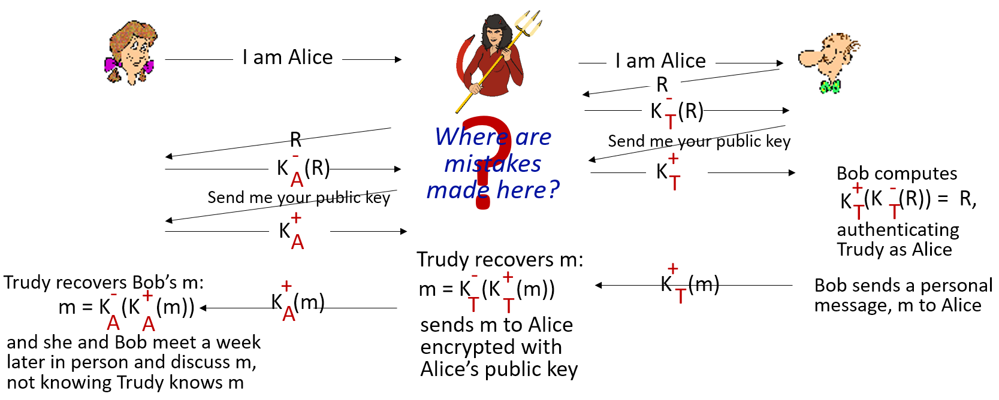
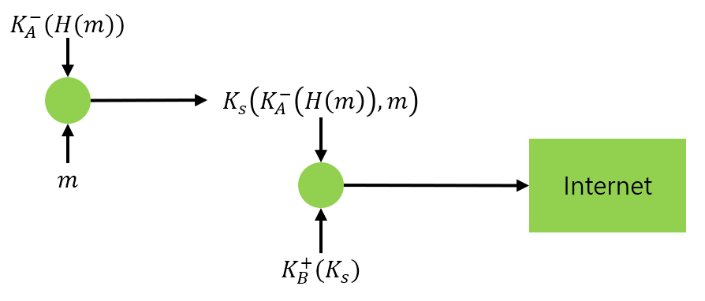
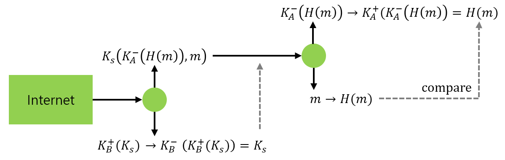
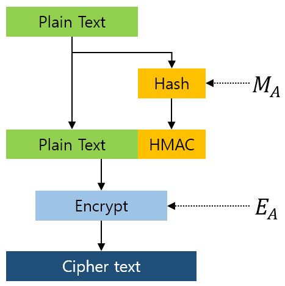
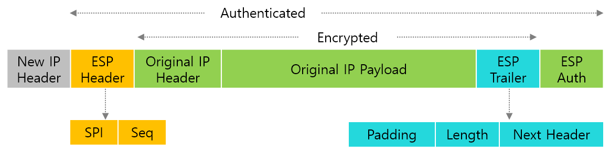

> 2023년 2학기 컴퓨터 네트워크 수업을 듣고 정리한 내용입니다.

# 용어

- Confidentiality = 기밀성

  송,수신자 외에 다른 사람이 메세지를 들여다 볼 수 없음을 의미한다.

- Authentication = 인증

  송,수신자가 서로의 존재를 알아볼 수 있음을 의미한다.

- Integrity = 무결성

  메세지가 전송과정에서 오염되지 않았음을 의미한다.

# 암호화란

어떤 메세지를 다른 사람에게 들키지 않으려면 송,수신자끼리 정한 규칙에 따라 암호로 나타낸다. 이 암호는 두 사람만 이해가능하다. 암호로 나타내려면 어떤 규칙이 필요한데 이걸 key라고 부른다.

송신자는 key를 통해 메세지 즉, 평문을 암호화하여 암호문으로 만든다. 수신자는 암호문을 다시 평문으로 바꿔 이해하여야 하기 때문에 복호화를 할 수 있는 key를 갖는다. 

$$
m = 평문\\ 
K_a = 암호화 키\\
K_b = 복호화 키
$$
$$
m = K_b(K_a(m))
$$

## 대칭키

또 다른 이론으로는 송신자와 수신자가 같은 키를 갖고 암호화를 진행하는 것이다. 단순히 데이터를 다른 데이터로 치환하는 구조라서 단순함과 빠른 연산 속도를 갖는다. 

$$
m = 평문\\ 
K_s = 대칭키
$$
$$
m = K_s(K_s(m))
$$

대신 키가 단순할 수록 해킹이 쉬워지므로 무식하게 키의 길이를 늘려서 사용한다.

## 공개키, 비밀키

보안을 위해 대칭키를 사용하려면 송신자와 수신자 모두 같은 키를 갖고 있어야 한다. 하지만 송신자와 수신자가 서로 만난 적이 없어 키를 갖지 않은 경우에서는 대칭키 암호화 방식을 사용할 수 없다. 보안이 없는 환경에서 보안을 위해 대칭키를 전달한다면 키가 노출되기 때문에 안전하게 전달할 수 없다.

그렇기 때문에 모두에게 공개된 공개키(public key)와 자기 자신만 갖는 비밀키(private key)를 구분하는 구조로 바뀌었다.

$$
m = 평문\\ 
K_a^+ = 공개 키\\
K_a^- = 개인 키
$$
$$
m = K_a^-(K_a^+(m)) = K_a^+(K_a^-(m))
$$

공개키 암호화 방식은 모듈러 연산을 이용한다. 

큰 소수 두 개 p, q를 생성하고, $$n = pq$$의 n과 $$z = (p-1)*(q-1)$$의 z를 계산한다.

z보다 작고 서로소인 어떤 수 e를 구한 후 $${ed-1}\mod z = 0$$인 d를 구한다.

이제 $(n, e)$는 공개키, $(n, d)$는 비밀키가 된다.

모듈러 연산에 의해 $m^{ed}\mod n$은 항상 m이 되기 때문에 공개키로 암호화된 메세지를 비밀키로 해독해낼 수 있다. 그렇기 때문에 큰 수를 모듈러 연산하기 위해 걸리는 시간이 크다는 단점이 있다.

### 세션키 공유

공개키 암호화 방식은 대칭키에 비해 키를 알아내기 거의 불가능하므로 **대칭키를 전달하기 위해 공개키 암호화 방식을 사용한다.**

# 인증

두 네트워크 호스트 간 인증을 하려고 이것저것 전달하려하니 중간에 패킷이 탈취당할 수 있다. 그래서 아무 의미없는 난수를 통해 인증을 진행한다.

서버가 생성한 난수를 클라이언트에게 전송하면 클라이언트가 자신의 비밀키로 암호화하여 전송한다. 그리고 서버는 클라이언트의 공개키를 이용하여 클라이언트가 전송한 암호문을 복호화하여 서버가 보낸 난수인지 확인한다. 

그러나 이 방법 또한 공격자가 서버와 클라이언트 사이에서 패킷을 가로채 둘 사이를 중계해버릴 수 있는 문제가 있다.

# 무결성

## 디지털 서명

문서의 주인이 송신자임을 나타내는 서명이다. 송신자는 문서를 비밀키로 암호화하여 문서와 같이 전송한다. 수신자는 이 문서의 서명을 송신자의 공개키로 해독하여 송신자가 서명했음을 확인함으로 위조되지 않았음을 알게 된다.

## Digests

비밀키로 문서를 암호화하려고 하다보니, 문서의 길이가 너무 길다면 암호화 및 복호화에 시간이 많이 걸린다. 따라서 문서를 정해진 해시 함수에 넣어 크기를 줄인 후 서명하는 방법을 사용한다.

1. 송신자는 메세지($$m$$)와, 해시 함수를 거친 메세지($$H(m)$$)를 비밀키로 암호화하여 같이 전송한다.
2. 수신자는 송신자와 같은 해시 함수($$H(m)$$)를 사용해 메세지($$m$$)를 변환한다.
3. 수신자는 송신자의 공개키를 이용해 송신자의 비밀키로 암호화된 $$H(m)$$을 복호화해낸다.
4. 2번에서 만든 값과 3번에서 만든 값을 비교해 무결성을 검증한다.

[인증](#인증) 항목에서, 공격자가 서버와 클라이언트 사이에서 상대방인척 위장할 수 있는 문제가 있었다. [무결성](#무결성)에서 이 문제를 해결하기 위해 서명을 거치는 방법을 사용했지만 여전히 중간에서 공격자가 상대방인 척 위장할 수 있다.

이 방법을 보완하려면 공개키를 누군가 보증하면 해결된다. 기관에 공개키를 등록해 두고, 인증을 할 때마다 그 기관이 서명한 공개키를 사용하면 된다. 

# 이메일 보안

무결성, 기밀성을 지키면서 이메일을 전송하려고 한다. 앞서 공개키 암호화 방식을 사용하여 대칭키를 전송한 방법, 문서를 해시 함수에 넣은 후 공개키 암호화 방식을 사용해 전송한 방법을 사용한다.

## 송신자

1. 송신자는 문서($$m$$)를 해시 함수로 크기를 고정시킨 후 그 값을 비밀키로 암호화한다. 

$$
K_A^-(H(m))
$$

2. 문서($$m$$)와 비밀키로 암호화한 값을 함께 대칭키로 암호화한다.

$$
K_s(K_A^-(H(m)), m)
$$

3. 수신자의 공개키를 이용해 대칭키를 암호화한다.

$$
K_b^+(K_s)
$$

4. 2, 3번의 결과를 같이 전송한다.

## 수신자

5. 수신자는 자신의 비밀키$$K_B^-$$로 대칭키를 얻어낸다.
$$
K_B^-(K_B^+(K_s)) = K_s
$$
6. 대칭키를 이용해 문서를 복호화하고, 송신자의 비밀키로 암호화된 데이터를 송신자의 공개키$$K_A^+$$로 복호화한다.
$$
K_s(K_s(K_A^-(H(m)))) = K_A^-(H(m))
$$
$$
K_A^+(K_A^-(H(m))) = H(m)
$$
7. 해시 함수에 문서를 넣어 얻은 값와 6번에서 얻은 값을 비교하여 무결성을 검증한다.

이 때 해시 함수는 송신자가 사용한 함수와 같아야 한다.

# Transport-Layer Security

TLS 프로토콜은 두 호스트 사이에 보안 환경을 제공하는 프로토콜이다. 전송 계층, 세션 계층 사이에서 동작한다.

## Handshake

TCP Handshake를 진행하고 나서 TLS Handshake를 진행한다. 이 과정에서는 TLS 버전, 암호화 알고리즘을 선택하고 서로의 인증서를 교환하여 통신하려는 상대가 유효한지 검증한다. 

1. 클라이언트는 서버에게 `Client Hello` 메세지를 전송한다.

  여기에는 클라이언트가 지원하는 **암호화 알고리즘(Cipher suite) 리스트**, **클라이언트가 임의로 생성한 난수**, 그리고 세션 ID를 함께 전송한다.

2. 서버는 이에 응답하여 `Server Hello` 메세지를 전송한다.

  클라이언트가 제공한 암호화 알고리즘중에서 하나를 선택하여 클라이언트에게 알린다. 그리고 세션 ID, 서버의 인증서 그리고 **서버가 생성한 임의의 난수**도 함께 전송한다. 

3. 클라이언트는 서버의 인증서를 검증하고, 인증서가 신뢰할만하다면 앞서 전송한 난수와 서버가 전송한 난수를 조합하여 `pre-master secret`을 생성한 후 인증서를 통해 얻은 서버의 공개키로 암호화하여 전송한다. 그리고 클라이언트 또한 인증서를 전송한다.

4. 서버는 클라이언트의 인증서를 검증하고, 인증서가 신뢰할만하다면 비밀키로 `pre-master secret`을 해독한 후 **`pre-master secret`**과, **서버의 난수**, **클라이언트의 난수**를 조합하여 세션키를 생성한다. 클라이언트 또한 이 값들을 갖고 있기 때문에 양 쪽 모두 세션키를 얻게 된다. 

이 과정을 매 TLS Connection마다 진행하면 시간이 꽤 걸리기 때문에 세션 ID를 부여하여서 같은 세션 ID를 사용하여 요청할 경우 Handshake 과정을 생략한다. 

## Key Derivation

생성된 세션키로 암호화, 복호화를 한 후 무결성을 검증할 때 쓸 수 있지만 키 하나로 모든 걸 다해버리면 좋지 않다. 따라서 세션키와 다른 난수를 통해 네 가지의 키를 생성한다.

- $$E_c$$ : 클라이언트가 서버에게 데이터를 전송할 때 사용할 세션키 
- $$M_c$$ : 클라이언트가 무결성을 위해 사용할 MAC키
- $$E_s$$ : 서버가 클라이언트에게 데이터를 전송할 때 사용할 세션키
- $$M_s$$ : 서버가 무결성을 위해 사용할 MAC키

서버와 클라이언트가 같은 세션키와 난수값을 보유하고 있기 때문에 서버와 클라이언트 모두 위 4가지의 같은 키를 보유하게 된다.

## Data Transfer

위에서 생성한 4가지의 키를 통해 데이터를 암호화하고 무결성을 보증하여 전송한다. 서로 갖고 있는 세션키를 통해 암호화, 복호화를 진행하면 된다.

무결성을 보증하기 위해서는 데이터와 MAC을 같이 전송하고, 수신측에서는 받은 데이터을 변환했을 때  MAC과 같아야 한다. 그러나 데이터의 크기가 매우 크면 fragmentation으로 데이터를 쪼개어 전송하게 된다. 쪼갠 데이터의 마지막 fragment에 MAC이 전송되면 **모든 fragment를 수신해야만 무결성 검증이 가능하다**. 그러므로 무작정 기다리지 않고 fragment마다 검증하기 위해 **모든 fragment에 MAC을 붙여 전송한다**.

## Format

type, version, length는 암호화되지 않고, Data와 HMAC은 세션키에 의해 암호화된다. 

type은 TLS 메세지가 Handshake인지 Application Data인지 구분하는 데에 사용하고, TLS Connection을 종료할 때에도 사용한다. 

version은 TLS 프로토콜의 버전을 의미한다.

length는 암호화된 데이터의 길이를 의미한다.

# IPSec

TLS가 전송 계층에서 사용한 보안 프로토콜이라면, IPSec은 네트워크 계층에서 사용하는 보안 프로토콜이다.  

## Mode

IPSec에는 두 가지 모드가 있다.
- Transport Mode : payload만 암호화한다.
- Tunnel Mode : datagram 전체를 암호화한다. 암호환 datagram은 새로운 datagram으로 캡슐화한다.

## Protocol

- Authentication Header(AH) Protocol : 헤더만 암호화하기 때문에 무결성을 검증할 수 없다.
- Encapsulation Security Protocol (ESP) : 무결성, 인증, 기밀성을 제공해서 AH보다 더 많이 쓴다.

## Security Associations

암호화된 datagram을 전송하기 전에 두 노드간에 보안 환경이 구성되어 있어야 한다. 이를 Security Association이라고 한다. 두 노드는 서로 같은 보안 속성을 기억하고 있어야 한다. 

- Security Parameter Index : SA를 식별하기 위한 id로 사용
- Destination IP Address : 하나의 IP마다 유일한 SA를 사용
- Security Protocol Identifier : AH, ESP중 하나 사용
- Encryption Key
- Authentication Key
- 무결성, 및 인증 방식 등

## IPSec Datagram

보낼 datagram 뒤에 Trailer를 붙인 후 SA에 정의된 방식으로 암호화한다. 그 다음 Header와 Auth 필드를 붙여 무결성 검증 처리를 한 뒤 새로운 IP Header를 붙여 전송한다.

ESP Header에는 replay attack을 막기 위해 Sequence Number가 들어있다. 

ESP Trailer에는 block cipher attack을 막기 위해 padding을 붙인다.

ESP Auth에는 SA에서 정의한 MAC이 들어간다.

이렇게 구성한 IPSec Datagram으로 상대방에게 전송한다.

### Sequence Number

새로 SA를 구성하면 0번부터 시작한다. replay 공격을 막기 위해서 매번 datagram을 송신할 때마다 값을 1씩 증가시킨다. 

## IP Security Databases

### Security Policy Databse (SPD)

> SPD: What to do

송신자는 이 datagram이 IPSec을 사용하는지 알아야 한다. 그리고 어떤 SA를 사용해야하는지 결정해야한다. 이에 대한 정보들이 이 DB에 저장된다.

### Security Association Database (SAD)

> SAD: How to do

Endpoint는 SAD안에 SA상태를 저장한다. 송신자가 IPsec datagram을 보낼 때 송신자와 연결된 라우터는 SAD에 접속하여 어떻게 datagram을 전송해야할지 결정한다.

수신자와 연결된 라우터는 SPI를 조사하고 SPI를 인덱싱하여 처리한다.

# Internet Key Exchange (IKE)

SA를 생성하기 위해 키 교환을 수행하여 보안 요소들을 설정한다.

## Pre Shared secret Key (PSK)

미리 공유된 키로 시작하여 인증을 진행하고 SA를 생성한다. 

## Public Key Infrastructure (PKI)

공개키/비밀키로 시작하여 인증을 진행하고 SA를 생성한다.

# 무선 및 모바일 네트워크 보안

# 방화벽

# IDS