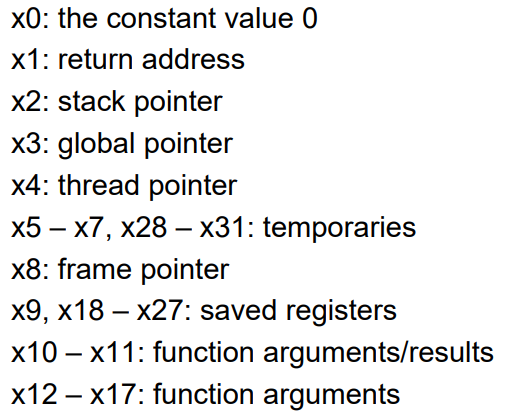
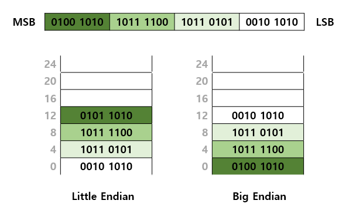
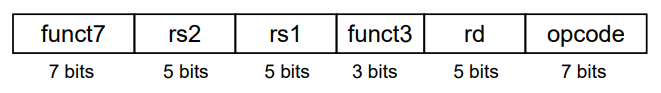
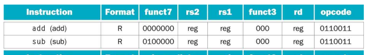
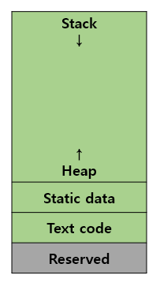
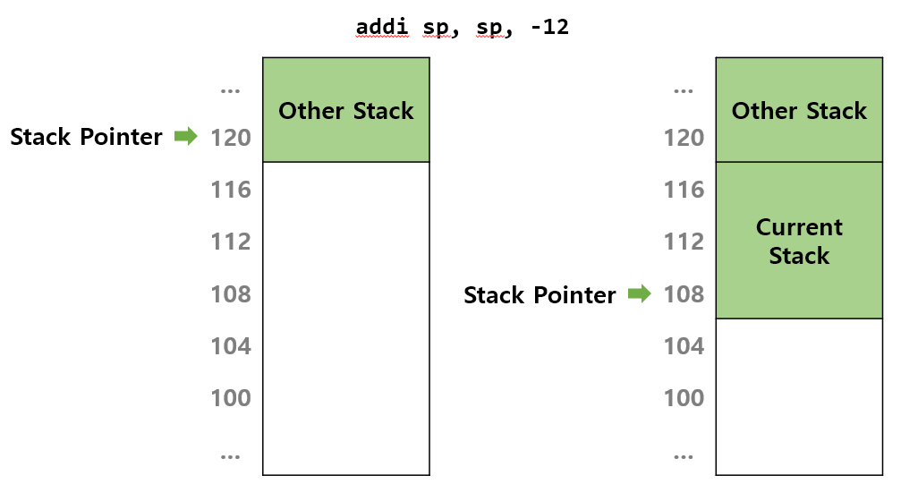

> 2023년 2학기 컴퓨터 구조론 수업을 듣고 정리한 내용입니다. 수업 교재는 [컴퓨터 구조 및 설계 RISC-V 2판](https://product.kyobobook.co.kr/detail/S000060622658)입니다.

컴퓨터는 명령어에 의해 동작한다. CPU는 메모리에 저장된 명령어를 불러와 해석하고 연산한다.

# 명령어 설계 원칙?
- 간단하게 하기 위해서는 규칙적인 것으로 정한다

  명령어에 들어가는 파라미터는 **3개**로 제한한다. ex. `add x5, x6, x7`은 x6과 x7이 갖고 있는 값을 더해 x5에 대입한다.

- 작게 설계해야 더 빠르다.

  레지스터의 개수는 32개(32비트 프로세서 기준)로 제한되어 있는데, 더 큰 레지스터를 가지면 CPU가 연산하기 편리하지만 *CPU<->레지스터간 왕복이 빈번해지므로 이에 따른 시간이 많이 소모된다*.

# 레지스터

CPU가 연산을 위해 이용하는 메모리다. 32비트, 64비트 프로세서가 의미하는 말은 **레지스터의 크기가 32비트인지 64비트인지**를 의미한다. 두 프로세서의 차이점은 접근할 수 있는 메모리의 범위가 다르다. 32비트 프로세서는 $$2^{32}\approx{4GB}$$만큼 접근 가능하지만 64비트 프로세서는 $$2^{64}\approx{16EB}=16,000,000TB$$나 접근이 가능하다.

> 수업은 32비트 프로세서를 기준으로 진행되었기 때문에 본 게시물도 32비트 프로세서를 기준으로 작성되었습니다.

## 각 레지스터의 용도



- `x0`: const value 0

  **읽기 전용**으로 되어있어서 다른 값을 쓸 수 없고, 0으로 정해져있어서 다른 레지스터나 변수에 값을 초기화하는 용도로 쓴다.
- `x1`: return address

  함수를 호출한 후 호출된 함수의 실행이 종료되면 다시 원래의 명령어 위치로 돌아와야 한다. 이 때 메모리에 스택이 생겼다가 사라지는데, 그 때 **함수를 호출한 명령어가 저장되어있던 주소**를 기억했다가 불러오는 용도다.
- `x2`: stack pointer

  함수를 호출하면 메모리에 함수의 스택이 새로 생성되는데, 이 때 **할당된 스택의 주소**를 이 레지스터가 나타낸다. 메모리에 변수를 생성할 때 이 스택 포인터를 이용하여 할당하게 된다.

나머지는 자세하게 배우지 않았다...

## 메모리 접근

메모리는 **1차원 배열**로 되어있다. 각 배열의 원소는 1바이트의 값을 저장할 수 있고, 원소마다 고유의 주소를 갖는다. 

레지스터에는 단순한 값이 담길 수도 있지만 메모리의 주소를 담을 수도 있다. 명령어를 통해 레지스터에 담긴 주소로 가서 값을 불러오거나 저장할 수 있다.

### endian

레지스터는 32비트이기 때문에 메모리에 접근해 데이터를 불러올 때 8비트(1바이트)만 불러오면 아쉽다. 한번에 32비트(4바이트=1워드)를 불러올 수 있으면 좋겠는데, 불러오는 순서가 좀 다르다.

- **Little endian**

  데이터의 **LSB**(Least Significant Bit, 제일 왼쪽 비트)가 담긴 바이트부터 저장하고 불러오는 방법이다.

- **Big endian**

  데이터의 **MSB**(Most Significant BIg, 제일 오른쪽 비트)가 담긴 바이트부터 저장하고 불러오는 방법이다.

두 방법의 차이는 아래 그림에 정리했다.



### 정렬 제약

이렇게 메모리를 한 번에 4바이트씩 접근하려고 하다보니 **4의 배수** 단위로 접근해서 갖고 오면 좋겠다. 그렇기 때문에 RISC-V에서는 정렬 제약을 두어서 항상 메모리를 저장할 때 바이트, 하프워드, 워드에 관계없이 무조건 **주소를 4의 배수 단위**로 끊어서 저장하도록 정했다. 

바이트와 워드가 섞여서 저장되어 있으면 값의 정확한 시작 주소를 알기 까다롭기 때문에 그렇다. 나중에 명령어를 통해 메모리에 접근할 때 꼭 지켜야하는 규칙이다.

> MIPS는 Big endian이고, ARM은 두 방식 모두 지원한다.

## 1의 보수, 2의 보수

2진수 체계에서 음수를 표현하기위해서는 2의 보수를 사용하는데 2의 보수는 1의 보수에서 1을 더한 결과다.

1의 보수는 단순히 2진수의 각 비트를 반전시킨 것이다. ex. $${00101}_{(2)}$$ -> $${11010}_{(2)}$$

1의 보수로 표현된 값에 1을 더하면 2의 보수가 된다. ex. $${11010}_{(2)}$$ -> $${11011}_{(2)}$$

$${00101}_{(2)}$$은 10진수에서 $$3$$이고, $${11011}_{(2)}$$은 10진수에서 $$-4$$다.

컴퓨터는 1의 보수 대신 **2의 보수**를 택했는데, 1의 보수는 0을 나타내는 값이 두 개나 존재하기 때문이다. $${0000}_{(2)} = 0$$, $${1111}_{(2)} = -0$$

2의 보수를 택함으로 레지스터가 나타내는 값의 범위는 $$-2147483648 \backsim 2147483647$$이 되었다.

# 명령어 형식

명령어 형식은 명령어의 종류마다 다르다. 그래서 자세한 형식에 대해서는 [riscv-specs-v2.2.pdf](https://riscv.org/wp-content/uploads/2017/05/riscv-spec-v2.2.pdf#page=116)에서 확인할 수 있다.

예시로 연산 명령어(R-format)의 형식을 살펴보면 다음과 같다.



명령어의 길이는 **32비트**인데, CPU가 **32비트 프로세서**라서 그렇다.

주어진 명령어가 어떤 형식인지 알기 위해서는 `opcode`를 확인해야한다. LSB부터 7개의 비트가 `opcode`다.



위 사진에서 R-format 명령어는 opcode가 `0110011`이다. 

R-format임을 확인했으니 해당 형식에 맞춰 각 파라미터들을 해석한다. 

- `rd`: destination register
- `rs1` : source register 1
- `rs2`: source register 2

명령어마다 각 파라미터들의 의미와 기능이 다르지만 R-format의 경우에는 `rs1` 레지스터에 들어있는 값과 `rs2` 레지스터에 들어있는 값을 연산하여 `rd` 레지스터에 저장한다.

레지스터를 가리키는 파라미터는 32비트 즉 $$2^5$$개이므로 5비트만 차지한다.

R-format에는 덧셈과 뺄셈이 있는데, 이를 구분하는 방법은 `func7`파라미터를 이용하면 된다.

사진에서 뺄셈만 `func7`값이 `0100000`이니까, func7자리에 해당하는 비트들을 조사하면 된다.

# 명령어 종류

> 수업 때 배운 명령어들만 적었습니다.

- `lw` : 메모리로부터 값을 불러와 레지스터에 저장한다.
- `sw` : 레지스터에 들어있는 값을 메모리에 저장한다.
- `add` : 두 레지스터가 갖는 값을 더하여 다른 레지스터에 저장한다.
- `sub` : 두 레지스터가 갖는 값을 빼서 다른 레지스터에 저장한다.
- `addi` : 한 레지스터에 들어있는 값과 주어진 상수값을 더해 저장한다.
- `slli` : 레지스터에 들어있는 값을 주어진 상수값만큼 왼쪽으로 시프트(`<<`)한다.
- `srli` : 레지스터에 들어있는 값을 주어진 상수값만큼 오른쪽으로 시프트(`>>`)한다.
- `beq` : 두 레지스터에 들어있는 값이 동일하다면 라벨로 표현된 주소로 이동하여 명령어를 실행한다.
- `bne` : 두 레지스터에 들어있는 값이 다르다면 라벨로 표현된 주소로 이동하여 명령어를 실행한다.

## 분기 명령어

`beq`와 `bne`처럼, 분기명령어일 때 라벨로 표현된 주소로 이동한다는 것은 아래의 코드와 같다.

```
// x10에는 10이, x11에도 10이 들어있다고 하자. 
// x5는 메모리에 저장된 변수 N을 의미한다고 하자.

      beq x10 x11 JUMP
      addi x10 x10 15
JUMP: sw x10 0(x5) // x5 레지스터가 갖는 주소값으로부터 
                   // 0만큼 떨어진 위치에 값 저장   
```

`x10`에 저장된 값이 10이고 `x11`에도 10이 저장되어 있으므로, 바로 아래의 `addi`코드를 실행하지 않고 `JUMP`로 분기하게 된다. 결과적으로 변수 N에는 25가 저장되지 않고, 10이 저장된다.

## 기본 블록

분기가 없는 명령어 코드 단위를 블록이라고 한다. 컴파일러가 C 코드를 명령어 코드로 만들 때 이런 블록들을 최대한 생성하려고 노력하여 최적화를 한다고 한다.

# 프로시저

명령어 코드들을 실행하는 중간에 함수를 호출하여 뭔가를 얻으려고 할 때가 있다. 이를 **프로시저**라고 하는데, 프로시저를 호출하는 과정에는 몇가지 단계가 있다.

0. 프로시저가 끝나고 나서도 사용할 값들을 스택에 보관한다.
1. 파라미터 역할을 하는 레지스터에 값을 넣는다.
2. 프로시저에게 컨트롤 권한을 넘긴다.
3. 프로시저를 위해 스택 메모리를 확보한다.
4. 프로시저의 시작 주소로 분기하여 프로시저의 명령어를 실행한다.
5. 프로시저 내부에서 반환할 값은 반환으로 사용할 레지스터에 저장한다.
6. 사용한 스택 메모리를 반환하고 다시 프로시저의 호출 시점으로 돌아온다.

프로시저의 명령어 코드를 실행하려면 **프로시저의 시작 주소로 분기하여야 한다**(이동하여야 한다). 이 때 `jal`과  `jalr` 명령어를 이용해 분기한다.

- `jal`

  프로시저를 실행하기 위해 프로시저가 시작되는 메모리 주소로 이동한다. 이때 인자값으로 프로시저를 의미하는 라벨을 사용한다.

  ex. `jal x1 LOOP` 명령어를 실행하면 LOOP 라벨이 가리키는 명령어의 주소값을 x1에 저장하게 된다.

- `jalr`

  `jal`과 비슷하지만 x1에 저장된 메모리 주소에서 상수값만큼 떨어진 위치로 이동한다. 

  ex. `jalr x0 0(x1)` 명령어를 실행하면, `x1`에서 0만큼 떨어진 위치 즉, x1에 저장된 명령어 주소로 이동한 후 명령어를 실행하게 된다. 
  
  > `x0`은 아무 의미도 없지만 인자로 포함되어 있는데, 이유는 앞서 파라미터 개수를 3개로 한정시켰기 때문이다. 

## 저장되어야할 레지스터값들

- **return address**

  프로시저를 호출하면 `x1`에 현재 명령어의 주소가 저장되고 프로시저로 흐름이 넘어가게 된다. 이 때 현재 x1에 들어있는 값은 *현재 프로시저가 종료되면 돌아갈 주소*이기 때문에 이 값을 항상 기억해야한다. 스택에 저장하고 나서 프로시저를 실행하고, 프로시저가 종료된 후 다시 불러와야한다.
- **saved registers**

  몇몇 레지스터의 값은 프로시저 내에서 사라지면 안되기 때문에 미리 값을 스택에 저장했다가 프로시저가 종료된 후 다시 불러와 사용한다.

## 메모리 구조

메모리의 구조는 단순한 1차원 배열이다.



### Stack

프로시저를 호출하면 현재 레지스터에 있는 값중 필요한 것을 스택에 저장하여 프로시저가 레지스터를 사용할 수 있게 해야한다. 

컴파일러가 프로시저를 호출하기 전에 기억해야할 레지스터의 개수를 계산하여 스택을 확보한다. 

```
// 예시
addi sp, sp, -12 // stack pointer(sp)를 12만큼 아래로 이동시킴
sw   x5, 8(sp)   // x5에 들어있는 값을 sp가 가리키는 주소 + 8 위치에 저장한다.
```



프로시저가 종료될 때, 프로시저가 종료되기 전에 확보했던 스택을 반환해야한다. 앞서 스택 포인터의 값을 감소시켜서 스택 메모리를 확보했다면, 반대로 스택 포인터의 값을 올려서 반환해버릴 수 있다.

위 예시대로라면 `addi sp, sp, 12`명령어를 실행하여 다시 원래대로 돌려놓게 된다.

### Heap

동적할당하여 확보하는 공간인데, 수업시간에 배우지는 않았다.

### Static

전역변수들을 저장하는 공간인데, 수업시간에 배우지는 않았다. `x3`이 global pointer로 지정되어 있다고 한다. 

### Text code

명령어를 저장하는 메모리 공간이다.

# 32비트 점프

통계에 의하면, 명령어에 들어가는 대부분의 상수값은 $$ 2^{12} $$ 보다 작다. 그러므로 상수값을 위해 12비트면 충분하지만, 32비트 상수 전체를 더하는 경우도 필요하다.

한 번에 32비트를 불러오려면 명령어의 길이 전체를 사용해야하니까, 그럴 수는 없다. 대신 레지스터의 크기인 32비트에서 12비트를 제외한 20비트를 불러올 수 있는 명령어인 `lui`를 사용한다.

# 주소를 다루는 방법

## Immediate addressing

레지스터에 담긴 주소값에 상수를 더해서 주소를 바꾸는 방법. 

ex. `addi sp sp 8`

## Register addressing

주소를 담고 있는 한 레지스터에 다른 레지스터에 담겨있는 상수값을 더하여 주소를 바꾸는 방법. 

ex. `add x5 x6 x7`

## Base addressing

주소를 담고 있는 레지스터에서 offset을 더하여 접근하는 방법. 

ex. `lw x5 12(x10)`

## PC-relative addressing ##

현재 실행되고 있는 명령어의 주소는 PC(Program Counter)에 저장되어 있는데, PC에 변위를 더하여 주소를 바꾸는 방법.

ex. `beq x9 x10 (Label)`

# Program Counter

32개의 레지스터와는 별개로 CPU 안에 **현재 실행되고 있는 명령어의 주소**를 저장하는 Program Counter 레지스터가 있다. 직접 접근하지 못하고, 명령어에 의해서 또는 순차적인 명령어의 실행을 통해 변경된다.

(PC값이 변경되는 과정 추가바람)

# 기계어 코드 해석

32비트값을 2진수로 나타내면 너무 길다. 따라서 16진수로 나타낸다.

```
00000000101001001000101000100011
-> 0000 0000 1010 0100 1000 1010 0010 0011
-> 00A48A23
```
