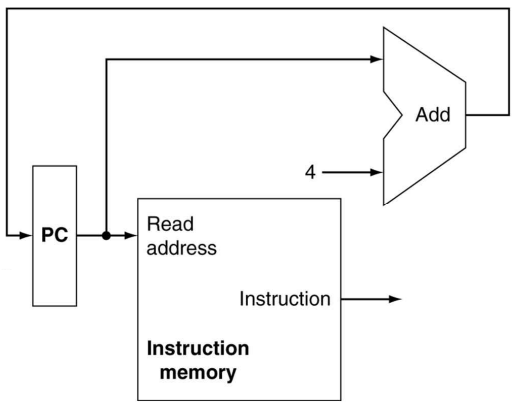
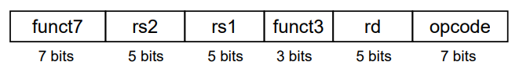
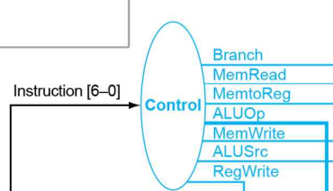
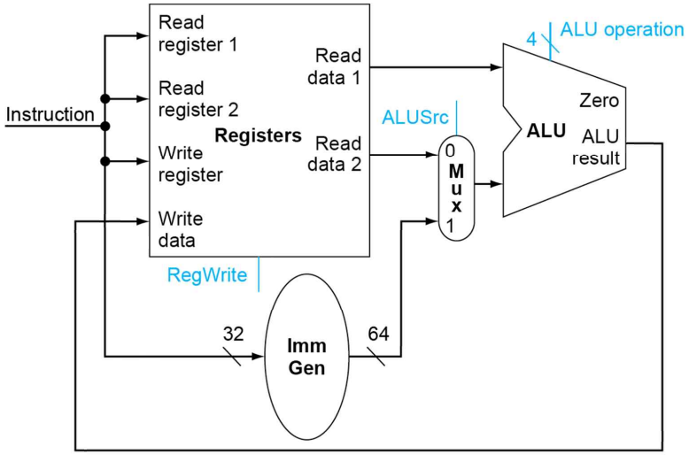
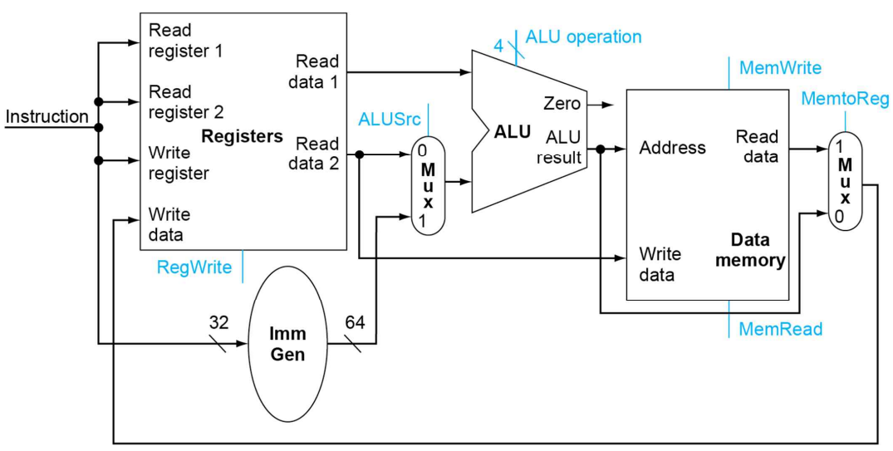
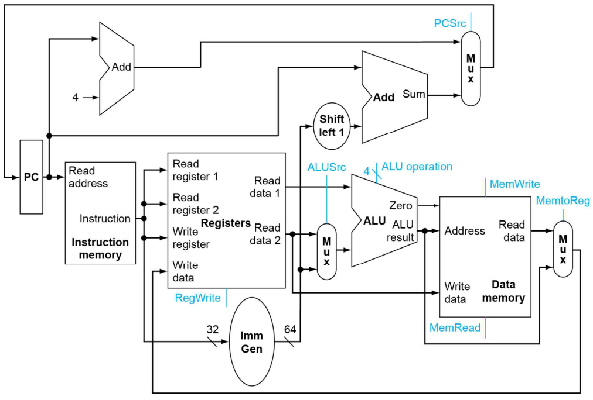

> 2023년 2학기 컴퓨터 구조론 수업을 듣고 정리한 내용입니다. 수업 교재는 [컴퓨터 구조 및 설계 RISC-V 2판](https://product.kyobobook.co.kr/detail/S000060622658)입니다.

# 흐름

CPU가 명령어를 해독하고 실행하는 과정을 간략하게 나타내면 이렇다.

1. 명령어를 메모리에서 인출해온다.

  프로그램 카운터(PC)에 저장된 주소값으로 명령어 메모리에 접근하여 명령어를 갖고 온다.

  명령어를 인출한 후에는 PC값을 다음 명령어의 주소로 바꾸기 위해 4만큼 더한다.

2. 명령어를 해독한 후 레지스터에서 필요한 값을 갖고 온다.
3. 명령어에 의해 연산을 실행한다.

> 모든 처리가 한 클럭안에 끝난다고 가정한 후 단일 데이터 패스를 설명합니다.

# 명령어 인출

하버드 아키텍쳐에 의해 데이터 메모리와 명령어 메모리가 분리되어, 명령어는 오직 명령어 메모리에서만 인출할 수 있다. 인출하고자 하는 명령어는 프로그램 카운터(PC)값을 주소로 사용하여 인출하게 된다.

현재 PC값을 주소로 사용하여 Instruction Memory(명령어 메모리)에 접근, 명령어를 인출한다. 명령어를 인출한 후에는 PC값을 다음 명령어의 주소값으로 설정하기 위해 4만큼 더한다. 

인출된 명령어는 명령어 구조에 따라 해독되어 레지스터와 컨트롤 유닛에게 전달된다.

# 명령어 해독

명령어 구조에 의해 해독된 값은 레지스터와 컨트롤 유닛에게 전달된다. 위 사진에서 rs1, rs2, rd값은 레지스터에게 전달되고 opcode값은 컨트롤 유닛에게 전달된다.

컨트롤 유닛은 opcode값을 논리회로에 의해 해독하여 각 element들을 제어하는 신호를 만든다. 

|신호|0일때|1일때|
|---|---|---|
|Branch(PCSrc)|-|분기할 명령어의 주소를 다음 PC값으로 설정|
|MemRead|-|전달된 메모리 주소에 값을 저장|
|MemToReg|ALU연산 결과를 레지스터에 전달|메모리에서 읽어온 값을 레지스터에 전달|
|MemWrite|-|메모리에 값을 저장|
|ALUSrc|레지스터에서 읽어온 값을 ALU에 전달|32비트로 확장한 상수값을 ALU에 전달|
|RegWrite|-|레지스터에 값을 저장|

`ALUOp(ALUOperation)`은 멀티플렉서를 제어하는 신호가 아니라 ALU가 어떤 연산을 할지 결정하는 신호다.

|ALUOperation|행동|
|---|---|
|0000|AND|
|0001|OR|
|0010|add|
|0110|subtract|

레지스터는 rs1, rs2값을 인덱스로 사용하여 저장되어있는 데이터를 읽어온다. rd값은 `add`같은 연산 명령어 또는 `lw`같은 읽기 명령어를 실행한 후 데이터를 저장하기 위한 인덱스로 사용된다.

# 명령어 실행

레지스터에 저장된 값을 읽어온 후 컨트롤 유닛이 생성한 제어 신호를 통해 명령어가 원하는 행동을 수행한다. 

> 수업 시간에는 대표적인 명령어들만 살펴보았다.

## 연산 명령어

연산 명령어는 두 레지스터에 저장된 값을 더하거나, 한 레지스터에 저장된 값에 임의의 상수값을 더한다. 

두 레지스터에 저장된 값은 *rs1과 rs2의 레지스터값*이 그대로 ALU에 전달되지만 임의의 상수값을 더할 때에는 *rs1의 레지스터값*과 *임의의 상수값*이 전달된다. ALU는 항상 32비트 혹은 64비트 단위로 연산을 진행하기 때문에, 명령어에 들어있는 **상수값을 32비트 또는 64비트로 부호확장**해야한다.

> 부호확장은 단순히 임의의 상수값의 MSB를 32비트 또는 64비트까지 복사하여 길이를 늘리는 것이다.

따라서 rs1은 그대로 ALU에 전달되고, rs1과 같이 연산할 값은 두 개의 입력중 한 가지를 선택하여야 하므로 **멀티플렉서**를 사용하게 된다. 이 때 멀티플렉서를 제어하는 신호는 앞서 컨트롤 유닛에서 정의한 `ALUSrc`다. 

또한 레지스터에 쓰기 작업을 한다고 신호를 주어야 한다. 컨트롤 유닛이 정의한 `RegWrite`를 사용한다.

## 쓰기/읽기 명령어

쓰기/읽기 명령어는 `lw`명령어와 `sw`명령어처럼 데이터 메모리에 레지스터의 값을 저장하거나, 데이터 메모리에 저장된 값을 레지스터에 저장하는 과정을 수행한다.

### lw

쓰기 명령어는 레지스터에 저장된 값을 *데이터 메모리의 주소*로 사용하고, 그 주소를 기준으로 **임의의 상수값만큼 떨어진 위치에 있는 데이터**를 불러와 레지스터에 저장한다. 

> 예) lw x10, 8(x9) = x9가 가진 주소에서 8만큼 떨어진 주소에 있는 데이터를 x10에 저장한다.

먼저 임의의 상수값과 rs1을 더하여 읽어올 메모리의 주소를 연산한다. 연산 결과는 데이터 메모리의 주소가 되고, 그 값을 이용해 메모리에 접근하여 레지스터로 데이터를 인출해온다. 

### sw

읽기 명령어는 저장 명령어와 비슷하게 레지스터에 저장된 값을 *데이터 메모리의 주소*로 사용하고, 그 주소를 기준으로 **임의의 상수값만큼 떨어진 위치에 있는 데이터**에 레지스터에 들어있는 값을 저장한다.

> 예) sw x12, 12(x11) = x12에 있는 데이터를 x11로부터 12만큼 떨어진 주소에 저장한다.

두 종류의 명령어 모두 연산 결과를 데이터 메모리의 주소로 사용한다.

연산 명령어는 *ALU의 연산결과*를, 읽기 명령어는 *데이터 메모리에 저장된 값*을 레지스터에 전달하기 때문에 여기서도 **멀티플렉서**를 사용하여 두 입력을 제어한다. 이 때 멀티플렉서를 제어하는 신호는 컨트롤 유닛이 정의한 `MemToReg`다. 이 값이 0일 때에는 연산 결과를, 1일 때에는 데이터 메모리에서 출력된 값을 레지스터에 전달하게 된다.

또한 읽기 명령어는 데이터 메모리에게 읽는다는 신호를 줘야한다. 쓰기 명령어 또한 데이터 메모리에게 쓴다는 신호를 줘야한다. 두 신호 또한 컨트롤 유닛이 정의한 `MemRead`, `MemWrite` 신호로 제어하게 된다. 

## 분기 명령어

분기 명령어는 두 레지스터에 저장된 값을 비교한 후, **현재 PC값에 임의의 상수값을 변위로 사용하여 분기할 명령어 메모리의 주소를 연산**한다. 두 레지스터에 저장된 값이 같다면 분기를 해야하므로 앞서 연산한 주소값을 다음 PC값으로 설정한다.

분기할 명령어의 주소를 계산할 때에는 `상수값 << 1`을 한 후 현재 PC값에 더한다.

두 레지스터가 같다면 ALU에서 `Zero`가 1로 출력된다. 이 값은 컨트롤 유닛이 정의한 `Branch` 신호와 AND연산으로 `PCSrc` 신호를 만들어 낸다. `PCSrc`신호는 **현재 명령어의 주소+4** 또는 **분기할 명령어의 주소**를 입력으로 하는 **멀티플렉서**를 제어하게 된다.

> bep 명령어만 살펴보았기 때문에 bne나 다른 명령어는 별도의 로직이 필요하다고 생각됩니다.

# 전체 데이터 패스

이 데이터 패스는 전체 element를 거쳐 명령어를 처리하는 과정이 단 한 클럭 안에 진행된다는 가정으로 세워졌다. 그래서 **클럭 사이클 타임은 가장 오래 걸리는 명령어의 실행시간**이 된다. 따라서 한 클럭이 매우 길 수밖에 없다. 게다가 단계가 많아질수록 더욱 길어진다. 이 문제를 해결하기 위해 각 단계를 병렬적으로 실행하는 **파이프라인 데이터 패스**가 등장했다.