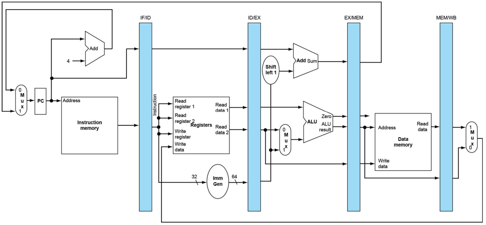
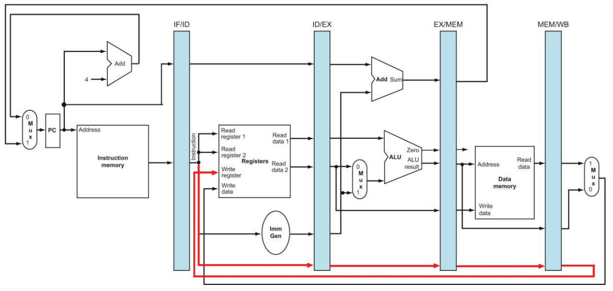
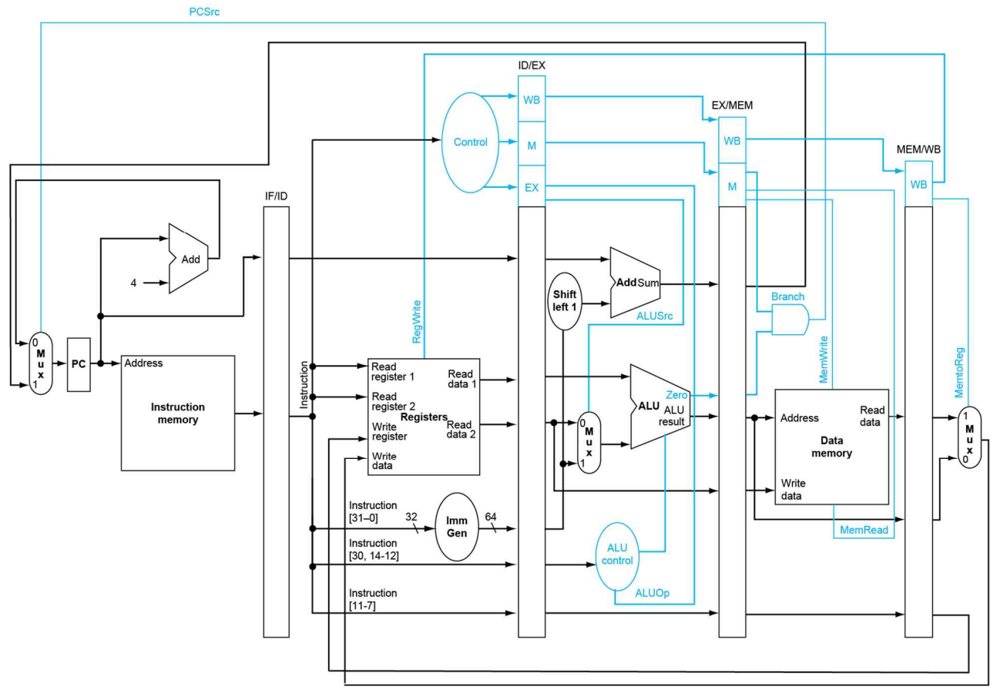

> 2023년 2학기 컴퓨터 구조론 수업을 듣고 정리한 내용입니다. 수업 교재는 [컴퓨터 구조 및 설계 RISC-V 2판](https://product.kyobobook.co.kr/detail/S000060622658)입니다.

# 단일 사이클 데이터 패스의 문제

element가 많아질수록 클럭 사이클 시간이 길어진다. 따라서 명령어를 처리하는 시간이 굉장히 길어지기 때문에 CPU의 성능이 저하된다.

이 문제를 해결하기 위해 각 element를 단계로 분할하여 병렬적으로 실행하는 파이프라인 데이터 패스가 등장했다.

# 파이프라인 데이터 패스

앞서 살펴봤던 단일 사이클 데이터 패스는 총 5단계로 구성되어 있다.

1. IF : 명령어 인출
2. ID : 명령어 해독 및 레지스터 인출
3. EX : ALU 연산
4. MEM : 데이터 메모리 접근
5. WB : 레지스터에 쓰기

파이프라인 데이터 패스는 각 단계 사이마다 **버퍼 레지스터**를 둔다. 버퍼는 명령어가 실행되기 위한 정보를 담는다. 각 단계는 버퍼에 담긴 데이터를 통해 명령어를 처리한다. 

이전 단계가 명령어를 처리하고 나면 다음 단계를 위해 버퍼에 처리 결과를 저장한다. 다음 단계는 이전 단계가 처리한 결과에 의해 명령어를 처리한다. 결과적으로 각 단계는 매 클럭마다 **버퍼를 통해 독립적으로 명령어를 처리할 수 있으므로** 한 클럭에 여러 개의 명령어를 처리하게 된다. 이렇게 된다면 단일 사이클 데이터 패스보다 더 좋은 CPU 성능을 만들어 낸다.

# 전체 데이터 패스

각 단계마다 버퍼 레지스터에 처리 결과를 저장한다. 하지만 마지막 단계인 레지스터에 쓰기 단계에서 레지스터에 쓰는 작업을 한다면 rd값 즉 데이터를 저장할 레지스터의 인덱스가 필요하다. 그러려면 마지막 단계까지 rd값을 전파하여야 한다. 

그러므로 위 그림처럼 명령어 해독 단계에서 rd값을 레지스터에 쓰기 단계까지 전파시키게 된다.

## 제어 신호 전파

단일 사이클 데이터 패스에서는 각 element마다 제어 신호를 통해 element에게 행동을 지시했었다. 파이프라인 데이터 패스에서는 한 클럭에 여러 개의 명령어를 처리하므로 **컨트롤 유닛이 만들어내는 제어 신호 또한 버퍼에 저장하여** 병렬적으로 명령어를 처리할 때 사용되어야 한다. 그러므로 rd값을 레지스터 쓰기 단계까지 전파시켰듯이 제어 신호들 또한 버퍼 레지스터를 통해 전파시킨다.

결과적으로 이런 데이터 패스를 얻게 된다.
