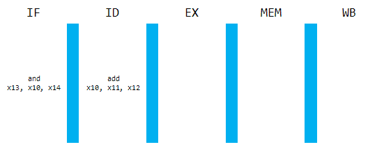
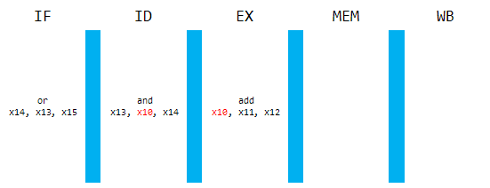
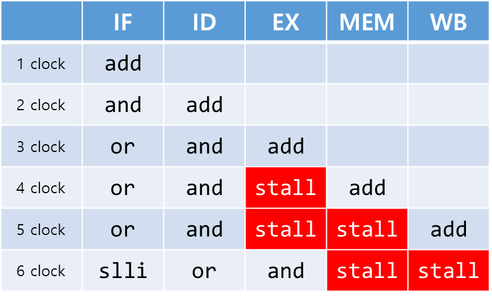
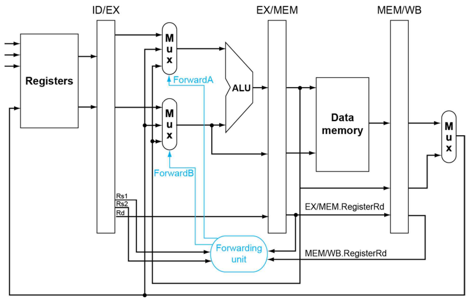
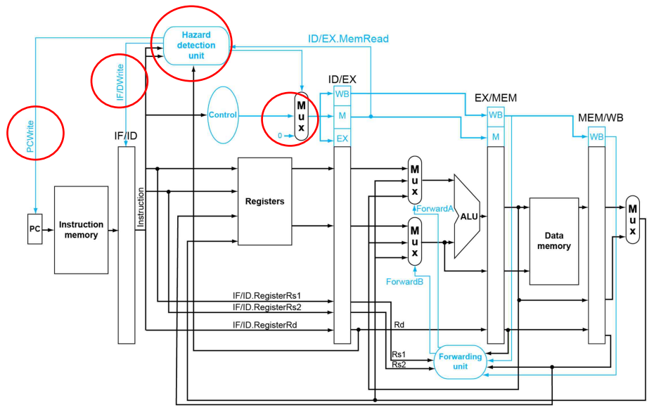

> 2023년 2학기 컴퓨터 구조론 수업을 듣고 정리한 내용입니다. 수업 교재는 [컴퓨터 구조 및 설계 RISC-V 2판](https://product.kyobobook.co.kr/detail/S000060622658)입니다.

# 데이터 하자드

파이프라인 데이터 패스를 통해 다음 명령어를 실행해보자.

```
 0 add  x10, x11, x12
 4 and  x13, x10, x14
 8 or   x14, x13, x15
12 slli x12, 100(x10)
```


PC값은 0번부터 초기화 되어있다. `add x10, x11, x12` 명령어가 인출된다. 인출된 명령어는 디코딩 단계로 진입한다.



다음 클럭에는 ID단계에서 인출한 명령어가 있으므로 그 명령어를 해독하고 레지스터값을 읽어와 ALU에게 전달하게 된다. 그리고 현재 PC값은 4이므로 `and x13, x10, x14` 명령어가 인출된다.



다음 클럭에는 EX단계에서 ALU가 명령어를 처리한다. 버퍼에 저장된 레지스터를 연산한다. ID단계에는 직전에 인출된 명령어인 `and x13, x10, x14`를 해독하고 레지스터값을 읽어온다. 똑같이, 현재 PC값이 8이므로 `or  x14, x13, x15`가 인출된다.

그런데, 명령어를 해독하다보니 **`x10` 레지스터**를 읽어오고 있다. 직전 명령어를 살펴보면 `x11`과 `x12`에 저장된 데이터를 읽어온 후 **두 값을 더하여 `x10`에 저장하고 있다**.

즉, ID단계에서 `x10`을 불러올 때에는 **레지스터에 저장된 값이 이전 명령어의 결과값일 것임을 기대하고 있다**. 하지만 **_아직 WB단계를 거치지 않았으므로 이전 명령어의 결과값이 불러와지지 않는다_**. 이것이 데이터 하자드다.

데이터 하자드는 현재 실행되는 명령어가 직전 또는 직직전 명령어에 종속되어 현재 명령어를 실행하기 위해서는 종속된 명령어의 결과를 기다려야 함을 의미한다. CPU의 성능을 저하시키는 요인으로 작용한다.

# 해결 방법

1. 지연시키기
2. `nop`
3. 코드 재배열
4. 전방 전달 또는 우회

## 지연시키기

종속된 명령어의 실행이 끝나기까지 강제로 파이프라인을 지연시키는 방법이다.



예시로 든 명령어는 and 명령어가 add 명령어에 종속되어 있기 때문에 add가 처리될 때까지 더이상 명령어 인출을 하지 않고 기다리게 된다.

## nop

명령어 인출을 하지 않는 방법이 약간은 복잡하기 때문에 단순히 소프트웨어단에서 아무것도 하지 않는 명령어를 넣는 방법이다.

컴파일러가 명령어 코드를 생성한다면 이렇게 될 것이다.

```
 0 add  x10, x11, x12
 4 nop
 8 nop
12 and  x13, x10, x14
16 or   x14, x13, x15
   ...
```

## 코드 재배열

아무것도 하지 않는 명령어를 넣는다면, *종속성에 관련없는 명령어 코드*를 끼워 넣는 편이 더 낫다고 할 수 있다. 컴파일러에 따라 이런 테크닉이 가능하면 불필요한 실행 시간을 줄일 수 있다.

## 전방 전달 또는 우회

**종속된 명령어가 데이터를 필요로 할 때 곧바로 전달해주는 방법이다**. 예시로 든 명령어를 살펴보면 EX단계에서 연산한 결과를 바로 ID단계의 버퍼로 전달시켜준다면 데이터 하자드를 회피할 수 있다.

5개의 단계를 거치는 파이프라인 데이터 패스에서 전방전달을 해야할 때는 다음과 같다.

1. 연산 결과를 필요로 할 때 (EX)
2. 메모리의 데이터를 필요로 할 때 (MEM)
3. 레지스터에 쓴 데이터를 필요로 할 때 (WB)

### EX, MEM단계 포워딩

연산 결과 또는 메모리 데이터를 전방 전달해야하는 경우다.

만약 연산 결과를 전방 전달해야한다면 EX단계와 MEM단계 사이의 버퍼(EX/MEM)에 담긴 `rd`값을 필요로 하는지 확인해야하며 연산 결과가 종국엔 레지스터에 쓰여지는지 확인해야한다.

또는 메모리 데이터를 전방 전달해야하는 경우라면 직전에 검사한 조건처럼 검사하되 EX/MEM 버퍼 대신 MEM/WB 버퍼를 확인해야한다.

불필요한 전방 전달을 피하기 위해 rd값이 0인(읽기전용 레지스터인) 경우는 예외처리를 한다.

레지스터에서 값을 읽어오는 대신 전방 전달을 하여 값을 갖고오는 것이므로 3가지의 입력이 들어가게 된다(레지스터, EX_MEM 버퍼, MEM_WB 버퍼). 따라서 멀티플렉서를 사용하여 입력을 받은 후 별도의 포워딩 유닛이 제어 신호를 생성하면 된다.



만약 아래와 같은 명령어를 실행한다면 종속성이 두 개나 발견된다.

```
add x2, x3, x4
add x2, x2, x5
add x6, x2, x7
```

3번째 명령어는 2번째 명령어의 rd와 1번째 명령어의 rd에게 종속성을 갖는다고 볼 수 있다. 이럴 때에는 가장 가까운 명령어에게 종속성을 갖도록 처리하면 된다.

```js
if (EX_MEM.RegWrite && ID_EX.rs1 == EX_MEM.rd && EX_MEM.rd != 0)
  // ALU 연산 결과를 필요로 할 때
  forwardA = 00
else if (MEM_WB.RegWrite && ID_EX.rs1 == MEM_WB.rd && MEM_WB.rd != 0)
  // 메모리 데이터를 필요로 할 때
  forwardA = 10
// 위 두 가지가 아니면 레지스터를 읽기
else forwardA = 01
```

### WB단계

```
lw  x10, 12(x11)
add x13, x10, x11
```

이런 명령어를 실행한다고 생각하자. `lw`는 레지스터에 쓰기 단계(WB)를 거치는 명령어인데, ALU 연산 결과는 접근할 데이터 메모리의 주소값이다. 그러므로 연산 결과를 전방 전달할 수 없고, 메모리에 접근을 해야만 전방 전달이 가능하다. **따라서 한 단계를 강제로 지연시켜야 한다.**

앞서 `RegWrite`를 검사했던 것처럼, `MemRead`인지 확인하고 그 때의 `rd`값이 `rs1` 또는 `rs2`와 같은지 확인해야한다. 

```js
if (ID_EX.MemRead && ((IF_ID.rs1 == ID_EX.rd) || (IF_ID.rs2 == ID_EX.rd)))
    // 읽어올 데이터 메모리에 종속성을 가질 때
    // 지연시키기
```

지연시키는 방법은 컴파일러 대신 **제어신호를 모두 0으로 만들어** 아무것도 하지 않도록 만든다. PC값 또한 변하지 않도록 **같은 명령어를 계속 인출하게 만든다**. 이렇게 된다면 명령어를 인출하되 아무런 행동도 하지 않게된다.


