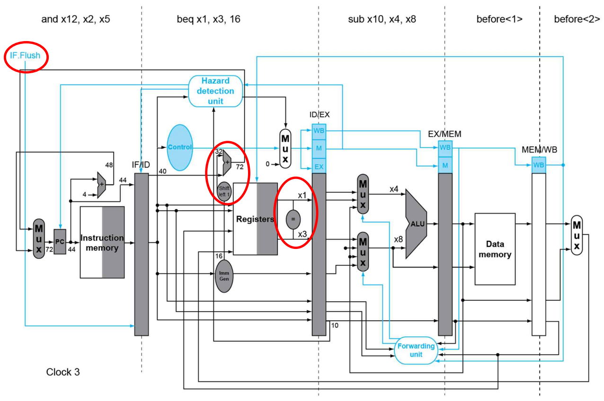
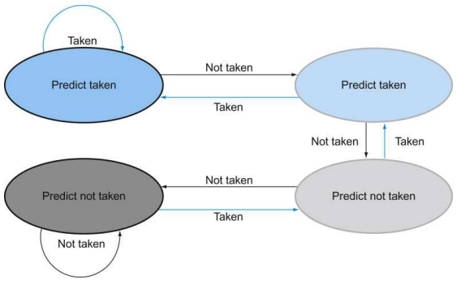

> 2023년 2학기 컴퓨터 구조론 수업을 듣고 정리한 내용입니다. 수업 교재는 [컴퓨터 구조 및 설계 RISC-V 2판](https://product.kyobobook.co.kr/detail/S000060622658)입니다.

# 분기 하자드

데이터 하자드와 유사하게, 분기 명령어를 실행할 때 발생한다.

다음과 같은 명령어 코드를 파이프라인 데이터 패스에서 실행한다고 생각하자.

```
 0  beq x10, x11,  12
 4  add  x2,  x3,  x4 <--
...
12   or x14, x28, x27
16  add x12, x11, x10
```

파이프라인 데이터 패스에 의해 순차적으로 해독된 명령어는 각 단계에서 병렬적으로 실행된다. 그런데 `beq` 명령어는 분기 명령어로 두 레지스터가 같다면 현재 PC값에 상수를 더해 PC값을 변하게 만든다. 하지만 **실제로 분기를 해야하는지 판단하는 단계는 MEM단계**다. 

즉 MEM단계 이전에는 **실행 여부가 불확실한 명령어**를 인출, 해독하고 있다. 다시 말해 분기 명령어를 실행한다면 다음 명령어가 정확히 어떤 것인지 알 수 없다. 이것이 분기 하자드다.

# 분기 시 지연

단순하게 분기 명령어 이후의 명령어가 어떤 것인지 결정되기 전까지 지연하는 방법이다. 분기가 확실한지 알기 위해서는 MEM단계까지 가야하므로, 3클럭 손실이 발생한다.

MEM단계에서 분기를 예측하는 것보다 *ID단계*에서 레지스터에 접근하자마자 분기를 판단하는 방법을 사용한다면 1클럭 손실로 줄일 수 있다.



별도의 분기 유닛을 두어 명령어 해독과 함께 분기를 판단한다. 만약 분기를 해야한다면, 현재 *IF단계에 인출된 명령어를 실행시키지 않기 위해* 그 명령어의 opcode를 0으로 만들어 아무런 행동을 하지 않도록 만든다.

# 분기 예측

지금은 5단계의 파이프라인 데이터 패스지만, 단계가 많아질수록 분기 손실이 매우 커진다. 그러므로 분기 여부를 예측, 단정짓고 진행하다가, 예측이 틀렸을 경우에만 rollback하여 진행한다. 이럴 경우에는 예측에 실패했을 때 손실이 생기며 좋은 알고리즘으로 이 손실을 최소화하여야 한다.

## 정적 분기 예측

명령어를 해독할 때 얻은 정보로만 분기를 예측한다. 분기가 일어나지 않는다고 가정하면 분기 명령어 다음에 있는 명령어를 순차적으로 실행한다. 하지만 실제로 분기가 일어나야 한다면 **처리하고 있던 명령어를 전부 쓸어내고** 분기 목적지부터 실행을 재개한다. 

명령어들을 쓸어내기 위해서는 제어 신호를 모두 0으로 설정하는 방법이 있다. 이렇게 하면 어떤 처리를 하게 되더라도 실제로 레지스터나 메모리에 변화가 없게 된다.

## 동적 분기 예측

프로그램을 실행하면서 별도의 상태를 설정하고, 분기 예측에 성공하거나 실패할 때마다 상태를 업데이트하여 동적으로 분기를 예측한다.

### 2비트 분기 예측



이 상태도를 살펴보면 예측이 연속으로 두 번 틀렸을 때 다음 예측 방향을 바꾸게 된다. 두 번 틀릴 것을 한 번만 틀리게하는 방법으로 좋은 알고리즘의 예시다.
