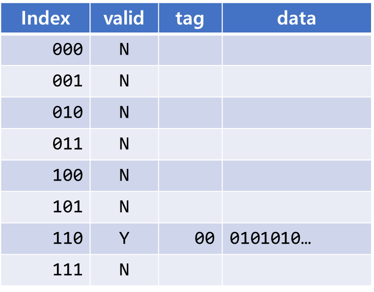
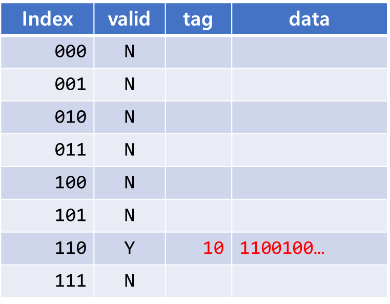
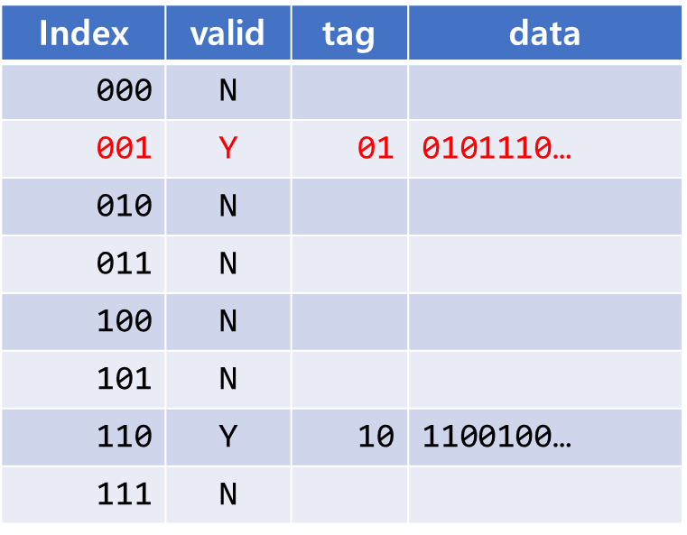
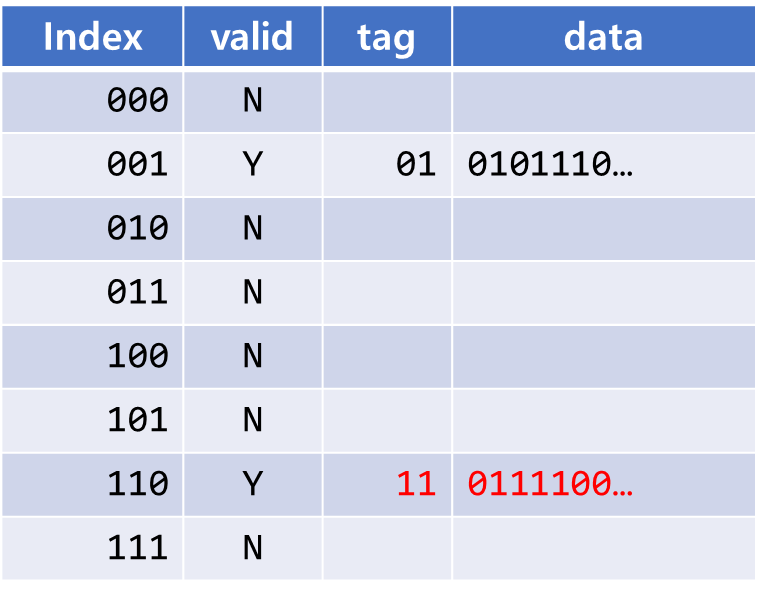

> 2023년 2학기 컴퓨터 구조론 수업을 듣고 정리한 내용입니다. 수업 교재는 [컴퓨터 구조 및 설계 RISC-V 2판](https://product.kyobobook.co.kr/detail/S000060622658)입니다.

# 메모리별 특징

## SRAM

비트 하나를 나타내는 데에 트랜지스터가 많이 필요하다. 비싸다. 대신 리프레시가 필요없다. 그렇기 때문에 접근 시간이 굉장히 짧다.

## DRAM

데이터를 전하 형태로 커패시터에 저장한다. 그래서 비트 하나를 표현하기 위해 트랜지스터 1개가 필요하다. 싸다. 대신 수 밀리초 동안만 유지되기 때문에 주기적인 리프레시가 필요하다. 그러므로 SRAM보다 읽는 데에 시간이 더 필요하다. 

## 디스크 메모리

원판에 데이터를 저장한다. 원하는 데이터를 읽기 위해서는 원판을 회전시키고 각 트랙 및 섹터를 찾아가는 시간이 필요하므로 훨씬 더 느리다. 대신 저장 용량이 굉장히 크다.

이렇게 메모리 종류별로 속도 및 용량에 차이점이 있으므로, CPU가 원하는 데이터를 빠르게 읽기 위해서는 **캐시**가 필요하다.

캐시는 메모리 계층에서 주기억장치와 프로세서 사이에 있는 중간 단계로, 프로세서가 더 빠르게 데이터를 읽고 쓸 수 있게 해주는 역할을 담당한다. 

# 지역성

캐시에 메모리를 저장하고 프로세서가 그것을 읽게 되는데, 캐시에 원하는 정보가 담겨 있어야 주기억장치까지 탐색하지 않을 수 있다. 그러려면 미리 캐시에 원하는 정보를 담아두어야 하는데 두 가지 지역성의 원리에 따라 담는다.

## 시간적 지역성

최근에 참조한 데이터는 연이어 참조될 확률이 높다. 예를 들어 반복문 속에서 변수의 값을 바꾼다고 하면 지속적으로 참조되고 있으므로 캐시를 통해 접근 시간을 줄인다면 성능이 향상된다.

```c
int sum = 0;
for(int i=1; i<=100; i++) {
  sum += i; // sum이 지속적으로 참조되고 있다.
}
```

## 공간적 지역성

참조한 데이터 주위에 있는 데이터 또한 참조될 확률이 높다. 예를 들어 배열에 접근한다고 하면 접근한 데이터 주변에 있는 데이터 또한 인덱스를 변경함으로써 접근될 확률이 높다.

```c
int arr[100];
for(int i=0; i<100; i++) {
  arr[i] = i*i; // 인덱스 i의 주변에 있는 데이터 또한 참조되고 있다.
}
```

# 성능

캐시의 성능은 **적중 시간 및 실패율, 실패 손실**에 의해 결정된다. **적중 시간**은 **캐시에 원하는 데이터가 있는지 확인하는 시간**이며, **실패 손실**은 **캐시에서 원하는 데이터를 찾을 확률**이며 이것은 실패율로 나타낼 수 있다. 

$$
평균\space메모리\space접근시간 = 적중\space시간 + 실패율 * 실패\space손실
$$

# 직접 사상 캐시

캐시 블록에 메모리 워드 하나를 저장한다. 이 때 캐시 블록이 $$2^N$$개라면, **메모리 주소의 하위 N비트를 캐시 블록의 인덱스로 사용**한다. 그리고 **남은 비트들은 `tag`에 저장**된다. 캐시 블록에 데이터가 없을 때에는 `valid`가 `N`으로 초기화 되어있고, 캐시에 데이터를 적재한다면 `Y`로 갱신한다.

예를 들어 메모리 주소 `00110`에 저장된 데이터를 캐시에 저장한다고 하면 아래 테이블처럼 된다.



캐시 블록이 $$2^3=8$$개이므로 메모리 주소 `00110`의 하위 N비트인 `110`이 인덱스로, 남은 `00`이 tag로 들어가게 된다. valid는 `Y`로 바뀌게 되고, 메모리에 들어있는 데이터가 저장된다.

이 때 메모리 주소 `10110`에 저장된 데이터를 캐시에 저장하면 이렇게 바뀐다.



하위 N비트를 제외한 남은 비트들인 `10`이 tag항목에 저장되면서 캐시가 갱신된다. 

## 캐시 접근

캐시에 접근해서 원하는 데이터를 찾았다면 `Hit`, 그렇지 못했다면 `Miss`로 표현한다.

`Hit`되기 위해서는 해당하는 인덱스 블록이 valid해야하고, tag또한 일치해야한다.

예를 들어 위 테이블에서 메모리 주소 `01001`에 접근하기 위해 캐시에 접근했다면 `001`인덱스에 `valid`비트가 `N`이므로 `Miss`다. 원하는 데이터를 얻지 못했다면 주기억장치에 접근하여 데이터를 읽어야 한다. 데이터를 읽어온 후 캐시에 업데이트하게 되면 아래와 같이 변한다.



만약 올바른 인덱스에 접근했고 `valid`도 `Y`인데 `tag`항목이 다르다면 이것 또한 `Miss`다. 

예를 들어 메모리 주소 `11110`에 접근하기 위해 캐시에 접근했다고 하자. 그럼 `tag`가 일치하지 않으므로 `Miss`이고, 캐시 테이블 또한 이렇게 바뀐다.



## 캐시 실패 처리 

명령어 메모리에서 캐시 실패가 일어났다면 인출을 중지하고 PC값을 메모리로 보내 데이터를 읽은 후 캐시에 저장한다. 그 후 다시 명령어 파이프라인을 진행한다.

데이터 메모리에서 캐시 실패가 일어났다면 메모리에서 데이터를 읽어올 때까지 파이프라인을 정지한다.

## 캐시 쓰기

캐시에 어떤 데이터를 쓴다면 종국에는 주기억장치에 업데이트 해야한다. 업데이트 하는 방법은 다음과 같다.

### 즉시 쓰기

캐시에 쓰기 작업을 한다면 메모리에도 동시에 쓴다. 하지만 이렇게 할거면 메모리에 계속 접근하는 셈이 되므로 성능 향상을 꾀할 수 없다.

### 쓰기 버퍼

캐시에도 쓰고 버퍼에도 쓴다. 그리고 메모리에 쓰는 작업은 쓰기 버퍼가 담당하게 내버려 둔 후 다시 명령어를 처리한다. 

이 때 버퍼는 큐 형태로 동작하며 큐에 데이터가 꽉 차서 오버플로우가 일어나면 파이프라인이 잠시 정지하게 된다.

### 나중 쓰기

당장에는 캐시에 데이터를 저장하되 캐시에서 쫓겨날 때(?) 메모리에 쓰기 작업을 한다. 별도의 비트를 두어 쓰기 작업을 했는지 관리한다. 

