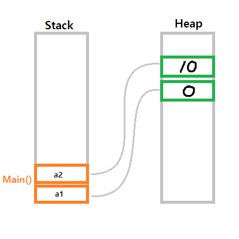

# 문제

유니티로 게임을 개발하기 위해 스크립트를 짜고 있었다. 리스트에 들어있는 인스턴스와 다른 인스턴스를 교환(swap)하는 코드를 짜고 있었는데, 아무리 해도 바뀌지 않는 것이었다. 

변수의 형식에 대해 어렴풋이 이해를 하고 있어서 교환이 제대로 안되는 이유를 몰랐다. 참조 형식이면 포인터 아닌가? 라고 생각해, 교환이 될 것이라고 생각했었지만 되지 않았다.

```csharp
public class Program {
    public class A
    {
        public A(int data = 0)
        {
            this.data = data;
        }
        public int data;
    }
    public static void Main(string[] args)
    {
        A a1 = new A(), a2 = new A(10);
        // a1.data = 0, a2.data = 10
        Swap(a1, a2);
        // a1.data = 10, a2.data = 0 ...?
    }

    public static void Swap(A a1, A a2)
    {
        A t = a1;
        a1 = a2;
        a2 = t;
        // for test
        Console.WriteLine($"{a1.data}, {a2.data}"); 
    }
}
```

이전에 형식에 대해 잠깐 읽었던 기억에 의존하면, 클래스는 **참조 형식**이어서 인스턴스를 생성하면 실제 데이터는 힙에 저장되고, 변수는 그 메모리를 참조하게 된다고 이해했었다. 

그래서 저 코드대로 실행하면 Swap 메소드의 파라미터는 main 함수 안에 있는 a1, a2가 가리키는 메모리를 참조하는 변수가 될 것이라고 생각했고, swap과정을 통해 서로 참조하는 메모리가 교환될 것이라고 이해했었다.

# 디버깅 해보기

이 코드를 그대로 vs의 디버거로 확인해보면 예상했던 대로 *동작하기는 한다.*


Swap 메소드 내에서 a1의 참조 값과 a2의 참조 값이 교환되었다. 하지만 Swap 메소드 스코프에서 잠깐 벗어나 Main 함수의 스코프로 돌아가보면,


Main 함수 내에서는 참조가 바뀌지 않았다. 이 이유를 그림으로 그리면 이렇다.



`Swap()`을 호출하기 전에는 메모리에 이렇게 저장되어 있다. 힙 메모리에 실제 인스턴스가 저장되어있고, 그 메모리에 대한 참조가 스택에 저장되어 있다.(a1, a2에 각각 담긴다.)

이제 Swap 메소드를 호출하면 어떻게 될까?


Swap의 파라미터인 a1, a2에 Main에서 생성했었던 a1과 a2의 참조가 복사되어 넘어간다. 이제 Swap 메소드 내에서도 같은 객체를 참조할 수 있다.

하지만 교환하는 코드를 실행하고 나면 이렇게 된다.


***Swap 메소드의 스코프 내에서 a1과 a2가 각각 참조값을 교환했을 뿐***, Main 함수에 있는 변수의 참조값은 바뀌지 않았다.

이 이유는 파라미터로 넘겨줄 때 **참조값이 복사되어 새로운 변수에 저장되었기 때문이다**. 이를 해결하기 위해 `ref` 키워드를 사용하여야 한다.

# ref

파라미터에 전달되는 값이 참조임을 나타낸다. 파라미터에 `ref`가 사용되었으면 함수를 호출할 때에도 `ref`키워드를 사용하여 참조가 전달되도록 해야한다.

```csharp
void foo(ref int A) { }

int data = 100;
foo(ref data);
```

주의할 점은 `ref`키워드가 사용된 변수는 선언과 동시에 초기화되어야 한다는 점이다. 게다가 `null`을 가질 수 없다.

`ref`로 전달된 파라미터는 인자로 전달되는 변수와 **똑같은 모습으로 작동한다**. 같은 인스턴스를 가리킬 뿐만 아니라, 변수에 다른 인스턴스의 참조가 저장되었을 경우 인자로 전달되었던 변수도 다른 인스턴스를 가리키게 된다.

**C++의 레퍼런스**(`&`)와 매우 유사한 개념이다. 같은 변수를 다른 이름으로 부르는 것으로 보면 될 것 같다. 

또다른 효과는 반환에 의한 복사나 함수 호출에 의한 복사가 일어나지 않는다는 점이다. 단순히 변수의 별칭을 만들어 전달하기 때문에 값을 복사하는데 드는 비용을 줄일 수 있다.

# 결과

종합해보면, 어떤 두 변수의 참조값을 다른 스코프에서 교환하고 싶을 때에는 `ref`키워드로 참조로 전달해야한다. `ref`키워드를 사용하지 않으면 값으로 전달된다.

Main 함수에 선언된 a1과 a2가 가진 참조를 Swap 메소드를 통해 교환하려면 **a1과 a2의 별칭을 인자로 받도록** 만들면 된다.

```csharp
public class Program {
    class A
    {
        public A(int data = 0)
        {
            this.data = data;
        }
        public int data;
    }
    static void Main(string[] args)
    {
        A a1 = new A(), a2 = new A(10);
        Console.WriteLine($"{a1.data}, {a2.data}"); // 0, 10
        Swap(ref a1, ref a2);
        Console.WriteLine($"{a1.data}, {a2.data}"); // 10, 0
    }

    static void Swap(ref A a1, ref A a2)
    {
        A t = a1;
        a1 = a2;
        a2 = t;
    }   
}
```

# 참고 문서

[ref 키워드 - C# 참조 | Microsoft Learn](https://learn.microsoft.com/ko-kr/dotnet/csharp/language-reference/keywords/ref)