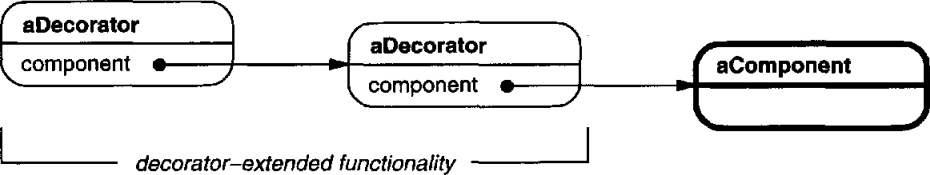

# 의도

객체에 **동적으로 새로운 책임**을 추가한다. 기능을 추가할 때 서브 클래스를 만드는 것보다 더 쉬운 방법을 제공한다.

# 사용 시기

- 다른 객체에게 영향을 주지 않고 개개의 객체에게 새로운 책임을 줘야할 때
- ***서브 클래스를 만드는 방법이 실용적이지 않을 때***, 또는 독립적인 책임이 너무 많아 **서브 클래싱으로 확장하기 어려울 때**

# 장점

상속으로 생기는 정적인 책임 관계보다 융통성을 가진다. 즉, 런타임 시기에 책임을 동적으로 추가, 삭제할 수 있다.

# 단점

객체에 추가되는 책임이 정의된 작은 객체들이 많이 만들어지므로 각각의 객체에 대한 이해가 꼭 필요하다.

추상 클래스에 정의된 내용을 모든 데코레이터의 서브 클래스가 구현해야하므로 추상 클래스가 거대해질수록 비용이 많이 든다.

# UML


컴포지트 패턴처럼 기초가 될 Component 추상 클래스를 정의한다. Component에는 데코레이터가 실행할 메서드인 `Operation()`를 정의한다.

Decorator는 Component를 상속받되 하나의 Component를 자식으로 갖는다. Decorator의 `Operation()`이 호출될 때 자식으로 갖는 Component의 `Operation()`을 호출한다.

Decorator의 서브 클래스는 조금 다르게 동작하는데, `Operation()`이 호출될 경우 먼저 자신의 부모 클래스인  **Decorator의 `Operation()`을 호출한다**. 그 다음 자신이 별도로 구현한 메서드를 실행한다.



데코레이터에 데코레이터를 추가하는 과정이 연이어 일어나면 위 그림처럼 연쇄적으로 호출되는 상황이 벌어진다.

# 구현

어떤 무기에 인챈트를 걸었다면 공격할 때마다 특수 효과가 발동된다. 

인챈트의 종류는 매우 많기 때문에 이를 일일히 상속으로 구현하려면 매우 까다로워진다. 여기서 데코레이터를 통해 무기를 감싸는 객체에게 효과를 부여하여 특수 효과를 적용할 수 있다.

```cpp
class Weapon {
public:
    virtual void attack();
}

class Sword {
public:
    virtual void attack() { 
        printf("물리 공격!");
    }
}
```

Sword클래스는 Weapon클래스의 서브 클래스다. 각 인챈트의 종류마다 서브 클래스를 만들 수 없으므로 데코레이터를 구현한다.

```cpp
class WeaponDecorator : public Weapon {
public:
    WeaponDecorator(Weapon* weapon) : _weapon(weapon) { }
    virtual void attack() {
        _weapon->attack();
    }
private:
    // 데코레이터는 Weapon 클래스의 서브 클래스를 가진다.
    // Weapon 클래스에 정의된 요청이 들어올 경우
    // 서브 클래스에게 그 요청을 무조건 전달해야한다.
    Weapon* _weapon;
}

class DrainHealthWeapon : public WeaponDecorator {
public:
    DrainHealthWeapon(Weapon* weapon) : WeaponDecorator(weapon) { }
    virtual void attack() {
        WeaponDecorator::attack();
        // 요청을 전달한 후에는 정의된 기능을 제공한다.
        printf("상대의 체력을 흡혈!");
    }
}

class FlameDamageWeapon : public WeaponDecorator {
public:
    FlameDamageWeapon(Weapon* weapon) : WeaponDecorator(weapon) { }
    virtual void attack() {
        WeaponDecorator::attack();
        printf("상대는 불에 타고 있다!");
    }
}
```

데코레이터의 서브 클래스들에게 `attack` 요청이 전해질 때 부모 클래스에 구현된 함수를 호출한다. 요청을 Weapon 클래스의 서브 클래스에게 전달하는 것이다. 

요청을 전달한 후에는 데코레이터의 서브 클래스마다 정의된 기능을(무기에 추가된 인챈트 효과를) 실행한다.

```cpp
Sword sword;
FlameDamageWeapon flameDamageWeapon(&sword);
DrainHealthWeapon flameDamageAndDrainHealthWeapon(&flameDamageWeapon);
flameDamageAndDrainHealthWeapon.Attack();
// 호출 결과
//
// 물리 공격!
// 상대는 불에 타고 있다!
// 상대의 체력을 흡혈!
```