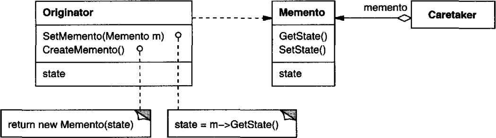
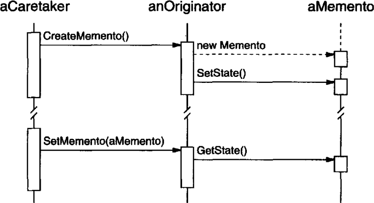

# 의도

캡슐화를 위배하지 않으면서 어떤 객체의 내부 상태를 잡아내고 실체화시켜두어 나중에 객체가 저장해둔 상태로 되돌아오도록 한다.

# UML



Originator는 현재 상태를 저장한 메멘토 객체를 생성하여 반환하고, 전달 받은 메멘토 객체로 현재 상태를 설정하게 된다. 

CareTaker는 Originator의 상태를 저장한 메멘토 객체를 전달 받아, 나중에 이전 상태를 불러와야 할 경우 `SetMemento()`에 메멘토 객체를 넘겨주어 Originator의 상태를 설정한다.

# 사용 흐름



먼저 CareTaker가 Originator에게 현재 상태를 저장하라는 명령(`CreateMemento()`)을 내린다.

Originator는 현재 상태를 저장하는 Memento객체를 생성하여 반환한다.

이후 CareTaker가 특정 메멘토 객체에 저장된 상태로 되돌아가라는 명령(`SetMemento()`)을 내리면, Originator는 현재 상태를 전달된 메멘토 객체에 들어있는 상태로 설정하여 명령을 수행한다.

# 사용 시기

- 어떤 객체의 스냅샷을 저장한 후 나중에 그 상태로 되돌아 가야할 때
- 객체의 내부 구현이 노출되지 않으면서 상태를 저장해야할 때

# 장점

캡슐화를 유지할 수 있다. 복잡한 내부 상태를 다른 객체로 분리하여 캡슐화를 유지하게 된다.(?)

Originator 클래스를 단순화할 수 있다. Originator는 현재 상태를 메멘토 객체에 저장하여 반환하고 전달된 메멘토 객체를 사용하여 현재 상태를 변경하기만 하면 된다. 

# 단점

상태를 저장해야 하므로 비용이 더 들 수 있다. 상태를 보호하는 비용과 상태 복구의 비용이 비싸다면, 메멘토 패턴은 적합하지 않다.

어떤 상황에서는 Originator 외에 다른 클래스가 메멘토에 접근할 수도 있어, 캡슐화가 망가질 수 있다.

보관자 객체는 메멘토 객체를 삭제해야하는 책임이 있다. 

# 구현

세이브 파일을 만든다고 하자. 세이브 파일은 메멘토로 볼 수 있다. 게임 도중에 저장하라는 명령이 전달되면, 게임의 상태를 저장하는 메멘토 객체를 생성한다. 그리고 게임을 시작하기 전에 세이브 파일을 불러와야 한다면 저장된 메멘토 객체를 불러와 게임의 상태를 변경한다.

> 여기서 CareTaker 즉 메멘토 객체를 관리하는 주체는 파일 시스템이 되겠지만 어쨌든 메멘토 패턴으로 볼 수 있다.

```cpp
class Game {
public:
    SaveMemento* Save() {
        return new SaveMemento(this);
    }
    void Load(SaveMemento* saveMemento) {
        // 게임 데이터를 불러오는 작업.
        saveData = saveMemento->GetState();
    }
private:
    SaveData* saveData;
}

class SaveMemento{
public:
    SaveMemento(Game* game) {
        // 세이브 데이터를 생성하는 작업.
    }
    SaveData* GetState() { return saveData; }
    void SetState(SaveData* SaveData) { saveData = saveData;}
private:
    SaveData* saveData;
}

class FileSystem {
public:
    SaveMemento* Open() {
        // 저장공간에 저장되어 있는 세이브 파일을 불러온다.
    }
    void Store(SaveMemento* saveMemento) {
        // 세이브 파일을 저장공간에 저장한다.
    }
}
```

게임 중간에 세이브 파일을 저장하는 요청이 전달되면 SaveMemento 객체를 생성하여 FileSystem에게 전달한다. FileSystem은 세이브 파일 즉, 메멘토 객체를 저장하였다가 특정 시점이 되면 저장한 메멘토 객체를 반환하여 게임의 상태를 변경한다.

```cpp
FileSystem fileSystem;
Game game;

// 게임 중간에 세이브 명령 실행
// -> 파일 시스템에 세이브 파일 저장
SaveMemento* saveMemento = game.Save();
fileSystem.Store(saveMemento); 

//...

// 저장되어 있는 세이브 파일 불러오기
// -> 파일 시스템으로부터 세이브 파일 불러와 게임의 상태 변경
SaveMemento* saveMemento = fileSystem.Open(); 
game.Load(saveMemento);
```

여기에는 실제 데이터인 `SaveData`는 드러나지 않는다. 이렇게 메멘토 패턴을 사용하면 실제 데이터가 노출되지 않는 장점이 있다.

하지만 FileSystem이 세이브 파일을 저장 공간에 저장해야하는데, 이 과정에 드는 비용이 높을 수 있으므로 설계할 때 주의해야한다.