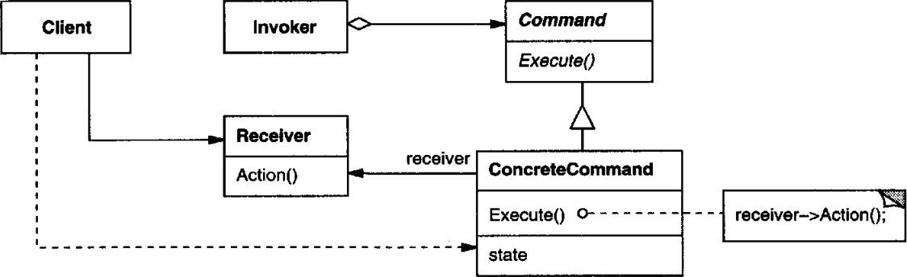
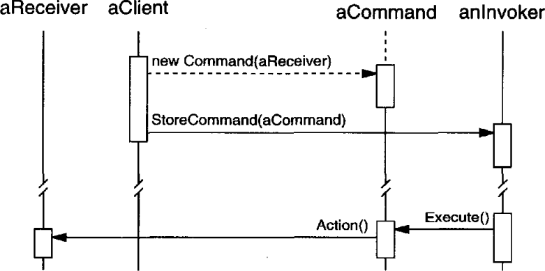

# 의도

요청 자체를 캡슐화하는 것이다. 이를 통해 사용자를 서로 다른 요청으로 매개변수화하거나, 요청을 로깅 또는 대기시킬 수 있고, 되돌릴 수 있는 연산을 지원한다.

# UML



Receiver는 어떤 동작을 하는 객체다. 이 객체를 다루는 책임은 Command 클래스가 담당한다.

Command 클래스에는 명령이 들어올 경우 자신이 갖고 있는 객체를 다루는 메서드를 정의한다. Command의 서브 클래스에서 그 메서드를 구현해 명령에 대한 구체적인 행동을 구현한다.

Invoker는 명령을 내리는 객체다. Invoker 객체가 참조하고 있는 Command 객체에게 명령을 내린다.

## 사용 흐름



먼저 사용자가 새로운 Command를 생성하면서 Receiver 객체를 인자로 넘겨준다.

그리고 Invoker에게 방금 생성한 Command 객체를 등록한다.

명령을 내릴 때가 되었다면 Invoker 객체에게 등록된 명령을 수행하도록 요청한다.

Invoker객체는 등록된 Command 객체를 실행하여 명령을 실행한다.

# 사용 시기

- 수행할 동작은 객체로 매개변수화하고자 할 때. 즉, 콜백 함수를 객체로 만든 것이다.
- 요청을 명시하고 저장하며 실행하고 싶을 때. 명령 객체가 독립적으로 표현되어야 할 때(?) (If the receiver of a request can be represented in an address space-independent way,)
- 되돌리기 기능을 지원해야할 때.
- 트랜잭션을 지원해야할 때.

# 장점

명령을 호출할 객체와 명령을 구현하는 객체를 분리할 수 있다.

한 명령이 여러 명령을 실행하도록(매크로처럼) 만들 수 있다.

# 단점

되돌리기(Undo)나 재시도(Redo)기능을 지원하려면 명령 객체가 추가적인 상태 정보를 갖고 있어야 한다. 명령이 수행되기 전의 원래 값을 알고 있어야 한다. 한 단계를 되돌리려면 직전의 상태 값을 알고 있으면 되는데, 여러 단계를 되돌리려면 실행 기록 전체를 관리해야 한다. 

취소, 재시도 명령을 반복하다가는 언젠가 오류가 터지는 상황이 생기므로 명령이 제대로 실행되었는지 검사하는 연산이 필요하다.

# 구현

메모장을 구현한다고 하자. 키 입력을 받으면 키에 할당된 명령이 수행된다.

Command객체는 구현된 명령을 수행하기 위해 메모장을 참조하고 있어야 한다.

```cpp
class Command {
public:
    virtual ~Command() { }
    virtual void execute() = 0;
protected:
    Command() { }
}
```

```cpp
class DefaultKeyCommand : public Command {
public:
    DefaultKeyCommand(Notepad* notepad, char key) : _notepad(notepad) { 
        _key = key;
    }

    virtual void execute() {
        _notepad->AddChar(_key);
    }
private:
    char _key;
    Notepad *_notepad;
}

class MacroCommand : public Command {
public:
    MacroCommand(Notepad* notepad, Command[] commandPtr) :
      _notepad(notepad) {
          while(commandPtr != null) {
              _commandList.push(commandPtr++);
          }
      }

    virtual void Execute() {
        // run all command in _commandList
    }
private:
    List<Command*> _commandList;
    Notepad *_notepad;
}
```

메모장에 문자를 하나 추가하는 명령 객체와 여러 명령을 갖고 있는 매크로 명령 객체가 있다.

사용자는 명령 객체를 생성하여 저장해둠으로 명령을 동적으로 변경하거나 실행할 수 있다.