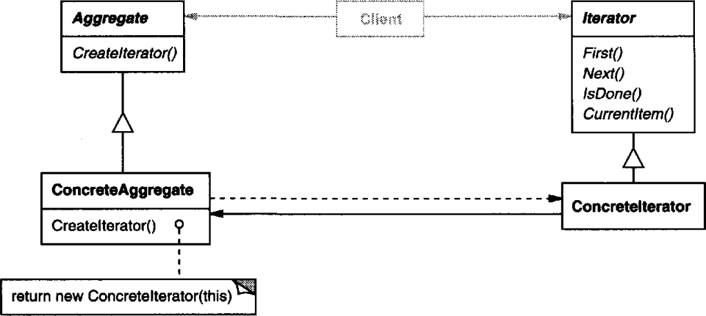

# 의도

객체의 내부 표현부를 노출하지 않으면서 집합에 속한 원소들을 순회하는 방법을 제공한다.

리스트 객체에 접근해서 새로운 내용을 삽입, 삭제 또는 순회하는 내용을 반복자 객체에 정의하여 집합 객체의 인터페이스를 확장시키지 않게 된다.

# UML



어떤 데이터들을 가진 객체(Aggregate)는 반복자(Iterator)를 생성한다.

Iterator를 생성할 때 *자기 자신을 인자로 넘겨* Aggregate가 가지고 있는 원소들을 Iterator가 접근할 수 있게 한다.

결과적으로 Iterator는 자신이 참조하고 있는 Aggregate의 원소를 다루는 메서드를 제공하여, **사용자가 Aggregate의 내부 표현을 모르고도** 원소를 순회할 수 있게 한다.

# 사용 시기

- **객체 내부 표현 방식을 모르고도** 집합 객체의 각 원소들에게 접근하고 싶을 때
- 집합 객체를 순회하는 **다양한 방법을 지원****하고 싶을 때
- 서로 다른 집합 객체 구조(?)에 대해서도 동일한 방법으로 순회하고 싶을 때

# 장점

집합 객체의 다양한 순회 방법을 제공한다. 집합 객체에 종속적으로 구현하지 않으므로 런타임에 순회 방법을 변경할 수 있다.

# 단점

???

# 구현

C++과 Java에는 List를 순회할 때 반복자(Iterator)를 제공하고 있다. 반복자를 사용한다면 사용자는 내부에서 순회하는 내용에 대해 구체적으로 알 필요가 없게 된다.

집합 객체중에 리스트를 예시로 들어 인터페이스를 정의한다.

```cpp
template <class Item>
class AbstractList {
public:
    AbstractList(long size = 0);
    virtual Iterator<Item>* CreateIterator() const = 0;

    long Count() const;
    Item& Get(long index) const;
}
```

`CreateIterator()`로 생성될 반복자의 인터페이스를 정의한다.

```cpp
template <class Item>
class Iterator {
public:
    virtual void First() = 0;
    virtual void Next() = 0;
    virtual bool IsDone() const = 0;
    virtual Item& CurrentItem() const = 0;
protected:
    Iterator(); // 생성자를 숨겨 사용자가 직접 생성하지 못하게 막음
}
```

반복자 인터페이스의 서브 클래스는 순회할 집합 객체의 참조자와, 반복자의 현재 위치를 저장한다.

```cpp
class ListIterator : public Iterator {
public:
    ListIterator(const List<Item>* list) : _list(list) { 
        _current = 0;
    }
    virtual void First() {
        _current = 0;
    }
    virtual void Next() {
        _current++;
    }
    virtual bool IsDone() {
        return _current >= _list->Count();
    }
    Item& CurrentItem() {
        return _list->Get(_current);
    }
private:
    const List<Item>* _list;
    long _current;
}
```

사용자는 AbstractList를 상속받는 집합 객체를 생성하고, 순회를 해야한다면 인터페이스에 정의된 `CreateIterator()`를 통해 반복자를 넘겨받게 된다.

```cpp
template <class Item>
class List : public AbstractList {
public:
    // ...
    virtual Iterator<Item>* CreateIterator() const {
        return new ListIterator<Item>(this);
    }    
}
```

사용자는 반복자를 통해 아래처럼 순회할 수 있다.

```cpp
ListIterator<Item>* iter = list.CreateIterator();
for(iter.First(); !iter.IsDone(); iter.Next()){
    iter.CurrentItem(); 
    // 현재 순회중인 iterator의 위치에 있는 원소를 받아옴
    // ...
}
```

순회하는 방법은 Iterator 내부에 정의함으로 다양한 순회 방법을 정의할 수 있다.
