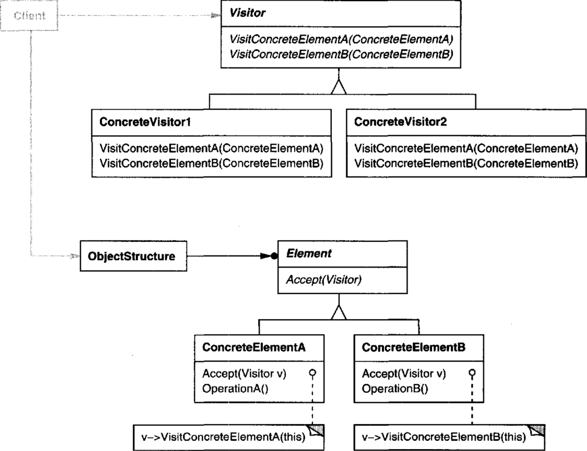
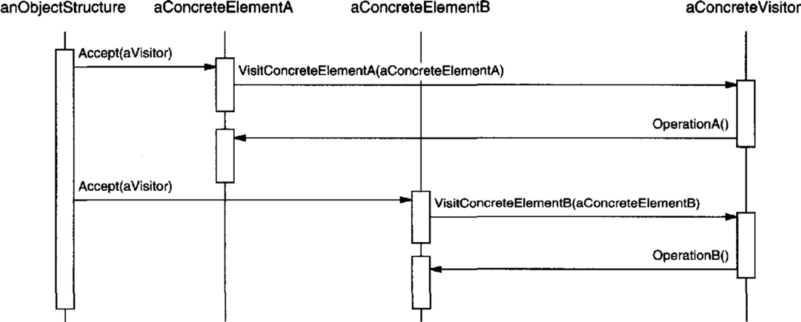

# 의도

객체 구조를 이루는 원소에 대해 수행할 연산을 표현한다. 연산을 적용할 원소의 클래스를 변경하지 않고도 새로운 연산을 정의할 수 있다.

# UML



방문자(Visitor) 인터페이스는 객체 즉, Element의 여러 서브 클래스들에 대해 방문할 때 수행할 메서드를 정의한다. 

Visitor를 상속한 서브 클래스들은 각 Element들을 순회하여 방문할 때 수행할 알고리즘을 구현한다.

Element 인터페이스는 자신이 갖고 있는 하위 Element에 대해 Visitor에 정의된 알고리즘을 수행하기 위한 `Accept()` 메서드를 정의한다.

Element 서브 클래스에서 `Accept()` 메서드를 구현한다. 이 때 방문자가 필요로 하는 메서드들을(`OperationA()`, `OperationB()` …) 제공한다.

## 사용 흐름



객체를 담고 있는 자료구조에게 방문자를 인자로 넘겨준다. 방문자에는 객체를 순회하는 방법이 구현되어 있다.

방문자 인터페이스에 정의된 메서드(`VisitConcreteElementA()`)를 통해 방문자가 객체를 다룰 수 있게 인자로 넘겨준다. 이로써 방문자가 가지고 있는 알고리즘으로 객체를 다루게 된다. 즉, 객체 내에 알고리즘을 정의하지 않고 방문자 클래스로 알고리즘을 분리시키게 된다.

# 사용 시기

- 객체 구조를 정의한 클래스는 거의 변하지 않지만, 전체 구조에 걸쳐 새로운 연산을 추가하고 싶을 때.
- 다른 인터페이스를 가진 클래스가 객체 구조에 포함되어 있으며, 서브 클래스에 따라 달라진 연산을 이들 클래스의 객체에 대해 수행하고자 할 때(?)

# 장점

객체 구조를 다루는 메서드가 Visitor에 모두 정의되어 있으므로 새로운 알고리즘을 만들기 쉽다.

방문자를 통해 관련된 알고리즘을 한 군데로 모아 관리하기 쉽다. 관련되지 않은 연산을 떼어내기 쉽다.(?)

반복자는 한 종류의 타입에 대해서만 순회가 가능하지만, 방문자는 객체의 타입이 다를 때에도 순회가 가능하다. 

# 단점

새로운 객체 구조를 추가하기 쉽지 않다. 새로운 객체가 추가되었을 때 모든 Visitor의 서브 클래스들은 새로운 메서드를 정의해야 한다. **Element 클래스 계통이 자주 변하지 않을 때에만** 방문자 패턴이 유용하다.

어떤 상황에서는 객체 내의 데이터를 읽어와야 하므로 데이터 은닉이 망가질 수 있다.

# 구현

자산을 조사하여 총 가치를 구한다고 하자. 자산에는 유형 자산과 무형 자산이 있다. 쉽게 생각해서 금괴와 부동산만 자산으로 친다고 하자.

```cpp
// 대충 금괴와 부동산을 클래스로 나타내면,
class GoldBar {
public:
		int getPrice() { return _price; }
private:
		int _price;
}

class Estate {
public:
		int getPrice() { return _price; }
private:
		int _price;
}
```

예시로 든 금괴와 부동산 모두 자산이라는 카테고리에 들어가므로 자산 인터페이스를 제공하면 된다.

이제 자산의 가치를 조사하는 방문자 객체를 만들어 사용자가 자산을 조사할 수 있도록 한다.

방문자에 알고리즘을 구현하려면 Asset 객체를 사용할 수 있어야 하므로 **인자로 전달받은 방문자에게 자기 자신을 인자로 전달해야 한다**. 
여기서는 `Visit()`을 통해 방문자에게 전달하는 것으로 표현했다.

```cpp
// 자산 인터페이스
// 가치(price)를 공통으로 가진다.
class Asset {
public:
		// 인자로 전달된 방문자에게 자기 자신을 전달한다.
		// 방문자의 알고리즘을 실행할 때 데이터 객체가 필요하기 때문이다.
		virtual void Visit(Visitor& visitor) = 0;

		int getPrice() { return _price; }
protected:
		// 생성자를 숨겨 추상 클래스임을 나타낸다.
		Asset(int price) : _price(price) { }
private:
		int _price;
}

class GoldBar : public Asset {
public:
		GoldBar(int price) : Asset(price) { }

		virtual void Visit(Visitor& visitor) {
				// Asset 자신을 인자로 넘겨줘 방문자에서 알고리즘을 수행하도록 함.
				visitor.VisitAsset(this); 
		}
}

class Estate : public Asset {
public:
		Estate(int price) : Asset(price) { }

		virtual void Visit(Visitor& visitor) {
				// Asset 자신을 인자로 넘겨줘 방문자에서 알고리즘을 수행하도록 함.
				visitor.VisitAsset(this);
		}
}
```

방문자는 Asset객체에게 전달되었을 때 알고리즘을 수행하는 메서드를 제공해야 한다.

```cpp
class Visitor {
public:
		virtual void VisitAsset(Asset& asset) = 0;
protected:
		Visitor();
}

class PriceVisitor : public Visitor {
public:
		PriceVisitor() {
				_totalPrice = 0;
		}

		// 알고리즘.
		// 전달된 객체의 가치를 totalPrice에 더한다.
		virtual void VisitAsset(Asset& asset) {
				_totalPrice += asset.getPrice();
		}

		int getTotalPrice() { return _totalPrice; }
private:
		int _totalPrice;
}
```

실제 사용은 이렇게 한다.

```cpp
PriceVisitor priceVisitor;

std::list<Asset*> assetList = new std::list<Asset*>();
assetList->push_back(new GoldBar(100));
assetList->push_back(new Estate(10000));

// 자료구조에 들어있는 객체를 반복하는 코드는 
// 1. 객체 구조가 담당할 수도 있고,
// 2. 방문자 객체가 담당하거나,
// 3. 반복자가 담당할 수도 있다.
// 여기서는 반복자가 담당하는 코드로 구현했다.

for(auto iter = assetList->begin(); iter != assetList->end(); iter++) {
		iter->visit(priceVisitor);
		// 각 asset 객체의 visit함수에는 인자로 받은 visitor에게 
		// 자기 자신을 넘겨 알고리즘을 수행하도록 하고 있다.
}

printf("total price : %d", priceVisitor.getTotalPrice());
// total price : 10100
```

## 다른 타입이 추가된다면?

새로운 데이터 객체가 추가된다면 방문자 패턴에게 좋지 않은 영향을 끼친다. 방문자 인터페이스에 새로운 메서드가 추가되었으므로 인터페이스를 상속하는 모든 방문자 객체가 그 메서드를 구현해야 한다. 여기서는 PriceVisitor밖에 없으므로 괜찮지만, 좋지 않은 상황이다.

예시를 계속 이어나가 보자. 비트코인은 가치를 갖고 있다. 하지만 자산에 포함이 안된다고 하자. 

비트코인도 가치를 계산하는 알고리즘이 계산하도록 하고 싶다.

> 비트코인을 잘 모르므로 자산에 포함이 안되는지는 명확히 모르지만 일단 예시를 들어봅니다.
> 

```cpp
class Bitcoin {
public:
		Bitcoin(int price) : _price(price) { }
		int getPrice() { return _price; }
private:
		int _price;
}
```

구현된 코드를 보면 비트코인은 Asset의 서브 클래스가 아니다.

그러므로 Visitor 인터페이스에 새로운 메서드를 추가해야 한다.

```cpp
class Visitor {
public:
		virtual void VisitAsset(Asset& asset) = 0;
		virtual void VisitBitcoin(Bitcoin& bitcoin) = 0;
protected:
		Visitor();
}

class PriceVisitor : public Visitor {
public:
		PriceVisitor() {
				_totalPrice = 0;
		}

		// 알고리즘.
		// 전달된 객체의 가치를 totalPrice에 더한다.
		virtual void VisitAsset(Asset& asset) {
				_totalPrice += asset.getPrice();
		}
		virtual void VisitBitcoin(Bitcoin& bitcoin) {
				_totalPrice += bitcoin.getPrice();
		}

		int getTotalPrice() { return _totalPrice; }
private:
		int _totalPrice;
}
```

예시처럼 반복을 통해 총 가치를 구하는 코드를 구현했다면 전체 코드를 수정해야 한다. Bitcoin클래스는 Asset의 서브 클래스가 아니기 때문이다. 

```cpp
PriceVisitor priceVisitor;

std::list<Asset*> assetList = new std::list<Asset*>();
assetList->push_back(new GoldBar(100));
assetList->push_back(new Estate(10000));

Bitcoin bitcoin(2500);

for(auto iter = assetList->begin(); iter != assetList->end(); iter++) {
		iter->visit(priceVisitor);
}
// 비트코인의 가치를 구한다.
bitcoin.visit(priceVisitor);

printf("total price : %d", priceVisitor.getTotalPrice());
// total price : 12600
```