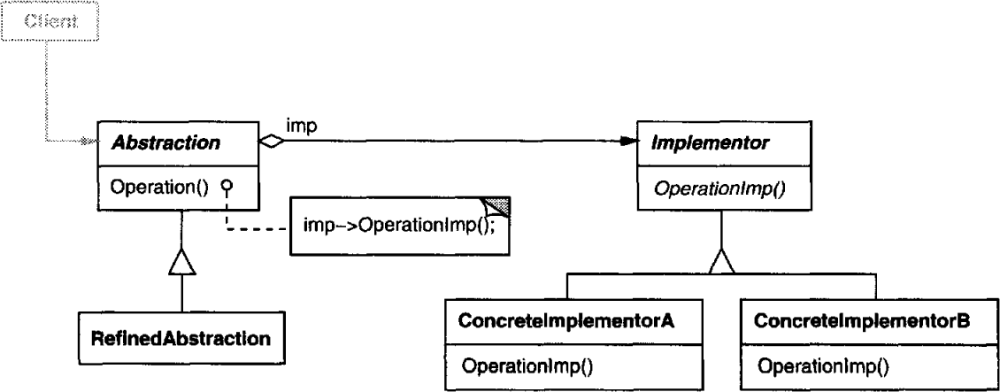

# 의도

구체적인 구현을 가진 클래스에서 추상적 요소를 분리하여 다양성을 가질 수 있도록 설계한다.

# UML



추상 클래스가 인터페이스를 참조자로 갖는다. 추상 클래스는 인터페이스에 정의된 메서드를 실행하는 메서드가 구현되어 있다.

인터페이스에는 추상 클래스와는 독립적으로 작용할 다른 메서드를 정의한다.

이렇게 함으로써 추상 클래스의 서브 클래스는 **런타임에 동적으로 인터페이스의 서브 클래스를 변경할 수 있다**.

# 사용 시기

- 추상적 개념과 구현 모두가 **독립적으로 서브 클래싱을 통해 확장되어야 할 때** 사용한다.

  여러 추상적 개념을 정의한 클래스를 상속으로 구현한다고 생각하면 서브 클래스의 개수가 매우 많아진다. Has-A관계로 인터페이스를 가진다면 이를 해소할 수 있다.

# 장점

구현이 인터페이스와 분리된다. 런타임에 어떤 구현을 사용할지 선택할 수 있다.

# 단점

???

# 구현

```cpp
class Warrior : public Unit { }
class Shaman : public Unit { }
class Archer : public Unit { }
...
```

Unit 클래스를 상속받는 캐릭터들을 구현한 서브 클래스가 있다고 하자. 여기에 진영 개념을 도입하여 어느 국가에 속한 캐릭터를 구현한다고 할 때 상속을 통해서 구현하려고 하면 `BlueTeamWarrior`, `YellowTeamArcher`같이 서브 클래스가 무진장 많아지게 될 것이다.

그래서 상속 대신에 객체 합성, **Has-A관계**를 사용하여 클래스가 인터페이스를 가지도록 변경한다.

```cpp
// 인터페이스
class Team {
public:
  virtual void encourage();
} 

// 인터페이스를 상속받아 구현
class BlueTeam : public Team { }; 
class RedTeam : public Team { };

class Unit {
public:
    void Encorage() {
      team->encourage();
    }
    void SetTeam(Team* team) {
      _team = team;
    }
private:
    Team* _team;
}

class Warrior : public Unit { }
class Archor : public Unit { }
```

Unit 추상 클래스에서 Team 인터페이스를 참조자로 갖기 때문에 Team의 서브 클래스들은 Unit의 서브 클래스들과는 독립적으로 작동한다. 따라서 런타임에 동적으로 Team의 참조자를 변경할 수 있다.

런타임에 어떤 서브 클래스를 선택할지는 팩토리 패턴을 이용할 수 있는데, 이 때 싱글턴에 정의하여 사용하면 더 편리하다.
