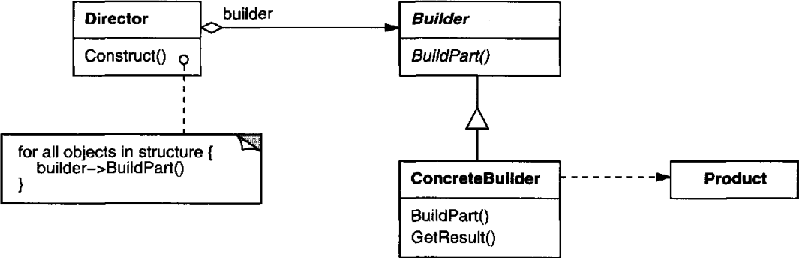

# 의도

복잡한 객체를 생성하는 방법을 표현하는 방법을 정의한 클래스로부터 분리하여, 서로 다른 객체를 생성할 때 동일한 과정을 통해 생성하도록 한다.

# 사용 시기

- 생성될 객체들이 각각 다른 표현을 가지는 것을 지원해야할 경우
- 복잡한 객체를 생성하는 과정이 그 객체를 조립하는 과정과 합성하는 과정(?)에 독립적일 때

# 장점

빌더 객체는 제품을 생성하도록 정의된 추상 인터페이스를 제공한다. 따라서 빌더 내부에 제품의 구성과 표현을 숨길 수 있다. 추상 인터페이스로만 요청할 수 있기 때문에, 다른 형태의 제품을 생성하려면 다른 빌더를 사용하면 된다.

제품의 내부 구조가 추상 인터페이스에 의해 빌더 내부에 숨겨지기 때문에, 사용자는 제품의 내부 구현을 알 필요가 없게 된다.

객체 생성 과정을 세밀하게 나눌 수 있다. 빌더 객체는 한 번에 객체를 생성하지 않고 단계별로 나누어 생성한다. 디렉터가 빌더 객체에게 완성된 제품을 돌려달라고 요청하기 전까지 생성 과정이 진행된다.

# 단점

???

# UML



디렉터는 빌더를 참조자로 갖는다. 생성해달라는 요청이 전달되면 디렉터 내부에 정의된 생성 절차에 따라 빌더에게 필요한 객체를 생성해달라고 한다. 모든 절차가 끝나면 객체가 생성된 것이다. 

사용자는 빌더에게 완성된 객체를 반환해달라는 요구를 하게 될 것이므로 빌더는 완성된 객체를 반환하는 메서드를 제공한다.

# 생성 흐름


먼저 빌더 객체와 디렉터 객체를 생성한다.

그 다음 빌더 객체를 매개변수로 하여 디렉터 객체에게 생성 요청을 한다.

디렉터 객체는 전달된 빌더 객체를 이용해 미리 정의된 생성 절차를 거친다.

생성 절차가 완료된 후에는 사용자가 직접 생성된 객체를 반환해달라고 요청한다.

# 구현

## 빌더 객체

자동차를 생성하는 절차가 정의된 빌더 객체를 만든다고 하자.

빌더 객체를 만들기 위해 먼저 자동차를 만드는 추상 인터페이스를 정의한다. 

```cpp
class CarBuilder {
public:
    virtual void BuildCarFrame() {}
    virtual void BuildTire() {}
    virtual void BuildCarGlass() {}

    virtual Car* GetCar() { return nullptr; }
protected:
    CarBuilder();
}
```

> 여기서도 추상 클래스를 사용하지 않았는데, 빌더마다 내부에서 사용하지 않는 연산이 있기 때문에 불필요한 정의를 하지 않도록 구현부를 비워두기만 한다.
> 

빌더 객체 내부에서 생성을 마친후 사용자가 직접 결과물을 받으려면 GetCar를 호출하면 된다.

```cpp
class BusBuilder : public CarBuilder {
public:
    virtual void BuildCarFrame();
    virtual void BuildTire();
    virtual void BuildCarGlass();

    virtual Car* GetCar();
private:
    Car* _car;
}
```

추상 인터페이스에 정의된 메소드를 구현하여 구체적인 빌더 객체를 만든다. (구현부 생략)

생성 절차가 진행되면서 멤버 변수인 _car에 생성된 결과물이 저장된다.

## 디렉터 객체

말만 어렵고, 사용자의 요청을 받아 정해진 절차대로 빌더 객체의 인터페이스를 다루도록 하는 객체일 뿐이다.

```cpp
Car* CreateCar(CarBuilder& builder) {
    builder.BuildCarFrame();
    builder.();
    builder.BuildCarGlass();
    ...
    return builder.GetCar();
}
```

디렉터에게 자동차를 생성하라는 요청이 전달되면 디렉터는 정해진 절차에 따라 빌더의 인터페이스를 단계적으로 호출하기만 한다.

객체의 세부 구현이 어떻게 되어있는지는 확인할 수 없다. 빌더 속에 캡슐화가 되어있기 때문이다.

## 사용자

```cpp
BusBuilder builder;
CreateCar(builder);

Car* bus = builder.GetCar();
```

사용자는 위와 같이 디렉터에게 객체를 달라고 요청하고, GetCar를 통해 생성된 객체를 전달받는다.

사용자는 단순하게 요청하기만 할 뿐 세부적인 구현은 빌더 객체가 책임지고 있다. 이렇게 생성 과정이 분리됨으로 다양한 빌더를 구성할 수 있다. 

```cpp
class RustedCarBuilder : public CarBuilder {
public:
    virtual void BuildCarFrame();
    virtual void BuildTire();
    virtual void BuildCarGlass();
    // 내부적으로 CarFrame이 녹슬고 CarGlass가 깨진 상태로 생성하도록 함.

    virtual Car* GetCar();
private:
    Car* _car;
}
```

녹슨 차를 만드는 빌더 클래스를 생성한 후 단순히 빌더 클래스만 교체함으로 유연하게 변경할 수 있다.

```cpp
RustedCarBuilder builder;
CreateCar(builder);

Car* bus = builder.GetCar(); // 실제로는 녹슨 차가 생성되어 반환된다.
```

# Effective Java Builder Pattern

GoF에서는 디렉터 → 빌더 구조인데, Effective Java에서는 색다른 빌더 패턴을 보여준다.

```java
public class Book {
    public String author;
    public String isbn;
    public String publishedDate;
    public int price;
    public Book(Builder builder) {
        this.isbn = builder.isbn;
        this.author = builder.author;
        this.publishedDate = builder.publishedDate;
        this.price = builder.price;
    }

    public static class Builder {
        public String author;
        public String isbn;
        public String publishedDate;
        public int price;
        public Builder(String isbn, String publishedDate) {
            this.isbn = isbn;
            this.publishedDate = publishedDate;
        }
        public Builder price(int price) {
            this.price = price;
            return this;
        }
        public Builder author(String author) {
            this.author = author;
            return this;
        }
        public Book build() {
            return new Book(this);
        }
    }
}
```

```java
Book book = Book.Builder("1234567890", "1900-01-01")
	.price(15000)
	.author("Kim")
	.build();
```

객체 내부의 값을 바로 대입하지 않고 빌더에 저장한 다음 build()를 호출해야만 실제 객체를 반환받는 형태다. 체이닝 기법을 사용해서 단계적으로 객체를 생성한다.

# 추상 팩토리 패턴과 다른 점

둘 다 객체를 생성한다는 점에서 생성 패턴에 속하지만 미묘하게 다른 점을 갖고 있다.

| 빌더 패턴 | 추상 팩토리 패턴 |
| --- | --- |
| 여러 단계를 거쳐 복잡한 객체를 생성 | 같은 제품군에 속하는 객체들을 생성하는 인터페이스를 제공 |
| 마지막 단계를 거친 후 완성된 객체를 반환 | 호출하는 즉시 객체를 반환 |

[What is the difference between Builder Design pattern and Factory Design pattern? | Stack Overflow](https://stackoverflow.com/questions/757743/what-is-the-difference-between-builder-design-pattern-and-factory-design-pattern)