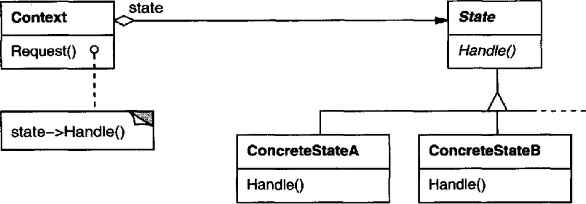

# 의도

객체의 내부 상태에 따라 행동을 변경한다. 이 때 객체가 자신의 클래스를 변경하는 것처럼 보이게 된다.

# UML



객체(Context)는 구체적인 상태를 갖기 위해 어떤 상태(State) 추상 클래스를 상속한 객체를 참조한다.

State에는 행동(`Handle()`)을 정의한다. 이 행동은 State의 종류에 따라 다르게 동작한다.

State를 상속한 서브 클래스들은 `Handle()`을 구현한다.

Context의 `Request()`는 자신이 갖고 있는 State 참조자의 메서드를 실행한다. 결국 State의 서브 클래스에 따라 다른 행동이 실행된다.

# 사용 시기

- 객체의 행동이 상태에 따라 달라질 수 있거나 객체의 상태에 따라 런타임에 행동이 바뀌어야 할 때
- 객체의 상태에 따라 분기가 너무 많이 나뉠 때

# 장점

어떤 상태에 의해 정해지는 행동을 하나의 객체로 관리할 수 있다.

값으로 상태를 나타낸다면 일관되지 않은 상태가 될 수 있지만 상태 객체는 그런 상황이 일어나지 않는다.

# 단점

어떤 상태가 다른 상태로 변할 때 서브 클래스 간 종속성이 생길 수 있다.

# 구현

LoL의 챔피언은 여러가지 상태를 갖는다. 챔피언의 상태는 대부분 군중 제어 효과(Crowd Control)에 의해 변경된다. 

플레이어는 이 상태에 따라 공격할 수 있거나, 조작할 수 없는 등 상태에 따라 상호작용의 여부가 나뉜다.

```cpp
class Player {
public:
    void Move() { _state->Move(); }
    void Attack() { _state->Attack(); }
    void UseSkill() { _state->UseSkill(); }

    // 플레이어의 상태를 변경하는 코드는 플레이어 내부에 구현.
    void ChangeState(State* state) { _state = state; }
private:
    State* _state;
}
```

모든 군중 제어 효과를 `if-else`로 검사하여 상호작용을 처리한다면 유지보수가 매우 어려워진다. 따라서 상태 패턴을 통해 관리하면 좋다.

```cpp
class State {
public:
    virtual void Move() { }
    virtual void Attack() { }
    virtual void UseSkill() { }
protected:
    void ChangeState(Player *player, State* state) {
        player->ChangeState(state);
    }
}
```

게임에 존재하는 모든 군중 제어 효과는 State 클래스를 상속받아 구현한다.

```cpp
// 기절 상태
// -> 이동, 공격, 스킬 제한
class StunState : public State {
public:
    virtual void Move() { printf("Can't move!"); }
    virtual void Attack() { printf("Can't attack!"); }
    virtual void UseSkill() { printf("Can't attack!"); }
}

// 둔화 상태
// -> 이동 제한
class SlowState : public State {
public:
    virtual void Move() { printf("Move but slow"); }
    virtual void Attack() { printf("Attack!"); }
    virtual void UseSkill() { printf("use Skill!"); }
}

// 변이 상태
// -> 공격, 스킬 제한
class PolymorphState: public State {
public:
    virtual void Move() { printf("Move!"); }
    virtual void Attack() { printf("Can't attack!"); }
    virtual void UseSkill() { printf("Can't attack!"); }
}
```

상태에 따라 플레이어의 행동을 구현하여, 플레이어가 직접 자신의 상태를 값으로 저장하지 않고도 관리할 수 있다. 

만약 값으로 관리했다면 if-else를 무진장 사용해야할 뿐만 아니라 조건에 없는 상태에 대한 예외처리도 해야한다.