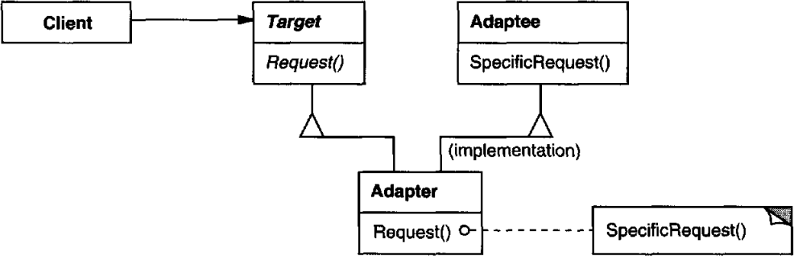

# 의도

클래스의 인터페이스를 사용자가 기대하는 인터페이스로 적응(Adapt)시킨다.

# 클래스 어댑터(상속을 통해 구현)

## UML



Target 클래스에 메서드를 정의하는데, 추상 클래스의 서브 클래스에서 Adaptee의 메서드를 호출하도록 구현한다. 이로써 Adaptee 인스턴스를 Target 클래스로 관리할 수 있게 된다.

## 장점

상속을 통해 구현하기 때문에 **Adaptee에 정의된 메서드를 재정의해버릴 수 있다**.

## 단점

Adaptee를 상속받기 때문에 **Adaptee의 서브 클래스**들을 적응시키려면 클래스 어댑터 방식을 사용할 수 없다.

# 객체 어댑터(Has-A를 통해 구현)

## UML


Target 클래스의 서브 클래스인 Adapter가 Adaptee를 멤버 변수로 갖고 있다. 그러므로 Adaptee 클래스의 서브 클래스들도 멤버 변수로 가질 수 있다.

## 장점

Adaptee에 대한 인스턴스를 멤버로 갖고 있기 때문에 Adaptee의 서브 클래스들에 대해서도 적용할 수 있다.

## 단점

Adaptee에 정의된 메서드를 재정의하기 까다롭다.

# 사용 시기

- 기존 클래스를 활용하고 싶은데 인터페이스가 맞지 않을 때
- 이미 만든 인터페이스를 사용하고 싶지만 라이브러리를 수정할 수 없을 때

# 구현

## 클래스 어댑터

상속을 통해 구현하기 때문에 적응할 인터페이스는 `public`으로, Adaptee는 `private`으로 상속받아야 한다.

```cpp
class Interface {
public:
    virtual void request();
}

class Adaptee {
public:
    void differentRequest();
}

class ConcreteAdapter : public Interface, private Adaptee {
public:
    virtual void request() {
        differentRequest();
    }

    // adaptee의 메서드를 재정의할 수 있다.
    void differentRequest() { }
}
```

## 객체 어댑터

먼저 적응이 필요한 메서드들을 정의한 인터페이스를 만든다.

### A. 추상화로 구현하기

인터페이스에 추상 메서드를 정의하고, 실제 구현은 adaptee를 가지는 서브 클래스에서 구현한다. 

```cpp
class AdapteeInterface {
public:
    void request() {
      doSomething();
    }
    virtual void doSomething() = 0;
}

class ConcreteAdapter : public AdapteeInterface {
public:
    virtual void doSomething() {
        adaptee.run();
    }
private:
    Adaptee adaptee;
}

ConcreteAdapter ca;
// AdapteeInterface에 정의된 메서드 호출
// 추상화에 의해 adaptee를 다룰 수 있게 됨
ca->doSomething();
```

서브 클래스 내에서 적응된 인터페이스 메서드를 호출하게 되면 결과적으로 adaptee에게 요청하는 것과 같아진다.

### B. 위임 객체를 가지기

인터페이스 클래스가 위임자를 갖고, 위임자 클래스는 적응될 메서드를 선언한다.

어댑터 클래스는 위임자 클래스를 상속받아 메서드를 구현한다. 

결과적으로 사용자는 인터페이스 클래스에게 요청하게 되고, 인터페이스 클래스는 위임자에게 그 요청을 전달하여 어댑터 클래스가 요청을 수행하게 한다.

```cpp
class ClientInterface {
public:
    void doSomething() {
        delegate->run();
    }
    void setDelegate(Delegate delegate) { this.delegate = delegate; }
private:
    Delegate delegate;
}

class AdapterInterface {
public:
    virtual void run() = 0;
}

class Delegate : AdapterInterface {
public:
    virtual void run() {
        adaptee->run();
    }
private:
    Adaptee adaptee;
}

ClientInterface ci;

// 위임자를 등록해야함
Delegate myDelegate;
ci.setDelegate(myDelegate);
// 인터페이스에 정의된 메서드를 호출하지만,
// 내부에서 위임자에게 요청을 전달함
// 위임자는 adaptee를 다루게 됨
ci.doSomething();
```