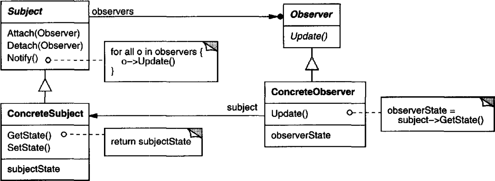
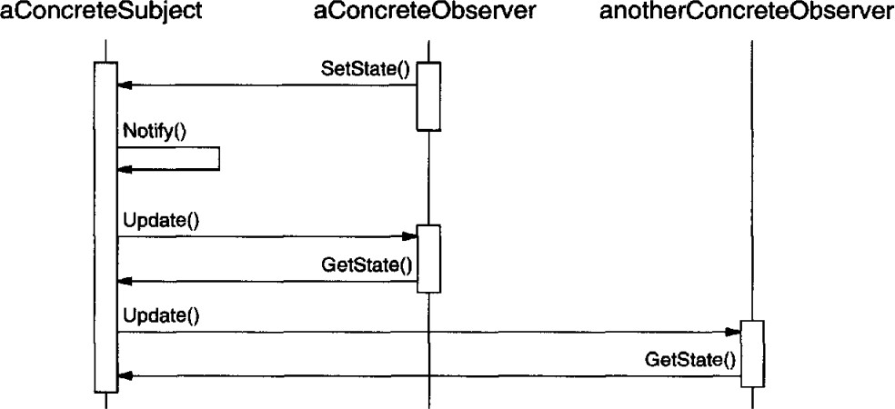

# 의도

객체 사이에 일 대 다 관계를 정의하여 어떤 객체의 상태가 변했을 때 모든 객체가 자동으로 그 변화를 통지받아 갱신되도록 만든다.

# UML



Subject는 여러 Observer들을 등록, 분리하는 메서드를 제공한다. `Notify()`를 통해 상태가 변경되었으므로 자신에게 등록된 모든 Observer들에게 상태를 갱신하라고 요청한다.

Observer는 Subject의 상태가 변경되었을 때 실행할 행동인 `Update()`를 정의한다.

Subject를 상속한 ConcreteSubject는 구체적인 상태를 갖고 있는데, 그 상태를 반환 및 수정하는 메서드(`GetState()`, `SetState()`)를 제공한다.

Observer를 상속한 ConcreteObserver는 ConcreteSubject의 상태와 동일한 타입의 변수(`observerState`)를 갖는다. 그리고 `subject`를 참조자로 갖는데, Subject로부터 `Update()`가 호출될 경우 자신이 갖고 있는 `subject` 참조자를 통해 Subject의 상태를 받아와 업데이트하게 된다.

# 사용 흐름



Observer들이 모두 Subject에 결합되어 있을 때 실제 흐름은 이렇다.

먼저 Observer가 `SetState()`를 통해 Subject의 상태를 변경한다. (또는 다른 요인에 의해 변경될 수 있다.)

Subject는 상태가 변경되었으므로 모든 Observer에게 `Update()`를 호출한다.

Observer의 Update에는 Subject의 상태를 받아와 자신의 상태를 갱신하는 작업을 진행하므로 `GetState()`를 통해 자신의 상태를 갱신한다.

# 사용 시기

- 한 객체에 가해진 변경으로 다른 객체를 변경해야 하지만 얼마나 많은 객체들이 변경되어야 할지 몰라도 될 때
- **어떤 객체가 다른 객체에게 자신의 변화를 통보하되** 누가 통보받는지 모른다 하더라도 통보가 될 때

# 장점

종속적인 관계를 Subject와 Observer로 나눠 *추상적인 결합도*만 가지게 만든다.

상태 변화 사실을 전달할 구체적인 Observer를 몰라도 된다. 대신 모든 Observer들에게 전달한다.

# 단점

상태를 변경하는 도중에 *여러 번의 불필요한 갱신*이 일어날 수 있다.

구체적으로 Subject의 **어떤 상태가 변했는 지에 대한 추적이 어렵다**.

# Notify의 호출 시기

상태가 변경되었다는 사실을 알리기 위해서는 **1. 상태를 변경하는 연산의 마지막에 `Notify()`를 호출**하도록 할 수 있고, **2. 사용자가 직접 `Notify()`를 호출하여 필요할 때 상태를 갱신**하도록 할 수 있다.

전자의 경우 사용자가 `Notify()`를 직접 호출하지 않아도 되지만, **불필요한 호출이 여러 번 반복될 수 있다**.

후자의 경우 불필요한 호출에 대한 책임은 사용자가 갖게 되어 비용이 줄어들게 되지만, **사용자가 갱신에 대한 책임을 지게 되므로** 만약 `Notify()`를 호출하지 않으면 오류가 일어날 가능성이 높다.

# 구현

공유된 문서를 수정한다고 가정하자. 실제 문서가 저장되어있는 서버와 클라이언트 간 결합도를 낮추기 위해 옵저버 패턴을 적용하자.

추상 클래스를 정의한다.

```cpp
class Subject {
public:
    void Attach(Observer* observer) {
        // 추가하는 연산
    }
    void Detach(Observer* observer) {
        // 지우는 연산
    }
    void Notify() {
        for(auto observer = _observerList->begin(); 
            observer != _observerList->end(); 
            ++observer) {
            observer->Update();
        }
    }
private:
    std::list<Observer*> _observerList;
}

class Observer {
public:
    void Update() { }
}
```

문서를 관리하는 서버 역할을 담당할 Subject와 클라이언트를 담당할 Observer를 만든다.

```cpp
class Server : public Subject {
public:
    Document GetDocument() {
        return _doc;
    }
    void SetDocument(Document doc) {
         _doc = doc;

        Notify(); // 서버가 Notify를 호출할 책임을 가지게 했다.
    }
private:
    Document document;
}

class Client : public Observer {
public:
    Client(Subject* subject) : _subject(subject) { }
    void Update() {
        _doc = _subject->GetDocument();
    }
private:
    Subject* _subject;
}
```

클라이언트에 의해서 또는 외부 객체에 의해서 `SetDocument()`가 호출되었을 경우 서버 내의 Document가 변하게 되고 서버가 `Notify()`를 호출할 책임을 갖게 설계되었으므로 자동으로 모든 클라이언트가 변경을 수신하게 된다.