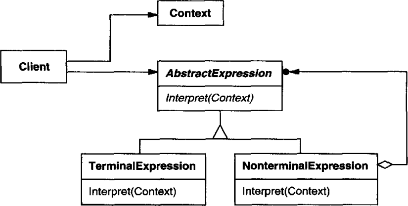

# 의도

특정한 종류의 문제가 빈번하게 발생할 때 어떤 언어(패턴)으로 그 문제를 나타내어 표현하면 더 나은 경우가 있다고 한다.

어떤 언어에 대해 **그 언어의 문법에 대한 표현을 정의하면서** 그것을 사용하여 **해당 언어로 기술된 문장을 해석하는 인터프리터**를 함께 정의한다.

인터프리터는 *문법을 정의하는 방법*, *문법을 통해 문장을 구성하는 방법*, *만든 문장을 해석하는 방법*을 설명한다.

# UML



AbstractExpression 추상 클래스는 `Interpret()` 즉, 주어진 표현(Context)을 해석하는 메서드를 정의하고 있다.

TerminalExpression은 특정 문법을 통해 Context를 해석하도록 `Interpret()`를 구현한다.

NonterminalExpression은 다수의 문법을 통해 해석하는 `Interpret()`를 구현한다. 이 때 AbstractExpression을 참조하기 때문에 다른 인터프리터를 조합한 구조를 통해 Context를 해석할 수 있다. 이는 **컴포지트 패턴**이므로 인터프리터는 트리 구조를 갖게 된다.

# 사용 시기

- 정의할 언어의 문법이 간단한 경우. 복잡하다면 인터프리터 대신 parser를 쓰는게 훨씬 낫다.
- 효율성을 따지지 않을 때.

# 장점

기존에 정의된 클래스를 상속받아 재정의하거나 새로운 서브 클래스로 확장하여 문법을 변경할 수 있다.

# 단점

복잡한 문법을 표현해야한다면 유지보수하기 힘들다.

# 구현

$3 + 4, 1 + 5$같은 간단한 덧셈 연산을 나타내야한다고 하자.

```cpp
class Operator {
public:
    virtual int interpret();
}
```

어떤 수식이 주어졌을 때 그걸 해석하는 인터페이스를 만든 후 서브 클래스에서 어떤 문법을 나타내어 해석하도록 구현한다.

```cpp
 class AddOperator : public Operator {
public:
    MultiplyOperator(Operator* operatorA, OperatorB* operatorB) :
        _operatorA(operatorA), _operatorB(operatorB) { } 

    virtual int interpret() {
        return _operatorA->interpret() + _operatorB->interpret();
    }
private:
    Operator* _operatorA;
    Operator* _operatorB;
}

class IntegerOperator : public Operator {
public:
    IntegerOperator(int n) : _n(n) { }

    virtual int interpret() {
        return n;
    }
private:
    int n;
}
```

실 사용은 이렇게 할 수 있다.

```cpp
IntegerOperator* a = new IntegerOperator(3); 
IntegerOperator* b = new IntegerOperator(4);
AddOperator* add = new AddOperator(a, b);
add.interpret(); // return 3+4
```

만약 정수 4개를 연산하도록 만들어야 한다면 이렇게 할 수 있다.

```cpp
IntegerOperator* a = new IntegerOperator(3); 
IntegerOperator* b = new IntegerOperator(4);
IntegerOperator* c = new IntegerOperator(1); 
IntegerOperator* d = new IntegerOperator(5);
AddOperator* AB = new AddOperator(a, b);
AddOperator* CD = new AddOperator(c, d);
AddOperator* add = new AddOperator(AB, CD);
add.interpret(); // return (3+4) + (1+5)
```

또한 Operator의 서브 클래스가 여러 Operator를 가지도록 만들 수도 있다.

```cpp
class MultpleAddOperator : public Operator {
public:
    MultipleAddOperator(list<Operator*> operatorList) : _operatorList(operatorList) {}

    virtual int interpret() {
        int result = 0;
        for(auto iter = operatorList.begin(); iter != operatorList.end(); iter++) {
            result += operator.interpret();
        }
        return result;
    }
private:
  list<Operator*> _operatorList;
}
```

이 서브 클래스는 여러 operator를 리스트로 관리하면서 모든 Operator의 연산 결과를 더해 반환하도록 하고 있다. 

인터프리터는 *컴포지트 패턴*을 사용하고 있지만,  **단 하나의 문법을 나타내기 위해 사용할 때**만 인터프리터라고 한다.