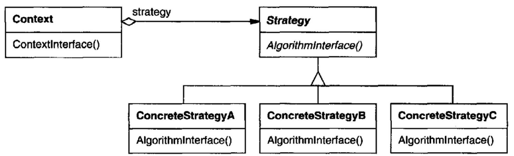

# 의도

동일 계열의 알고리즘 군을 정의하고, 각 알고리즘을 캡슐화하며, 이들을 상호교환이 가능하도록 만든다. 알고리즘을 사용하는 클라이언트와 상관없이 독립적으로 변경할 수 있도록 한다.

# UML



알고리즘(Strategy) 추상 클래스는 알고리즘을 정의하고 서브 클래스에서 해당 알고리즘을 다양하게 구현한다.

사용자(Context)는 Strategy 추상 클래스를 참조자로 갖는다. `ContextInterface()`를 통해 Strategy 인스턴스의 알고리즘을 실행한다.

# 사용 시기

- 비슷한 행동들이 개념적으로 관련된 클래스가 많이 존재할 때
- 알고리즘이 사용자에게서 감추어야 하는 데이터를 사용할 때. Strategy 클래스 속으로 감추어 사용할 수 있다.
- 다중 조건문에 의해 알고리즘이 실행될 때

# 장점

알고리즘 군을 형성한다.

알고리즘이 상속에 의해 구현되었다면 확장하기 어려워진다. 전략 패턴을 사용한다면 알고리즘을 독립적으로 구현하게 되므로 확장하기 쉬워진다.

다중 조건문에 의해 실행되는 알고리즘을 개선한다.

# 단점

Strategy 클래스에 정의된 메서드를 전부 사용하지 않는 서브 클래스도 있으므로, 사용자는 전략 객체의 구현을 알고 있어야 한다.

# 구현

캐릭터가 무기를 갖고 공격하려고 한다.

무기에는 여러 종류가 있는데 제각각 공격 방식이 다르다.

```cpp
class Player {
public:
    void Attack() {
        _weapon->Attack();
    }
    void ChangeWeapon(Weapon* weapon) {
        _weapon = weapon;
    }
private:
    Weapon *weapon;
}
```

여기서 Weapon은 전략 객체의 추상 클래스가 된다. 각 무기들은 Weapon 클래스를 상속해 공격 방법을 구현한다.

```cpp
class Weapon {
public:
    virtual void Attack() = 0;
}

class Gun : public Weapon {
public:
    virtual void Attack() {
        printf("빵야빵야");
    }
}

class Knife : public Weapon {
public:
    virtual void Attack() {
        printf("푹 찍");
    }
}

class AluminiumBat : public Weapon {
public:
    virtual void Attack() {
        printf("깡");
    }
}
```

사용자는 갖고 있는 무기를 사용하여 공격하되 공격하는 알고리즘은 전략 객체가 담당하고 있다.

## 기본 전략

만약 갖고 있는 무기가 없다면 기본 전략을 만들어야 한다.

아무 행동도 하지 않는 빈 전략 객체를 만들 수도 있지만, 플레이어가 갖고 있는 무기가 없을 경우 기본 전략을 플레이어 클래스 내에서 구성할 수도 있다.

```cpp
class Player {
public:
    void Attack() {
        if(_weapon == nullptr) { // 무기가 없을 때 기본 전략 정의
            printf("주먹질");
        }
        else {
            _weapon->Attack();
        }
    }
private:
    Weapon* _weapon;
}
```

# 상태 패턴과 비슷한데??

상태 객체는 객체 내에서 사용자가 상태를 변경하는 코드를 실행할 수 있다. 하지만 전략 객체는 그런 코드가 없다.

즉, 상태 객체는 스스로 상태를 변경할 수 있지만, 전략 객체는 외부에서 객체를 바꾸지 않는 이상 변할 방법이 없다.
