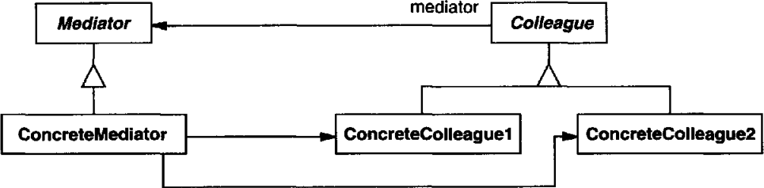

# 의도

한 집합에 속해있는 객체의 상호작용을 캡슐화하는 객체를 정의한다. 객체들이 서로를 참조하지 않고 중재자 객체를 참조하도록 하여 과도한 결합을 줄인다.

# UML

상호작용을 할 객체(Colleague)들은 모두 mediator 변수를 통해 중재자(Mediator)를 알고 있다.

Mediator를 상속한 ConcreteMediator는 상호작용이 일어날 객체들, 즉 **Colleague를 상속한 객체들을 관리하여 상호작용을 구현한다**.

이렇게 하면 복잡한 상호작용을 Colleague에 구현하지 않고 Mediator에 구현함으로써 로직을 분리할 수 있다.

각 Colleague들은 모두 Mediator를 알고 있어야 하고, Mediator는 모든 Colleague를 알고 있어야 하므로, 중재자 패턴은 *옵저버 패턴의 활용*이라고 볼 수 있다. 차이점이라면, 옵저버 패턴은 **Subject와 Observer간의 관계**를 나타내지만, 중재자 패턴은 **각 Colleague간의 상호작용**을 나타낸다.

# 사용 시기

- 여러 객체들이 **복잡한 상호작용**을 가질 때
- 한 객체가 다른 객체를 너무 많이 참조하고 의사소통이 너무 많아 이해하기 힘들 때
- 여러 클래스에 분산된 행동들이 상속을 하지 않고 상황에 맞게 수정되어야 할 때(?)

# 장점

집합에 속해있는 객체들의 종속성을 줄일 수 있다.

_N:N관계를 1:N관계로 줄일 수 있다_.

객체 간 협력 방법을 추상화하게 된다. 추상 클래스를 통해 중재자의 행동을 정의하고 내부 구현은 상속으로 다양하게 변경할 수 있다.

# 단점

중재자 객체 내에서 모든 상호작용을 처리하기 때문에 복잡해진다. 유지보수를 하기 어렵다.

# 구현

추가바람.