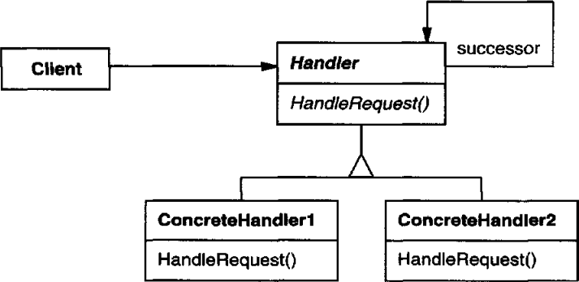

# 의도

메시지를 보내는 객체와 이를 받아 처리하는 객체들 간의 결합도를 낮춘다.

어떤 요청을 받았을 때 그 요청을 처리할 수 없다면 자신과 연결된 객체에게 전달하여 모든 객체가 그 요청을 처리할 수 있도록 설계한다.

# UML



Handler 추상 클래스는 자기 자신을 참조자로 갖는다. 

Handler의 서브 클래스는 HandleRequest를 통해 자기 자신이 처리할 수 없는 명령을 받았다면 자기가 갖고 있는 successor(Handler 참조자)에게 명령을 전달한다.

# 사용 시기

- 메시지를 받을 객체를 명시하지 않은 채 여러 객체 중 하나에게 처리해 달라고 요청하고 싶을 때

# 장점

다른 객체가 어떻게 처리하는지 몰라도 된다. 요청을 보내는 측과 받는 측 모두 서로에 대해서 모르게 된다. 요청이 전달될 모든 객체를 알 필요가 없이 자신과 연결된 후보 객체 하나만 알면 된다.

런타임에 자신과 연결된 후보 객체를 변경할 수 있으므로 유연성을 가질 수 있다.

# 단점

요청이 100% 처리된다는 보장이 없다.

# 구현

대대장님이 간부들에게 배수로 작업을 시켰다고 한다. 중대장들은 자기 임무가 아니니까 휘하 간부들에게 명령을 위임했다. 소대장들도 뺑이치기 싫어서 상사급 간부들에게 명령을 위임했다. 

결국 상사 → 중사 → 하사까지 명령이 전달되었다. 하사급 간부들은 눈물을 훔치면서 비가 오는 날 밖에서 배수로 작업을 했다. (이 부대는 무조건 하사급 간부가 배수로 작업을 해야했다…)

중요한 점은 대대장은 배수로 작업을 누가 할지 모른 채 명령을 내렸다는 것이다. 하사급 간부들도 누가 명령을 내렸는지 알 필요가 없다. 단순히 명령이 전달되었고, 처리할 수 없어서 위임했을 뿐이다.

```cpp
class OrderHandler {
public:
    OrderHandler(OrderHandler* handler) : _handler(handler) { }

    void order(char* str) {
        if(_handler != nullptr){
            _handler->order(str);
        }
    }
private:
    OrderHandler* _handler;
}
```

OrderHandler 클래스에는 인스턴스의 참조자가 있다면 그 인스턴스에게 명령을 위임하는(또는 전달하는) 메소드가 구현되어 있다. 서브 클래스에서 명령을 처리할 수 없다면 이 클래스의 Order를 호출하여 명령을 전달하게 된다.

```cpp
class Commander : public OrderHandler {
public:
    Commander(OrderHandler* handler) : OrderHandler(handler) { }

    void order(char* str){
        if(canResolveOrder(str)){
            resolve();
        }
        else {
            OrderHandler::order(str);
        }
    }
    void canResolveOrder(char *str){
        return false; //중대장은 무조건 처리할 수 없음
    }
}

class StaffSergeant : public OrderHandler {
public:
    StaffSergeant(OrderHandler* handler) : OrderHandler(handler) { }

    void order(char* str) {
        if(canResolveOrder(str)){
            resolve();
        }
        else {
            OrderHandler::order(str);
        }
    }
    void canResolveOrder(char *str){
        return true; //하사는 무조건 처리할 수 있음
    }
}
```

중대장과 하사는 모두 OrderHandler의 서브 클래스다. order메소드를 오버라이드하여 자신이 처리할 수 있는 명령인지 확인한다. 만약 처리할 수 없는 명령이 전달되었다면 자신이 갖고 있는 OrderHandler클래스의 인스턴스에게 명령을 전달한다. 

예제의 경우 하사는 무조건 명령을 처리하게 되어있지만 경우에 따라서는 아무도 명령을 처리할 수 없는 경우도 있게 된다.