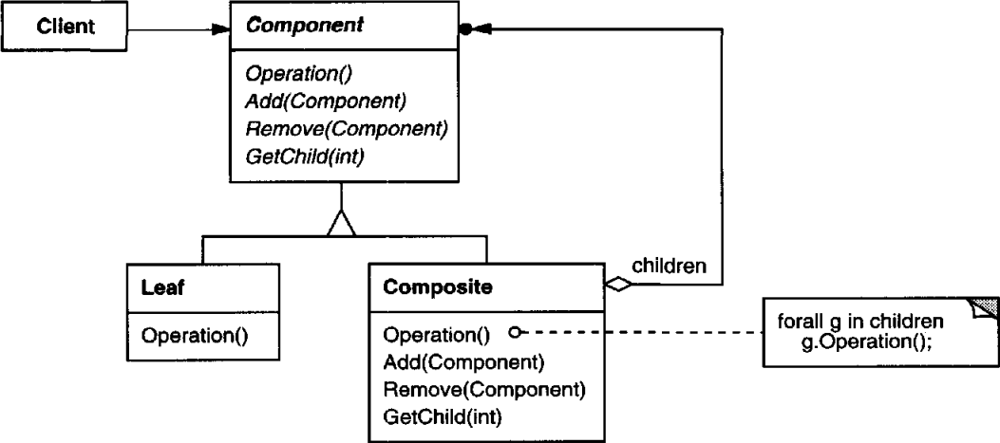

# 의도

부분과 전체의 계층을 표현하기 위해 객체들을 트리 구조로 구성한다. 사용자는 기본 객체와 복합 객체(컴포지트 객체)를 동일하게 다룰 수 있게 된다.

# UML



추상 클래스 Component를 정의한다. 추상 클래스 내에는 *다른 Component를 자신에게 추가하거나 삭제하는 메서드*를 정의한다. 이 때 자료구조를 통해 하위의 Component들을 관리한다. 

Component의 서브 클래스인 Composite는 **복합 객체**로, 추상 클래스에서 정의한 자식을 관리하는 메서드를 구현한다. 이를 통해 Composite에 Component의 서브 클래스들을 등록할 수 있게 된다. 

Leaf는 **기본 객체**로, 복합 객체와는 다르게 자식을 관리하지 않는다. 대신 어떤 특별한 기능을 정의하되 다른 Composite에 추가되어 복합 객체와 동일하게 다루어진다.


최상위 복합 객체의 Operation을 호출하게 되면 복합 객체는 자신이 가진 모든 Component들에게 Operation을 전달하게 된다. (또는 자기 자신이 어떤 작업을 수행할 수도 있다.) **기본 객체와 복합 객체 모두 Component의 서브 클래스**이므로 두 객체를 동일하게 다룰 수 있게 된다.

# 사용 시기

- 부분 - 전체의 관계(?)를 갖는 계통을 표현할 때
- 객체의 합성으로 인해 생긴 복합 객체와 기본 개체를 구분하지 않고 똑같이 취급해야 할 때

  PPT에서 여러 도형을 하나로 묶으려면 그룹화 기능을 사용한다. 이 그룹 또한 도형을 다루는 것처럼 크기 조절이나 글씨체 등을 변경하는 기능을 제공해야 한다. 즉, 복합적으로 연결된 객체 또한 기본적인 객체를 다루는 것처럼 작동해야 한다. 이 때 컴포지트 패턴을 사용한다.

# 장점

사용자는 복합 객체나 기본 개체를 구분하지 않고 코드를 작성하게 된다.

새로운 종류의 구성 요소를 추가하기 쉽다.

# 단점

특정 타입에 대해 제약을 가하기 어렵다. 제약을 가하기 위해서는 런타임에 검사하는 코드가 필요하다.

# 구현

## 인터페이스를 최대화하기

사용자는 복합 객체와 기본 객체를 동일하게 다룰 수 있어야 한다. 그러려면 두 객체 사이의 공통된 연산이나 메소드를 Component 클래스에 구현해야 한다. 

하지만 Leaf 객체에서는 필요가 없는 메소드를 정의해야할 때도 있다. 이럴 때에는 Component에서 아무 행동도 하지 않는 메소드를 정의한 후 Composite에서 메소드를 구현하면 된다.

## 자식 객체는 누가 관리하나

복합 객체는 자식을 가지기 때문에 자식 객체를 관리하는 메소드를 갖고 있게 된다. 이 메소드 또한 모든 객체에서 동일하게 제공되어야 하므로 Component에 정의되는데, Leaf 객체 또한 Component를 상속받으므로 동일한 메소드를 갖게 된다. 그러나 Leaf 객체는 자식이 없기 때문에 이 연산은 의미가 없다. **대신 사용자가 주의를 기울여야 하는 비용을 치뤄야 한다**.

반면 Leaf객체에게 이런 메소드를 제공하지 않기 위해 Component에 정의하지 않고 Composite에 정의한다면 인터페이스가 다르므로 사용자는 이를 다른 객체로 생각하게 된다.

책에서는 인터페이스를 동일하게 구성하되 비용을 치르는 방법을 추천하고 있다. 

## 자식 객체를 저장하는 자료구조는

예시로 리스트를 들었는데, 해시 테이블이나 딕셔너리 등 가능한 자료구조들은 많다. Composite의 서브 클래스에서 자식을 관리하기 위해 별도의 자료구조를 사용한다면 그에 대한 구현도 재정의해야한다.

```cpp
/* Component 클래스 */

class Object {
public:
		virtual void changeColor() = 0;
		virtual void changeFont() = 0;
}

/* Composite 클래스 */

class Shape : public Object{
public:
		// 자식 객체를 추가하거나 삭제하는 메소드 제공
		void Add(Object&);
		void Remove(Object&);

		virtual void changeColor() { 
				/* 모든 자식 도형의 색 바꾸는 연산 */
		}
		virtual void changeFont() { 
				/* 모든 자식 도형의 폰트 바꾸는 연산 */
		}
private:
		List<Object> children;
}

/* Leaf 클래스들 */

class Triangle : public Object{
public:
		// Object 인터페이스에 정의된 메소드 구현
		virtual void changeColor() {
				// 대충 진짜 색깔 바꾸는 연산
		}
		virtual void changeFont() {
				// 대충 진짜 폰트 바꾸는 연산
		}
}

class Rectangle : public Object {
public:
		// Object 인터페이스에 정의된 메소드 구현
		virtual void changeColor() {
				// 대충 진짜 색깔 바꾸는 연산
		}
		virtual void changeFont() {
				// 대충 진짜 폰트 바꾸는 연산
		}
}
```

Object 클래스는 Component 클래스로, 모든 서브 클래스에서 구현되어야할 내용을 정의한다.

Shape는 Composite 클래스로, 자식을 관리하는 메소드를 포함한다. 이 객체 또한 Object를 상속 받기 때문에 자신이 갖는 모든 자식에게 요청을 전달하는 내용으로 구현한다.

Leaf 클래스들은 Object의 서브 클래스들로 Composite에 추가되어 관리된다.