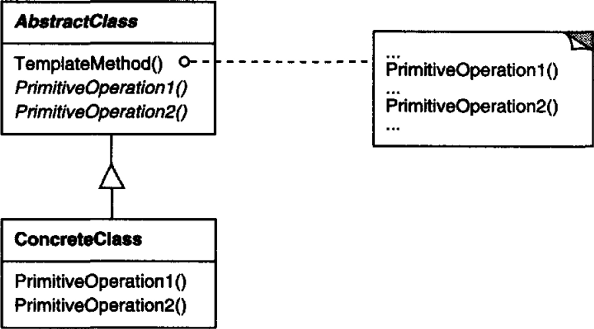

# 의도

알고리즘의 뼈대만 정의하고 각 단계에서 수행할 구체적 처리는 서브 클래스 쪽으로 미룬다. 

서브 클래스에서 알고리즘의 각 단계를 재정의하여 구현한다.

# UML

AbstractClass에서는 알고리즘의 뼈대(`TemplateMethod()`)를 정의한다. 

`TemplateMethod()`내에는 서브 클래스에서 재정의될 메서드들 또는 AbstractClass 내에 구현된 메서드를 호출한다.

AbstractClass의 서브 클래스들은 알고리즘의 뼈대에서 호출될 메서드들을 구현한다.

# 사용 시기

- 알고리즘의 변하지 않는 부분을 정의한 후 다양해질 수 있는 부분을 서브 클래스에서 정의하도록 남겨둘 때
- 서브 클래스 사이에 공통적인 부분은 한 곳에 모아두고 싶을 때

# 장점

라이브러리에 정의할 클래스들의 공통 부분을 분리 시킴으로 코드 재사용성을 올린다.

# 단점

???

# 구현

무조건 override 해야할 메서드와 override가 가능한 메서드를 구분해야한다. 사용자가 서브 클래스를 구현할 때 모든 메서드를 override하려면 매우 피곤해지기 때문에 추상 클래스에서 어떻게 정의하고 있는지 알고 있어야 한다. 책에서는 이런 메서드를 정의할 때 *이름에 규칙을 부여하여 짓도록* 권장하고 있다.

추가 바람.