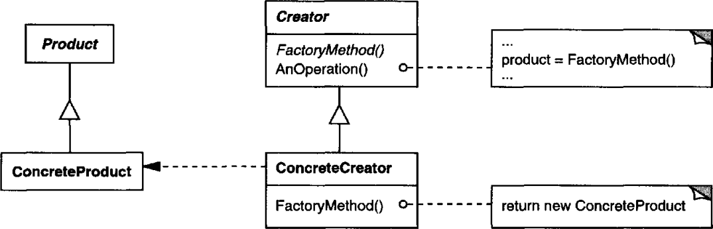

# 의도

객체를 생성하기 위해 **인터페이스를 정의**하지만, 어떤 클래스의 인스턴스를 생성할 지에 대한 **결정은 서브 클래스**가 내리도록 한다.

# 사용 시기

- 어떤 클래스가 자신이 생성하게 될 객체의 클래스가 어떤 것인지 예측할 수 없을 때
- 생성할 객체에 대해 명시할 책임을 서브 클래스가 담당하길 바랄 때
- 여러 서브 클래스 중 하나에게 책임을 위임하고 어느 서브 클래스가 위임자인지에 대한 정보를 로컬라이즈하고 싶을 때

# UML



추상 클래스에는 **서브 클래스에서 재정의될 생성 메서드를 명시**한다. 서브 클래스에서 이 메서드를 재정의하여 구체적인 객체를 생성하게 된다. 

서브 클래스에서 어떤 객체를 생성하게 되므로 1:1관계 즉, *병렬 클래스 구조*가 나타난다.

# 장점

서브 클래스에서 재정의할 수 있는 hook 메서드를 제공한다. 다형성을 가진 객체를 직접 생성하는 것보다 유연하게 생성할 수 있다.

# 단점

**병렬 클래스 구조**를 만들게 된다. 생성해야할 객체마다 팩토리 메서드 추상 클래스의 서브 클래스를 구현해야하기 때문에 병렬 클래스 구조를 만들 수 있다.

# 구현

## 추상 클래스를 상속받아 생성

```cpp
// 팩토리 메서드 추상 클래스
class CarFactory {
public:
    virtual Car* CreateCar() {
        return new Car();
    }
}
```

어떤 객체를 생성할 지에 대한 추상 클래스를 구성했다면 이제 서브 클래스를 구현하여 어떤 객체를 생성할지 결정한다.

> 책에서 제시된 예제는 팩토리 메서드 클래스를 순수 가상함수로 만들지 않았는데, 객체의 종류에 따라 입맛대로 구성하면 될 것 같다.

```cpp
class BusFactory : public CarFactory {
public:
    virtual Car* Create(){
       return new Bus();
    }
}

class SUVFactory : public CarFactory {
public:
    virtual Car* Create(){
        return new SUV();
    }
}
```

팩토리 메서드를 가진 추상 클래스를 상속받아 서브 클래스에서 구체적인 생성 과정을 구현한다.

추상 클래스를 상속받은 팩토리를 만들고, 추상 클래스의 인터페이스에 정의된 메서드를 호출하기만 하면 구체적인 객체가 생성된다.

Car를 상속받아 구현된 객체를 생성하기위해 서브 클래스가 각각 *1대1 대응*되어 생성된 모습이다. 이런 구조를 **병렬 클래스 구조**라고 하는데, 코드의 양이 늘어나게 되는 문제가 있다.

## 매개변수에 의한 생성

서브 클래스에 구체적인 생성 과정을 구현하지 않고 매개변수에 의해 생성하도록 할 수 있다.

```cpp
class CarFactory {
public:
    static Car* Create(CarType type){
        switch(type){
            case CarType::BUS:
                return new Bus();
            case CarType::SUV:
                return new SUV();
        }
        return new Car();
    }
}
```

매개변수에 따라 다른 차량을 생성하게 구현할 수 있다. 

또한 매개변수에 의해 생성하는 팩토리 메서드 클래스를 상속받아서 변경할 수 있다.