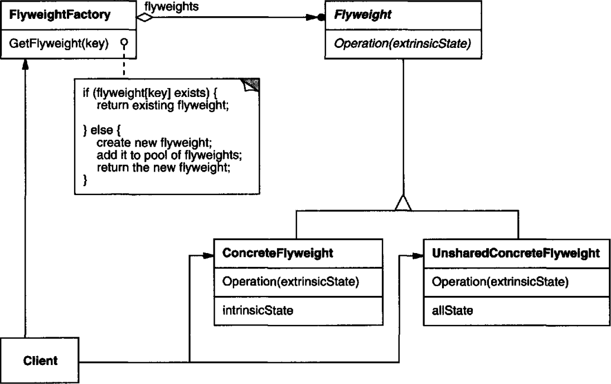

# 의도

**공유**를 통해 다수의 작은 객체들을 지원한다. 수많은 객체가 하나의 클래스에 대해 각각의 인스턴스를 갖게 하기보다 미리 생성해놓은 인스턴스의 참조자를 가지도록 만드는 것이다.

# UML



사용자(Client)는 팩토리(FlyweightFactory)를 통해 플라이웨이트(Flyweight) 객체를 생성한다.

이 때 자료구조를 통해 이미 생성된 Flyweight 인스턴스를 반환하거나 새로 만들어 반환한다.

Flyweight 추상 클래스에는 모든 플라이웨이트 객체가 가지는 행동을 정의한다.

Fyweight 클래스의 서브 클래스들은 추상 클래스에 정의된 메서드를 구현한다.

# 사용 시기

- 프로그램이 대량의 객체를 사용하여 저장 비용이 매우 높아질 때
- 다수의 객체들이 비교적 적은 수의 **공유된 객체**로 대체될 수 있을 때. 살펴보니, 객체의 본질은 똑같지만 부가적인 속성만 달랐을 때

# 장점

인스턴스를 공유함으로써 전체 개수를 줄일 수 있다. **메모리 사용량을 줄이는 효과**가 된다.

# 단점

공유된 인스턴스를 이용하여 부가적인 상태에 대한 연산에 드는 비용이 생긴다.

특정 인스턴스만 다르게 동작해야한다면 이 패턴을 적용할 수 없다.

공유된 인스턴스를 수정하면 그 인스턴스를 참조하고 있는 객체에 영향을 끼친다.

# 구현

먼저 공유할 객체에서 본질적 속성만 남겨두고 부가적인 속성들은 제외시킨다.

공유할 객체는 사용자가 생성할 수 없어야 하므로 팩토리를 통해 접근하도록 만든다.

인벤토리에 목검이 100만개나 있다고 가정하자. 모든 목검은 외형이 같지만, 등급이라는 속성만 다르다고 하자.

이 때 목검 인스턴스는 리소스(본질)와 등급(속성)을 갖는 객체라고 할 수 있다. 

```cpp
class WoodSword {
public:
		WoodSword(int tier):_tier(tier)
		int getTier();
private:
		Sprite *_sprite;
		int _tier;
}
```

목검 스프라이트가 1Kb라고 가정하면 인벤토리에 들어있는 목검의 메모리 사용량은 100만Kb이다. 약 0.1Gb에 달한다.

여기서 어차피 리소스가 똑같다면, 공유된 인스턴스로 만들어 메모리를 줄일 수 있다는게 플라이웨이트 패턴이다.

```cpp
class WoodSwordFactory {
public:
		static WoodSword* createWoodSword(int tier) {
				if(_map.contains(tier) == false){
						_map[tier] = new WoodSword(tier);
				}
				return _map[tier];
		}
private:
		std::Map<int, WoodSword*> _map;
}

class WoodSword {
public:
  int getTier() { return _tier; }
    WoodSword() { }
private:
    Sprite* _sprite;
    int tier;
}
```

공유된 인스턴스를 참조하기 위해 팩토리를 통해야만 목검을 참조할 수 있도록 되어있다.

만약 생성된 적이 없는 목검이라면 새로 생성한 후 반환하도록 하고 있다. 반면 이미 생성되어있는 목검이라면 그 인스턴스를 바로 반환하도록 하고 있다.

이렇게 할 경우 목검의 등급이 모두 같다면 새로운 인스턴스를 생성하지 않고 한 번 생성된 목검의 인스턴스를 참조하게 되므로 약 0.1Gb에서 1Kb에 가깝게 메모리 샤용량이 줄어들게 된다.

만약 목검의 스프라이트가 바뀌었다면 팩토리에 등록되어있는 인스턴스 전체에게 영향이 갈 것이다. 이런 사이드 이펙트를 조심하기 위해서는 **절대 변하지 않는 본질적 속성만 플라이웨이트 객체에 담아야 한다**.