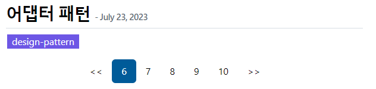

# 동기

Gatsby로 블로그를 만들 때 Gatsby Starter Blog 테마를 적용했다. 매우 깔끔한 테마에 파일 구조도 단순하여 금방 글을 작성하여 배운 내용을 정리하고 있었다.

어느덧 게시글 수가 20개를 향해가다보니 한 페이지에 너무 많은 글이 보이기 시작했다.

Gatsby Starter Blog 테마에서는 Pagination을 지원하지 않는다. 그래서 찾아봤더니 공식 문서에서 기능을 개발하는 방법을 제공하고 있었다.

그러나 [🔗공식 문서](https://www.gatsbyjs.com/docs/adding-pagination/)에서 제공하는 방법을 그대로 적용시키려니 잘 안되었다.

React에 대해서 무지했던 나는, 문서도 제대로 읽지 않고 그대로 코드를 복붙하여 넣었다. 당연히 안되니까 의지가 팍 상해버렸다. 제대로된 이해가 필요했다.

# Gatsby 이해하기

Gatsby는 React를 기반으로 **_정적 웹페이지 또는 애플리케이션_**을 빠르게 제공하는 프레임워크다.

즉, Gatsby로 만든 블로그는 사실 **Gatsby가 만든 정적 페이지**인 것이다.

`gatsby build`를 실행하게 되면 여러 절차를 거쳐 `gatsby-node.js`로 도달하게 되는데 여기에서 **사이트에 필요한 모든 페이지를 생성한다**.

`gatsby-node.js`에는 GraphQL을 통해 폴더 구조에 들어있는 모든 파일을 조사하여 블로그로 보여줄 페이지를 생성하는 코드가 작성되어 있다.

# 공식 문서 이해하기

공식 문서에서 제시한 방법은 이렇다.

먼저 `BlogList`라는 컴포넌트를 작성하는데, 여기에는 쿼리를 통해 전체 게시글중 일부만 SELECT하여 게시글 리스트를 보여주는 JSX표현식(이 용어가 맞나?)을 갖고 있다.

`BlogList`는 `src/template/blog-list-template.js`에 저장되어 있다. 빌드를 할 시기에 `gatsby-node.js`에서 전체 페이지를 만들 때 저 파일을 불러온다. 결과적으로 빌드가 끝나면 아래처럼 페이지가 생성된다.

```
정적페이지
|   // 게시글
+-- post A
+-- post B
|   ...
|
|   // 게시글 리스트
+-- post-list-page-1-to-10
+-- post-list-page-11-to-20
    ...
```

Gatsby Starter Blog 테마에 바로 적용할 수 없었던 이유는, 내가 멍청하게도 `src/pages/index.js` 를 수정하려고 해서 그랬다. 사실 그대로 적용해도 잘 작동한다. 새로 `blog-list-template.js`파일을 만들지 않아도 될 것 같다고 착각해서 그랬다.

# Pagination 적용하기

공식 문서에서 제공하는 방법을 그대로 따라했지만, 자잘하게 수정할 점이 있었다.

## 쿼리 수정

GraphQL 쿼리에서는 edges라는 필드?에 접근하고 있는데 그 부분을 완전히 제거했다.

Gatsby Starter Blog 테마에서는 게시글 목록을 갖고 올 때 `const posts = result.data.allMarkdownRemark.nodes`를 통해 접근하고 있었기 때문에 쿼리를 수정하든가 저 코드를 수정해야했다.

```js
export const blogListQuery = graphql`
  query blogListQuery($skip: Int!, $limit: Int!) {
    site {
      siteMetadata {
        title
      }
    }
    allMarkdownRemark(
      sort: { frontmatter: { date: DESC } }
      limit: $limit
      skip: $skip
    ) {
      nodes {
        excerpt
        fields {
          slug
        }
        frontmatter {
          date(formatString: "MMMM DD, YYYY")
          title
          description
          tags
        }
      }
    }
  }
`
```

## src/pages/index.js 삭제

Pagination이 적용된 게시글 리스트 페이지를 생성하려고 보니 첫 페이지는 루트 경로, 즉 `/`로 접근할 때 보여줄 페이지를 만들고 있었다.

그런데 `src/pages/index.js`라는 파일이 존재하기 때문에 한 경로에 두 페이지가 생성되고 있다. 몇몇 사이트에서는 Redirect를 이용하라고 되어있었지만, 사이트에 처음 접속하면 Redirect되는 순간 404에러가 발생했다.

해결 방법은 그냥 단순하게 파일을 삭제하는 것이었다. 프레임워크의 정확한 동작을 모르지만 `index.js`가 루트 경로를 담당하는 페이지 역할을 하는 것 같다.

## 네비게이션 버튼 만들기

이제 빌드를 하면 Pagination이 적용되어 게시글 리스트 페이지가 여러 개 생성된다.

이제 네비게이션으로 페이지를 이동할 수 있게 새로 컴포넌트를 만들어야 했다.

이건 조금 하드코딩을 했다.

먼저 pagination에 필요한 몇 가지 정보를 context에 담아 전달했다.

```js
// gatsby-node.js

exports.createPages = async ({ graphql, actions, reporter }) => {
  // ...

  const postsPerPage = 10 // 한 페이지에 보여줄 게시글 수
  const paginationPageCount = Math.ceil(posts.length / postsPerPage) // 전체 페이지 수
  const numPagination = 5 // 네비게이션에 보일 페이지 수

  Array.from({ length: paginationPageCount }).forEach((_, i) => {
    // create paginated page.
    createPage({
      path: i === 0 ? `/` : `/${i + 1}`,
      component: path.resolve("./src/templates/pagination.js"),
      context: {
        limit: postsPerPage,
        skip: i * postsPerPage,
        currentPage: i + 1,
        numPagination,
        paginationPageCount,
      },
    })
  })
}
```

현재 페이지, 전체 페이지 수, 네비게이션에 보일 페이지 수를 전달했다.

페이지를 생성하는 코드에서는 위 정보를 그대로 컴포넌트에게 전달했다.

```js
// src/template/pagination.js

export default class PaginationPage extends React.Component {
  render(){
    const location = { pathname: "/" }
    const siteTitle = this.props.data.site.siteMetadata?.title || `Title`
    const posts = this.props.data.allMarkdownRemark.nodes

    return (
      <Layout location={location} title={siteTitle}>
        <Bio/>
        // 게시글 리스트 구조 코드

        <Pagination
          currentPage={this.props.pageContext.currentPage}
          numPagination={this.props.pageContext.numPagination}
          paginationPageCount={this.props.pageContext.paginationPageCount}
          />
    )
  }
}
```

컴포넌트에서는 주어진 정보를 토대로 html 태그를 생성하고 className을 설정하여 하이라이트 되도록 했다.

```js
// src/components/pagination.js

import * as React from "react"

const Pagination = ({ currentPage, numPagination, paginationPageCount }) => {
  const previousPaginationLastPage =
    Math.floor((currentPage - 1) / numPagination) * numPagination
  const nextPaginationFirstPage =
    Math.floor((currentPage - 1) / numPagination + 1) * numPagination + 1

  let previousPagination, nextPagination
  if (currentPage > numPagination) {
    previousPagination = (
      <a
        className="pagination-link pagination-previous"
        href={`/${previousPaginationLastPage}`}
      >
        {"<<"}
      </a>
    )
  }
  if (nextPaginationFirstPage <= paginationPageCount) {
    nextPagination = (
      <a
        className="pagination-link pagination-next"
        href={`/${nextPaginationFirstPage}`}
      >
        {">>"}
      </a>
    )
  }

  //
  const paginationList = Array(paginationPageCount)
    .fill()
    .map((_, i) => i + 1)
    .slice(previousPaginationLastPage, nextPaginationFirstPage - 1)

  return (
    <div className="pagination">
      {previousPagination}
      {paginationList.map(index => {
        return (
          <a
            className={`pagination-link${
              index === currentPage ? " pagination-current-link" : ""
            }`}
            href={`/${index !== 1 ? `${index}` : ``}`}
          >
            {index}
          </a>
        )
      })}
      {nextPagination}
    </div>
  )
}

export default Pagination
```

```css
/* src/styles/pagination.css */
/* src/style.css에서 import하고 있습니다. */
.pagination {
  display: flex;
  justify-content: center;
  align-items: center;
}

.pagination-link {
  color: black;
  vertical-align: middle;
  padding: var(--spacing-2) var(--spacing-4);
  text-decoration: none !important;
}

.pagination-link.pagination-current-link {
  background-color: var(--color-primary);
  border-radius: 6px;
  color: white;
}
```

# 결과물



React에 대해 잘 모르지만 열심히 코드를 뜯어보며 이해하니 매우 간단하게 구현할 수 있었다.

다음엔 Github dicussion을 이용해 댓글 기능을 추가하는 기능과 구글에서 이 블로그를 검색할 수 있는 기능을 구현해야겠다.
