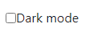
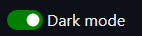

[이전 게시글](/posts/Gatsby-사이트-구축기)에서 다크모드를 적용하기로 마음만 먹고 계속 미뤘는데, 이번에 구현해보기로 마음먹었다.

# gatsby-plugin-dark-mode

이 플러그인은 `body`의 `class` 속성을 변경하여 각각 다른 css를 적용할 수 있는 도구를 제공하고 있다.

공식 문서를 따라 아래 코드를 별도의 컴포넌트로 만들어 저장했다.

```jsx
// src/components/theme-toggler.js
import React from 'react'
import { ThemeToggler as DarkModeThemeToggler } from 'gatsby-plugin-dark-mode'

class ThemeToggler extends React.Component {
  render() {
    return (
      <DarkModeThemeToggler>
        {({ theme, toggleTheme }) => (
          <label>
            <input
              type="checkbox"
              onChange={e => toggleTheme(e.target.checked ? 'dark' : 'light')}
              checked={theme === 'dark'}
            />{' '}
            Dark mode
          </label>
        )}
      </DarkModeThemeToggler>
    )
  }
}

export { ThemeToggler }

```

그 다음 만들어둔 컴포넌트를 `layout.js`에 포함시켜서 페이지에 노출시켰다.

```jsx
...
import { ThemeToggler } from "./theme-toggler"

const Layout = ({ location, title, children }) => {
  ...
  return (
    <div className="global-wrapper" data-is-root-path={isRootPath}>
      <ThemeToggler/>
      <header className="global-header">{header}</header>
      <main>{children}</main>
      <footer>
        © {new Date().getFullYear()}, Built with
        {` `}
        <a href="https://www.gatsbyjs.com">Gatsby</a>
      </footer>
    </div>
  )
}

```

# CSS 작업

## 체크박스 꾸미기



여기까지 했다면 이렇게 기본 체크박스가 생성되므로 보기에 좋지 않다.

css로 조금 예쁘게 꾸미기 위해 [이 블로그](https://www.daleseo.com/css-toggle-switch/)를 참고했다.



## 다크모드 css 만들기

이제 토글할 때마다 body의 class가 달라지면서 css를 다르게 적용할 수 있게 되었다.

깃허브 테마를 따라하기 위해 css변수에 rgb값을 저장하고, 그 값으로 각 element의 색깔을 정하도록 했다.

```css
:root {
  --color-background: #ffffff;
  --color-blockquote: #656d76;
  --color-blockquote-border: #d0d7de;
  --color-header-border-bottom: #d8dee4;
  --color-table-border: #d8dee4;
  --color-table-evenRow-background: #f6f8fa;
  --color-text: #1f2328;
  --color-text-heading: var(--color-text);
  --color-text-bio: var(--color-text);
  --color-text-light: #656d76;
  --color-codeblock-background: #eff1f3;
}

body.dark {
  --color-background: #0d1117;
  --color-blockquote: #7d8590;
  --color-blockquote-border: #30363d;
  --color-header-border-bottom: rgb(33, 38, 45);
  --color-table-border: #30363d;
  --color-table-evenRow-background: #161b22;
  --color-text: #e6edf3;
  --color-text-heading: var(--color-text);
  --color-codeblock: var(--color-text);
  --color-codeblock-background: rgba(110, 118, 129, 0.4);
}

...

```

## gatsby-remark-prismjs

토글될 때마다 css변수가 바뀌면서 다크모드가 적용되지만, 코드블록의 색깔은 변하지 않았다. 나는 `prismjs` 플러그인으로 코드 하이라이팅을 하고 있어서 똑같이 css로 색깔을 조절할 수 있었다. 이것도 css변수를 통해 색깔값만 따로 설정하도록 변경했다.

```css
/* src/styles/prism-ghtheme.css */

code[class*="language-"],
pre[class*="language-"] {
  color: var(--color-prismjs-code);
  font-family: "Consolas", "Bitstream
  ...
}

... 

.token {
  color: var(--color-prismjs-code);
}

.token.comment,
.token.prolog,
.token.doctype,
.token.cdata {
  color: var(--color-prismjs-token-comment);
  font-style: italic;
}

...

```

```css
/* src/styles/ghcolor.css */

:root {
  --color-prismjs-code: #24292f;
  --color-prismjs-codeblock: #b3d4fc;
  --bgcolor-prismjs-codeblock: #f6f8fa;
  --color-prismjs-inlinecode: #24292f;
  --bgcolor-prismjs-inlinecode: rgba(175,184, 193, 0.2);
  ...
}

body.dark {
  --color-prismjs-code: #c9d1d9;
  --color-prismjs-codeblock: #e6edf3;
  --bgcolor-prismjs-codeblock: #161b22;
  --color-prismjs-inlinecode: #e6edf3;
  --bgcolor-prismjs-inlinecode:rgba(110, 118, 129, 0.4);
  ...
}
```

구체적인 설정값은 직접 [리포지토리](https://github.com/10cheon00/10cheon00.github.io)에서 볼 수 있다.

## utterances

블로그에 utterances를 적용하여 issue를 댓글처럼 활용하도록 했다. 그런데 utterances는 iframe을 이용하기 때문에 css를 변경하는 방법을 사용할 수 없다. 

그래서 iframe의 window로 `postMessage`를 날리는 방법밖에 없다. 

[Dynamically change theme? · Issue #170 · utterance/utterances | Github](https://github.com/utterance/utterances/issues/170#issuecomment-504716232)

여기저기 찾아보다가 이 방법을 시도하니 바로 적용이 되었다. 

```jsx
// src/components/theme-toggler.js

import * as React from "react"
import { ThemeToggler as DarkModeThemeToggler } from "gatsby-plugin-dark-mode"

class ThemeToggler extends React.Component {
  render() {
    const changeUtteranceTheme = () => {
      const utterancesEl = document.querySelector(".utterances-frame")
      if (utterancesEl) {
        const theme = document.body.classList.contains("dark")
          ? "github-dark"
          : "github-light"
        const message = {
          type: "set-theme",
          theme: theme,
        }
        utterancesEl.contentWindow.postMessage(message, "https://utteranc.es")
      }
    }
    return (
      <DarkModeThemeToggler>
        {({ theme, toggleTheme }) => (
          <label className="theme-toggler">
            <input
              type="checkbox"
              onChange={e => {
                toggleTheme(e.target.checked ? "dark" : "light")
                changeUtteranceTheme()
              }}
              checked={theme === "dark"}
            />{" "}
            <span>Dark mode</span>
          </label>
        )}
      </DarkModeThemeToggler>
    )
  }
}

export { ThemeToggler }

```

`theme-toggler.js`에서 `onChange`가 일어난 후에 추가로 utterances의 테마를 변경하는 함수를 실행하도록 했다. body의 class를 확인하여 변경된 테마의 색에 따라 요청을 넣도록 했다.

