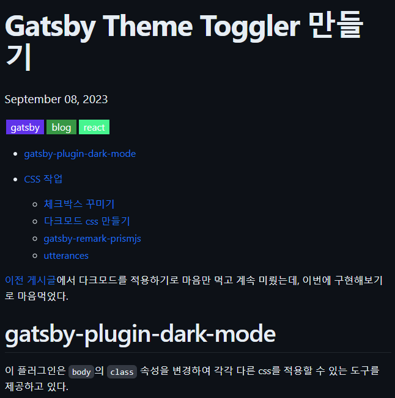
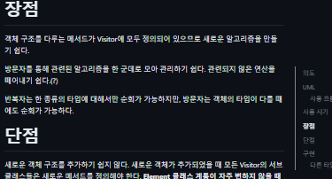

# 동기

velog를 보면 게시글 오른쪽에 목차 사이드바가 떠있다. 간단한 기능이지만 긴 게시물의 경우 굳이 스크롤로 이동하지 않고 사이드바의 링크를 클릭해서 게시글을 이동할 수 있으니 꽤 좋은 기능이다.

이런 플러그인을 찾기는 어려울 것 같아서 직접 만들어보기로 했다.

# tableOfContents 쿼리

게시물마다 목차만 추출해오기 위해서 [Gatsby Blog에 목차 추가하기 | Harry Park's Blog](https://soopdop.github.io/2020/12/03/add-table-of-content-gatsby/)를 참고했다.

graphql을 이용해서 이미 만들어져 있는 목차 데이터를 갖고 올 수 있다.

```js
// gatsby-node.js

exports.createPages = async ({ graphql, actions, reporter }) => {
  const { createPage, createRedirect } = actions

  // Get all markdown blog posts sorted by date
  const result = await graphql(`
    {
      allMarkdownRemark(sort: { frontmatter: { date: ASC } }, limit: 1000) {
        nodes {
          id
          fields {
            slug
          }
          frontmatter {
            tags
          }
          tableOfContents
        }
      }
    }
  `)

  ...
```

이렇게 쿼리문을 작성하고 `localhost:8000/__graphql`로 접속해서 실행해보면 아래처럼 결과를 얻게 된다.

```json
{
  "data": {
    "allMarkdownRemark": {
      "nodes": [
        {
          "id": "5611776e-48ff-5ad2-b058-ddd2071068d1",
          "fields": {
            "slug": "/posts/Gatsby-사이트-구축기/"
          },
          "frontmatter": {
            "tags": [
              "gatsby",
              "blog"
            ]
          },
          "tableOfContents": "<ul>\n<li><a href=\"#gatsby%EB%A5%BC-%EC%84%A0%ED%83%9D%ED%95%9C-%EC%9D%B4%EC%9C%A0\">Gatsby를 선택한 이유</a></li>\n<li><a href=\"#%EC%84%A4%EC%B9%98\">설치</a></li>\n<li><a href=\"#fatal-couldnt-find-remote-ref-refsheadsmain\">fatal: Couldn't find remote ref refs/heads/main</a></li>\n<li><a href=\"#%ED%83%9C%EA%B7%B8-%EC%B6%94%EA%B0%80%ED%95%98%EA%B8%B0\">태그 추가하기</a></li>\n<li><a href=\"#todo\">TODO</a></li>\n</ul>"
        },

        ...
      ]
    }
  }
}
```

이 블로그는 `gatsby-starter-blog`로 제작되어서 `tableOfContents`가 html을 반환한다. a태그가 리스트에 담겨있는 형태이므로 이걸 렌더링한뒤 css로 꾸미기만 하면 된다.

# 컴포넌트 제작

게시물 페이지에서만 목차 컴포넌트를 렌더링해야한다. 

```js
// src/components/table-of-contents.js

import * as React from "react"

class TableOfContents extends React.Component {
  render() {
    return (
      <div className="table-of-contents-layout">
        <div
          className="table-of-contents"
          dangerouslySetInnerHTML={{ __html: this.props.tableOfContents }}
        ></div>
      </div>
    )
  }
}

export default TableOfContents
```

게시물 컴포넌트안에서 목차 컴포넌트가 등장해야하므로 아까 쿼리문으로 얻어낸 `tableOfContents`를 전달받아 그대로 렌더링한다.

이 때 전달받은 값이 raw html이므로 `dangerouslySetInnerHTML` 속성에 전달한다.

```js
// src/templates/blog-post.js

...
import TableOfContents from "../components/table-of-contents"
...

const BlogPostTemplate = ({
  data: { previous, next, site, markdownRemark: post },
  location,
}) => {
  const siteTitle = site.siteMetadata?.title || `Title`
  const tableOfContents = post.tableOfContents
  return (
    <Layout location={location} title={siteTitle}>
      <article
        className="blog-post"
        itemScope
        itemType="http://schema.org/Article"
      >
        ...
        <TableOfContents
          tableOfContents={tableOfContents}
        />
        <section
          dangerouslySetInnerHTML={{ __html: post.html }}
          itemProp="articleBody"
        />
        ...
      </article>
      ...
    </Layout>
  )
}
```

게시물 컴포넌트에서는 아까 만들어둔 `TableOfContents` 컴포넌트를 불러온 다음 graphql에서 얻은 데이터를 넣어주기만 하면 된다.

# 꾸미기

여기까지 한다면 게시물에 목차가 드러난다.



css로 알차게 꾸며주면 된다.

```css
@media screen and (max-width: 1440px) {
  .table-of-contents {
    display: none;
  }
}

.table-of-contents-layout {
  position: sticky;
  top: 150px;
}

.table-of-contents {
  position: absolute;
  left: 100%;
}

.table-of-contents > ul {
  margin: 0 0 0 var(--spacing-6);
  max-width: var(--maxWidth-xs);
  width: var(--maxWidth-xs);
  border-left: 2px solid var(--color-blockquote);
}

.table-of-contents ul {
  padding-left: var(--spacing-4);
  list-style-type: none;
}

.table-of-contents a {
  text-decoration: none;
  color: var(--color-blockquote);
  font-size: var(--fontSize-0);
}

.table-of-contents a.active {
  color: var(--color-text) !important;
  font-weight: var(--fontWeight-bold);
}

.table-of-contents p {
  margin: 0;
}

```

목차 레이아웃은 `position: sticky`속성을 주고 그 안에 목차 요소를 배치한다. 

목차 요소는 `position: absolute`에 `left: 100%`로 `sticky`로 정해진 레이아웃 요소의 오른쪽에 배치되도록 한다.

# 현재 읽고 있는 내용 하이라이트 하기

스크롤 될 때마다 현재 어느 목차를 읽고 있는지 확인해야 하므로 `onScroll`이벤트리스너를 추가하여야 한다.

컴포넌트가 마운트될 때 이벤트 리스너를 추가하고, 언마운트될 때 리스너를 삭제한다.

그리고 DOM에 있는 목차요소들(`h1`, `h2`, `h3`)의 y좌표가 0보다 작은지 검사하고 가장 0과 가까운 y좌표를 가진 요소를 하이라이트 하도록 했다.

하이라이트는 단순하게 `classList="active"`처럼 클래스 이름으로 css를 다르게 적용하는 방법을 사용했다.

```js
// src/components/table-of-contents.js
import * as React from "react"

class TableOfContents extends React.Component {
  componentDidMount() {
    window.addEventListener("scroll", this.updateTableOfContents)
  }

  updateTableOfContents() {
    const headers = document.querySelectorAll(`
      section[itemProp="articleBody"] h1,
      section[itemProp="articleBody"] h2,
      section[itemProp="articleBody"] h3
    `)
    const links = document.querySelectorAll(`div.table-of-contents a`)
    const currentHeader = Array.from(headers)
      .reverse()
      .find(e => {
        const pos = e.getBoundingClientRect()
        return pos.y < 0
      })

    links.forEach(e => {
      if (e.textContent === currentHeader?.textContent) {
        e.className = "active"
      } else {
        e.className = ""
      }
    })
  }

  componentWillUnmount() {
    window.removeEventListener("scroll", this.updateTableOfContents)
  }

  render() {
    return (
      <div className="table-of-contents-layout">
        <div
          className="table-of-contents"
          dangerouslySetInnerHTML={{ __html: this.props.tableOfContents }}
        ></div>
      </div>
    )
  }
}

export default TableOfContents
```


