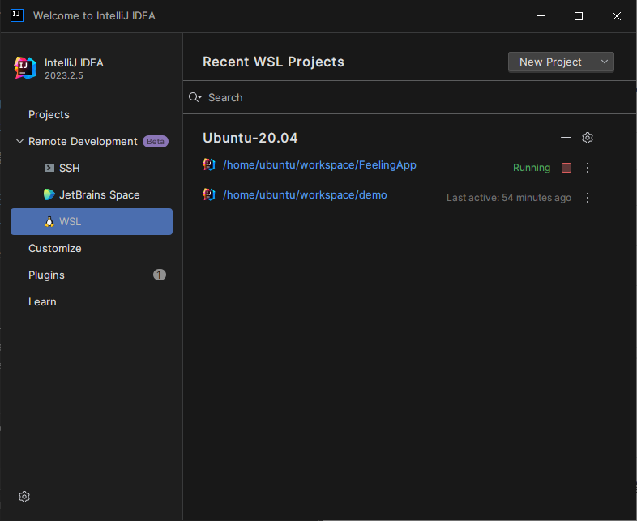
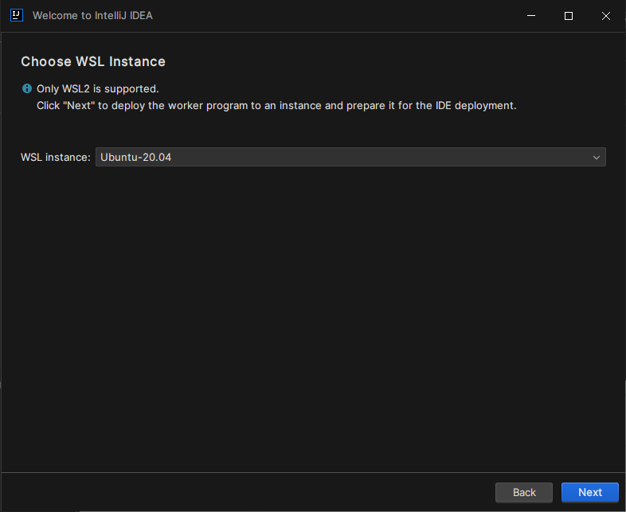
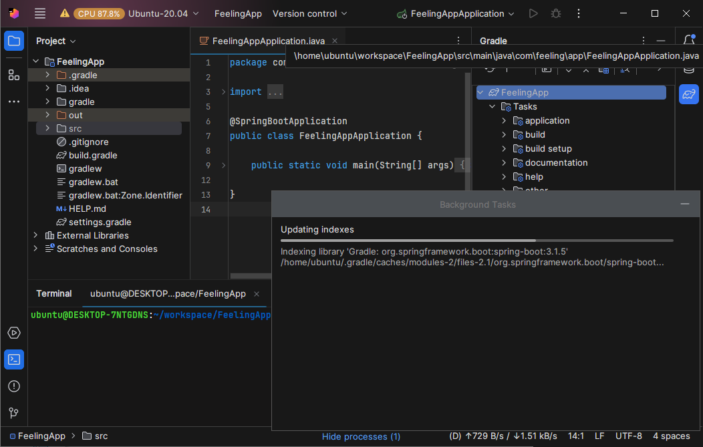
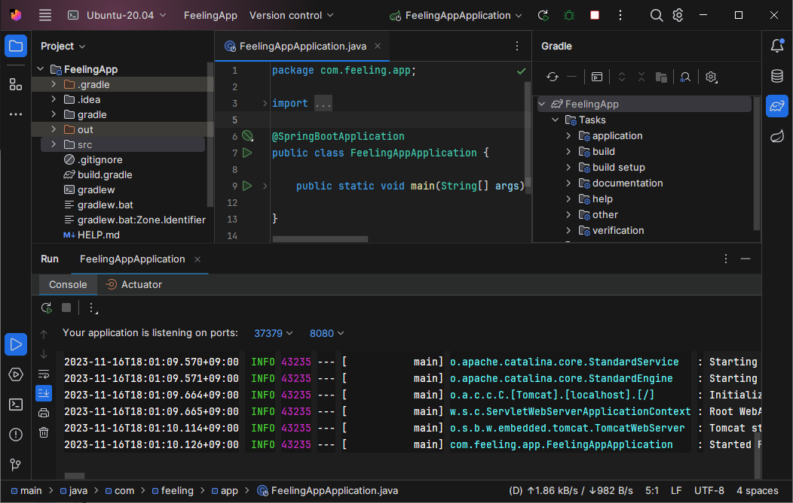

# 서론

C에 설치한 인텔리제이로 WSL에 있는 프로젝트를 돌리려고 하니, `UNC Path is missing hostname: //` 이런 에러가 뜨지 않나, 어찌어찌 Gradle import를 성공하고 실행시키니 `Could not find or load main class com.example.demo.demoapplication` 이런 에러가 뜨지 않나... 정말 화가 나서 싹 설치 제거하고 다시 설치했는데도 이렇게 오류가 떴는데, 정말 간단하게 해결할 수 있었다.

```
# 환경

WSL 버전: 2.0.9.0
커널 버전: 5.15.133.1-1
WSLg 버전: 1.0.59
MSRDC 버전: 1.2.4677
Direct3D 버전: 1.611.1-81528511
DXCore 버전: 10.0.25131.1002-220531-1700.rs-onecore-base2-hyp
Windows 버전: 10.0.19045.3570
Ubuntu 20.04.6 LTS
IntelliJ IDEA Ultimate 2023.2.5
jbrsdk-17 (WSL) java version "17.0.9" (JetBrain Runtime JDK 17.0.9)

```

# [IntelliJ 설치](https://www.jetbrains.com/ko-kr/idea/download/?section=windows)

다운로드 받은 파일을 실행해서 설치한다. 

# [WSL2 설치](https://learn.microsoft.com/ko-kr/windows/wsl/install-manual)

아직 윈도우 11을 사용하지 않아서 다른 링크를 갖고 왔다.

# IntelliJ에서 JetBrain Client로 WSL 사용하기

설치를 다 끝내고 인텔리제이를 키게 되면 이렇게 Remote Development에 WSL이 있다.



우측 상단에 New Project를 누르면 이렇게 설치된 배포판을 고를 수 있다. 



설치된 배포판을 선택하고 나면 IDE Version을 갖고 온다는 로딩이 뜬 후에 IDE를 고를 수 있는 드롭다운이 보인다.


고르고 싶은 IDE를 고른 다음 하단에 Project directory에 불러올 스프링 프로젝트의 경로를 지정해주면 된다.


열심히 다운로드하는 모습이다.

다운로드가 다 끝나면 IntelliJ 창이 아닌 JetBrain Client라는 새로운 창이 열린다.

gradle import도 잘 되는 모습이다.



좌측 상단의 Ubuntu 20.04를 클릭하면 신기하게도 성능 프로파일을 잘 보여준다.


아무것도 건드리지 않고 프로젝트를 실행하면 역시 잘 된다.

앞으로 WSL을 사용해 개발하려면 이렇게 해야겠다.

