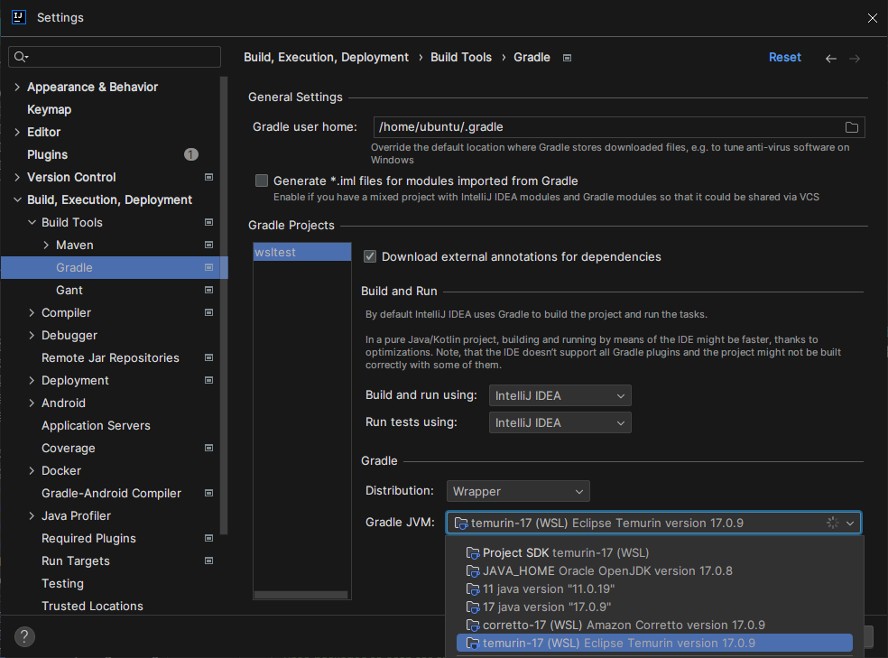
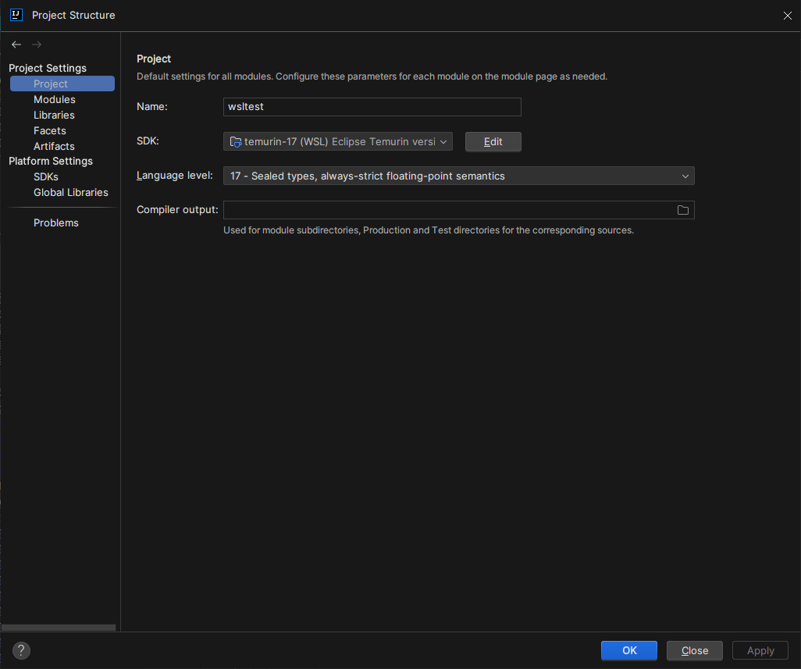

```
Windows 10 Pro 22h2 19045.3570
IntelliJ Idea 2023.2.4
```

[Spring Initializr](https://start.spring.io)를 이용해 간단한 설정파일들을 받은 후 WSL에 설치되어있는 JDK를 이용해 프로젝트를 불러오려고 했다.



Gradle 설정은 이렇게 해두었다. 사진에는 짤렸는데 Add SDK 항목에서 WSL에 JDK를 설치할 수 있다.



프로젝트 설정은 이렇게 WSL에 설치한 JDK를 선택하고, Java 17을 사용할 것이어서 버전도 맞춰주었다.

그런데 프로젝트를 열어보니, Update Indexing...에서 한 시간이 넘도록 가만히 있는 것 같았다. 이 문제를 해결하려고 여기저기 검색했었는데, 아래 Github Issue에서 해답을 찾을 수 있었다.

[Windows Defender is fcking the performance of Windows 11 WSL2 · Issue #8995 · microsoft/WSL](https://github.com/microsoft/WSL/issues/8995#issuecomment-1356454733)

윈도우 방화벽에서 *특정 프로세스*를 제외시키면 된다.

```
fsnotifier-wsl
idea64.exe
```

파일이나 폴더를 제외시키는건 딱히 효과가 없었고 프로세스를 제외시키는 것이 효과가 있었다.
