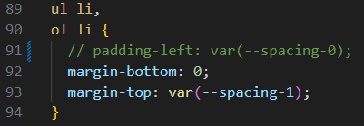
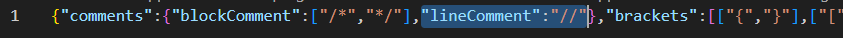

# 문제

vscode에서 scss파일을 작업하다가 `Ctrl+/` 단축키로 주석처리를 했더니, 이렇게 되었다.



편집기에서는 오류를 내지 않는데, `gatsby develop`으로 개발 서버를 열려고 하니 에러를 내뿜는다.

```shell
 ERROR #98123  WEBPACK.DEVELOP

Generating development JavaScript bundle failed

Module build failed (from ./node_modules/css-loader/dist/cjs.js):
CssSyntaxError

(91:6) /home/ubuntu/workspace/10cheon00.github.io/src/styles/post.scss Unknown word

  89 | ul li,
  90 | ol li {
> 91 |   // padding-left: var(--spacing-0);
     |      ^
  92 |   margin-bottom: 0;
  93 |   margin-top: var(--spacing-1);


File: src/style.scss:91:6

failed Re-building development bundle - 0.136s
ERROR in ./src/style.scss
Module build failed (from ./node_modules/mini-css-extract-plugin/dist/loader.js):
ModuleBuildError: Module build failed (from ./node_modules/css-loader/dist/cjs.js):
CssSyntaxError

(91:6) /home/ubuntu/workspace/10cheon00.github.io/src/styles/post.scss Unknown word

  89 | ul li,
  90 | ol li {
> 91 |   // padding-left: var(--spacing-0);
     |      ^
  92 |   margin-bottom: 0;
  93 |   margin-top: var(--spacing-1);

    at processResult (/home/ubuntu/workspace/10cheon00.github.io/node_modules/webpack/lib/NormalModule.js:764:19)
    at /home/ubuntu/workspace/10cheon00.github.io/node_modules/webpack/lib/NormalModule.js:866:5
    at /home/ubuntu/workspace/10cheon00.github.io/node_modules/loader-runner/lib/LoaderRunner.js:400:11
    at /home/ubuntu/workspace/10cheon00.github.io/node_modules/loader-runner/lib/LoaderRunner.js:252:18
    at context.callback (/home/ubuntu/workspace/10cheon00.github.io/node_modules/loader-runner/lib/LoaderRunner.js:124:13)
    at Object.loader (/home/ubuntu/workspace/10cheon00.github.io/node_modules/css-loader/dist/index.js:155:5)
 @ ./gatsby-browser.js 16:0-26
 @ ./.cache/api-runner-browser-plugins.js 46:10-41
 @ ./.cache/api-runner-browser.js 3:16-55
 @ ./.cache/app.js 10:0-65 28:87-32:1 36:20-29 64:0-14 87:19-28 122:6-15 28:0-32:2

1 ERROR in child compilations (Use 'stats.children: true' resp. '--stats-children' for more details)
```

[공식 문서](https://sass-lang.com/documentation/syntax/comments/)에서는 `//`을 사용하지 않고 대신 `/* */`을 사용하도록 되어 있다.

그러니까 vscode내에서 주석 형식이 `//`로 처리되는 것이 문제다.


# 해결법


[linux - Is it possible to use "/" in a filename? - Stack Overflow](https://stackoverflow.com/a/68745974) 

해결법은 간단하다. 위 링크를 참조하면, vscode가 설치된 폴더에서 scss폴더 속 `language-configuration.json`파일을 열고 `lineComment` 속성의 값을 `""`로 바꾸면 된다는 것이다.

파일을 열기 위해 `WIN+R`을 눌러 실행창을 열고 `%LOCALAPPDATA%\programs\Microsoft VS Code\resources\app\extensions\scss`을 입력한다.

그러면 scss폴더의 몇몇 설정들이 담긴 폴더가 열리는데 `language-configuration.json`파일을 연다.



한 줄밖에 없는 파일이 열리는데 바로 보이는 `lineComment`의 값을 `""`로 바꾸면 해결된다.