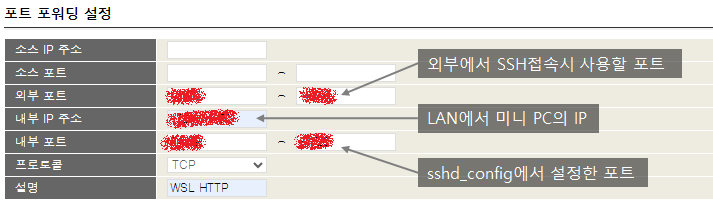
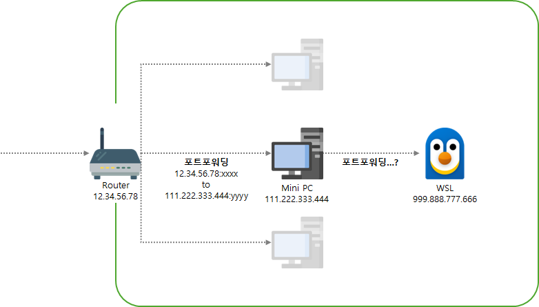
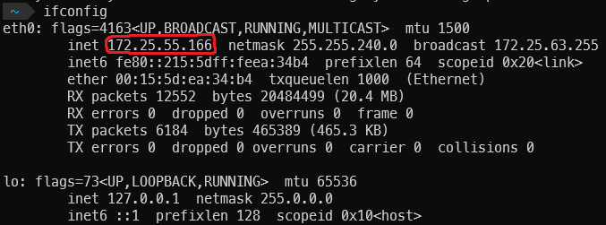
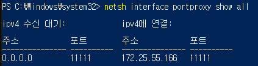
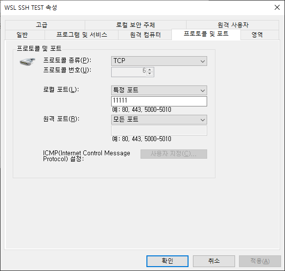
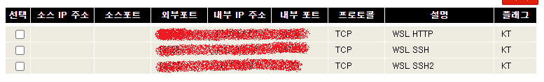
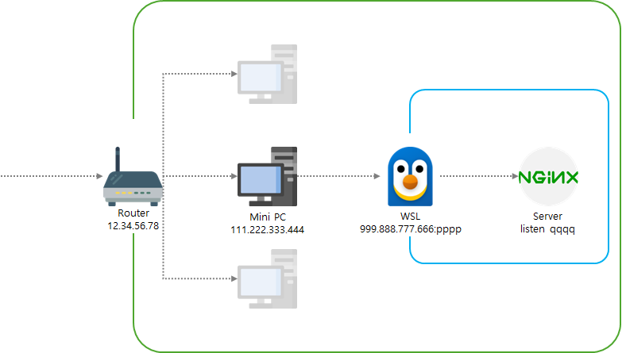

# 동기

어쩌다 해커톤에 나가서 스프링 애플리케이션을 배포해야했는데, AWS, 네이버 클라우드, 구글 클라우드 모두 사용할 수 없었던 상황에 빠져 난감했었다. 

다행히 예전에 가입해놓고 까먹었던 오라클 클라우드를 찾아 인스턴스를 생성한 다음 부랴부랴 올려서 개발을 진행했었다. 하지만 실력 부족으로 서비스를 개발하진 못했다. 다시 생각해보면 웹 서버를 배포하는 것에 시간을 매우 많이 쏟았기 때문이었던것 같다. 

오라클 클라우드의 프리티어 인스턴스는 메모리가 1Gb, CPU 코어 1개만 주기 때문에 가볍게 쓰기는 좋지만 약간 무거운 작업을 하기만 해도 뻗어버린다. 이 프리티어 인스턴스에서 pip install pandas만 해도 설치파일을 메모리에 올리려 하는 와중에 메모리 부족 에러가 일어날 정도다. 

그래서 예전에 사두었던 N100 미니 PC에 서버를 배포하면 어떨까 생각했다. 대충 우리집 공유기에 포트포워딩 해두고 적절히 서버 포트를 바꾸면 될 것 같다고 생각했다.


# SSH 설정을 위한 집 공유기(라우터) 포트포워딩

서버 설정을 만지기 전에, 외부에서 미니 PC에 올라간 WSL에 접근할 수 있도록 SSH 접속 환경을 제공해야했다.

## SSH 설치

```shell
sudo apt update
sudo apt upgrade
sudo apt install openssh-server
```

미니 PC의 WSL에서 위 명령어를 실행해 SSH를 설치한다.

설치가 완료되면 `sudo vi /etc/ssh/sshd_config`을 실행하여 아래와 같이 설정을 맞췄다.

```
Port 1234567890
Protocol 2
PermitRootLogin no
AuthorizedKeysFile  .ssh/authorized_keys
PasswordAuthentication yes
PubkeyAuthentication yes
ChallengeResponseAuthentication no
X11Forwarding yes
UseDNS no
```

포트 번호만 마음대로 설정하면 된다. 나중에 포트포워딩할 때 내부 포트 부분에 적어주면 된다.

우리집은 kt 공유기를 사용하고 있기 때문에 공유기의 homehub 사이트에 접속해서 포트포워딩을 했다.




이렇게 설정해두면 공유기 ip와 포트 번호를 파라미터로 사용하여 외부에서 접근할 수 있다. 미니 PC의 WSL로 접근하여 로그인을 하게 된다. 


> 로그인 말고 공개키를 사용한 방법은 아직 몰라서 하지 않았다... 나중에 꼭 해두어야 github action으로 배포가 가능하겠다.

이렇게 했는데 외부에서 접근이 안된다. 포트포워딩을 적절하게 했는데도 ssh 명령어를 실행하였을 때 아무 응답이 없었다. 잘못된 포트나 IP를 사용했을 땐 바로 connection refused 에러가 뜬다.

네트워크 환경을 생각하면 다음과 같다.



공유기가 제공하는 포트포워딩을 통해 SSH 접속을 미니 PC로 전달했지만, 미니 PC 속에 존재하는 WSL에는 도달하지 못한다. 그렇다면 미니 PC에서 직접 포트포워딩같은 방법을 사용해서 전달해야한다.

## Portproxy

미니 PC에서 Powershell을 관리자 권한으로 연 뒤 다음 명령어를 입력한다.

```shell
netsh interface portproxy add v4tov4 `
listenport=<포트포워딩에서 열어둔 포트> `
listenaddress=0.0.0.0 `
connectport=<ssh 설정에서 열어둔 포트> `
connectaddress=<WSL IP>
```

WSL의 IP를 알기 위해서는 ifconfig에서 eth0의 ip를 확인하면 된다.



listenport는 공유기의 포트포워딩에서 사용한 포트로, connectport는 ssh 설정에서 열어둔 포트로 적으면 된다. 나는 둘 다 같은 값으로 해서 전부 11111로 적용했다.

잘 적용되었는지 확인하려면 다음 명령어를 입력한다

```shell
netsh interface portproxy show all
```



## 방화벽 설정

포트프록시 설정을 했는데도 연결이 안되어서 이리저리 찾아본 결과, 간단하게도 미니 PC의 방화벽 설정을 해야한다.

인바운드, 아웃바운드 규칙을 모두 만들어주어야 한다.



다른 설정은 건드릴 필요가 없고, 인바운드에는 포트포워딩에서 적용한 내부포트를, 아웃바운드에서는 ssh 설정에서 열어둔 포트로 설정하면 된다.

# 서버 배포

SSH를 사용하기 위해 포트포워딩을 했던 것처럼, 미니 PC의 다른 포트를 열어서 연결해주면 된다.



WSL HTTP 규칙이 서버에 접근하도록 만드는 포트포워딩 규칙이다.

방화벽 설정 또한 인바운드, 아웃바운드 모두 만들어 준다.

## Nginx 설정

> Nginx 설치 과정은 생략한다.

미니 PC에서 `vi /etc/nginx/sites-enabled/default`를 실행해서 아래 설정을 제일 하단에 추가한다.

```
server {
        listen <포트번호>;

        # 이 밑으로는 테스트를 위해 간단하게 적은 것임

        root /var/www/html;
        # Add index.php to the list if you are using PHP
        index index.html index.htm index.nginx-debian.html;

        server_name test_server;

        location / {
                # First attempt to serve request as file, then
                # as directory, then fall back to displaying a 404.
                try_files $uri $uri/ =404;
        }
}
```

그리고 `sudo service nginx start`를 해서 nginx를 실행하고 localhost:포트번호로 접근이 되는지 확인한다.

이제 내 IP:포트포워딩한 포트번호로 접근하면 역시나 접근이 안된다! 앞서서 SSH 설정할 때 portproxy를 썼던 걸 또 해야한다.

```shell
netsh interface portproxy add v4tov4 `
listenport=<포트포워딩한 내부 포트> `
listenaddress=0.0.0.0 `
connectport=<listen에 적혀있는 포트> `
connectaddress=<WSL IP>
```



위 사진을 참고하면, listenport=pppp connectport=qqqq가 되겠다.

이제 외부에서 내 IP와 특정 포트로 요청을 넣으면 서버에게 요청이 전달되어 응답이 돌아온다!

만약 Nginx가 아니라 Spring Tomcat으로 배포하려 한다면 Tomcat 설정에서 포트만 적절히 바꿔서 배포하면 될 것 같다.

# TODO

Github Action으로 CI/CD 구축하는 방법과 Docker를 사용했을 때 네트워크 설정하는 방법을 공부해야겠다.
