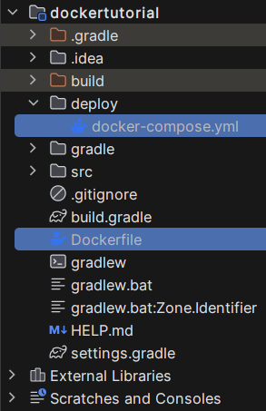

# docker build

`docker build`를 통해 Dockerfile에 명시된 설정대로 image를 생성한다. 생성된 이미지는 `docker run`을 통해 컨테이너에 담겨 실행된다. 

## Spring boot

로컬 환경에서 개발하고 있는 Spring boot 프로젝트를 도커 컨테이너에 올리려고 다음과 같은 방법을 사용했다.

일단 테스트를 위해 HelloWorld를 출력하는 컨트롤러를 하나 만들었다.

```java
package com.dockertutorial.example;

import org.springframework.web.bind.annotation.GetMapping;
import org.springframework.web.bind.annotation.RequestMapping;
import org.springframework.web.bind.annotation.RestController;

@RestController
@RequestMapping("")
public class HelloWorld {
    @GetMapping("")
    public String ReturnHello() {
        return "HelloWorld";
    }
}
```

그런다음 `./gradlew build`로 프로젝트를 빌드하여 jar파일을 만들고, 프로젝트 루트에 만들어놓은 Dockerfile을 실행하여 image를 생성했다.

```Dockerfile
# Dockerfile

FROM openjdk:17
ARG JAR_FILE=build/libs/*-SNAPSHOT.jar
COPY ${JAR_FILE} app.jar
ENTRYPOINT ["java", "-jar", "/app.jar"]
```

> java 17버전을 사용했다.

image를 생성하기 위해 프로젝트 루트에서 다음과 같은 명령어를 실행했다.

```bash
ubuntu@DESKTOP-GMH7007:~/workspace/dockertutorial$ docker build -t dockertutorial:0.0.4 .
 => [internal] load build definition from Dockerfile                                                                                                                                                                                           0.0s
 => => transferring dockerfile: 157B                                                                                                                                                                                                           0.0s
 => [internal] load .dockerignore                                                                                                                                                                                                              0.0s
 => => transferring context: 2B                                                                                                                                                                                                                0.0s
 => [internal] load metadata for docker.io/library/openjdk:17                                                                                                                                                                                  1.3s
 => [internal] load build context                                                                                                                                                                                                              0.0s
 => => transferring context: 116B                                                                                                                                                                                                              0.0s
 => [1/2] FROM docker.io/library/openjdk:17@sha256:528707081fdb9562eb819128a9f85ae7fe000e2fbaeaf9f87662e7b3f38cb7d8                                                                                                                            0.0s
 => CACHED [2/2] COPY build/libs/*-SNAPSHOT.jar app.jar                                                                                                                                                                                        0.0s
 => exporting to image                                                                                                                                                                                                                         0.0s
 => => exporting layers                                                                                                                                                                                                                        0.0s
 => => writing image sha256:de7cc8dfa14d2cfd123a6a000b383681224eb275d82567eaad6b7eda39e98c36                                                                                                                                                   0.0s
 => => naming to docker.io/library/dockertutorial:0.0.4            
```

여기까지 한다음 `docker images`를 실행하면 방금 생성한 이미지가 나타난다.

```bash
ubuntu@DESKTOP-GMH7007:~/workspace/dockertutorial$ docker images
REPOSITORY                 TAG       IMAGE ID       CREATED             SIZE
dockertutorial             0.0.4     de7cc8dfa14d   9 minutes ago       494MB
mysql                      latest    73246731c4b0   3 weeks ago         619MB
hello-world                latest    d2c94e258dcb   8 months ago        13.3kB
```

생성한 image를 실행하여 컨테이너에 올리기 위해 다음과 같이 실행했다.

```bash
ubuntu@DESKTOP-GMH7007:~/workspace/dockertutorial$ docker run -d -p 10011:8080 --name dockertutorial dockertutorial:0.0.4
bf3f65653bc59ce425ec11da831c6ca49ea5647d00ed5958698649a5524e6aa2
```

> 포트포워딩을 위해 8080을 10011로부터 포워딩했다.
> :0.0.4처럼 tag를 붙여서 image를 구분할 수 있다.

잘 실행되었는지 확인하기 위해 `docker ps`를 실행하면 이렇게 나온다.

```bash
ubuntu@DESKTOP-GMH7007:~/workspace/dockertutorial$ docker ps
CONTAINER ID   IMAGE                  COMMAND                CREATED              STATUS              PORTS                                         NAMES
bf3f65653bc5   dockertutorial:0.0.4   "java -jar /app.jar"   About a minute ago   Up About a minute   0.0.0.0:10011->8080/tcp, :::10011->8080/tcp   dockertutorial
```

## Mysql

mysql image는 원격 서버에서 받아야 한다. 

```
docker pull mysql
```

mysql을 컨테이너에 그대로 올리면 바로 종료된다. `docker ps -a`로 확인하면 이렇다.

```bash
ubuntu@DESKTOP-GMH7007:~/workspace/dockertutorial$ docker run -d -p 10012:3306 --name database mysql:latest
a46115bed622b1153211179c281711f046cca26a1e74c85a37dcb195b76dd2e0

ubuntu@DESKTOP-GMH7007:~/workspace/dockertutorial$ docker ps -a
CONTAINER ID   IMAGE                  COMMAND                  CREATED          STATUS                        PORTS                                         NAMES
a46115bed622   mysql:latest           "docker-entrypoint.s…"   33 seconds ago   Exited (1) 32 seconds ago                                                   database
```

> 포트포워딩을 10012에서 3306으로 향하도록 설정했다. 

어떤 오류를 내는지 확인하기 위해 `docker container logs database`를 실행하면 이렇게 나온다.

```shell
ubuntu@DESKTOP-GMH7007:~/workspace/dockertutorial$ docker container logs database
2024-01-12 13:40:15+00:00 [Note] [Entrypoint]: Entrypoint script for MySQL Server 8.2.0-1.el8 started.
2024-01-12 13:40:15+00:00 [Note] [Entrypoint]: Switching to dedicated user 'mysql'
2024-01-12 13:40:15+00:00 [Note] [Entrypoint]: Entrypoint script for MySQL Server 8.2.0-1.el8 started.
2024-01-12 13:40:16+00:00 [ERROR] [Entrypoint]: Database is uninitialized and password option is not specified
    You need to specify one of the following as an environment variable:
    - MYSQL_ROOT_PASSWORD
    - MYSQL_ALLOW_EMPTY_PASSWORD
    - MYSQL_RANDOM_ROOT_PASSWORD
```

필수적으로 설정해야하는 환경변수가 존재하기 때문에, 컨테이너에 올릴 때 항상 옵션으로 넣어야 한다. 로그에서 볼 수 있듯 세 가지 옵션 중에 하나는 무조건 넣어야 한다고 한다.

['mysql - Official Image | Docker Hub'](https://hub.docker.com/_/mysql#Environment-Variables) 이 링크에서 설정할 수 있는 환경변수를 명시하고 있다.

문서를 읽어보면 `MYSQL_ROOT_PASSWORD`를 항상 요구하고 있다. 따라서 컨테이너를 실행할 때 이렇게 실행하면 된다.

```
ubuntu@DESKTOP-GMH7007:~/workspace/dockertutorial$ docker run -d -p 10012:3306 --name database -e MYSQL_ROOT_PASSWORD=password mysql:latest
7e6ae1b3f7be97bc063105de1834c1b23f0b0c4075bbc8e26f813091f152b559

ubuntu@DESKTOP-GMH7007:~/workspace/dockertutorial$ docker container logs database
2024-01-12 13:51:20+00:00 [Note] [Entrypoint]: Entrypoint script for MySQL Server 8.2.0-1.el8 started.
2024-01-12 13:51:20+00:00 [Note] [Entrypoint]: Switching to dedicated user 'mysql'
2024-01-12 13:51:20+00:00 [Note] [Entrypoint]: Entrypoint script for MySQL Server 8.2.0-1.el8 started.
2024-01-12 13:51:20+00:00 [Note] [Entrypoint]: Initializing database files
2024-01-12T13:51:20.566833Z 0 [System] [MY-015017] [Server] MySQL Server Initialization - start.
2024-01-12T13:51:20.567560Z 0 [Warning] [MY-011068] [Server] The syntax '--skip-host-cache' is deprecated and will be removed in a future release. Please use SET GLOBAL host_cache_size=0 instead.
2024-01-12T13:51:20.567597Z 0 [System] [MY-013169] [Server] /usr/sbin/mysqld (mysqld 8.2.0) initializing of server in progress as process 79
2024-01-12T13:51:20.575524Z 1 [System] [MY-013576] [InnoDB] InnoDB initialization has started.
2024-01-12T13:51:21.721999Z 1 [System] [MY-013577] [InnoDB] InnoDB initialization has ended.

```

# docker-compose
 
spring boot 프로젝트와 mysql을 컨테이너에 올렸다 내렸다 하려면 명령어를 여러개 쳐야한다. 상당히 복잡한데 이걸 yml파일로 명시하여 한 번에 여러 개의 컨테이너를 생성하기 위해 `docker-compose`를 사용한다고 한다.

```yml
version: '3.8'

services:
  db:
    container_name: mysql
    image: mysql:latest

    environment:
      MYSQL_ROOT_PASSWORD: password
      MYSQL_USER: admin
      MYSQL_PASSWORD: password1
      MYSQL_DATABASE: TestDatabase

    ports:
      - '10012:3306'
  app:
    container_name: app
    build:
      context: ../
      dockerfile: Dockerfile
    restart: always
    ports:
      - '10011:8080'

    depends_on:
      - db
```



`docker-compose.yml`을 deploy폴더에 넣어두고 위와 같이 작성했다.

그다음 `docker-compose build`, `docker-compose up`으로 이미지 생성과 컨테이너 실행을 했다.

```bash
ubuntu@DESKTOP-GMH7007:~/workspace/dockertutorial/deploy$ docker-compose build; docker-compose up
db uses an image, skipping
Building app
[+] Building 0.9s (7/7) FINISHED                                                                                                                                                                                                     docker:default
 => [internal] load .dockerignore                                                                                                                                                                                                              0.0s
 => => transferring context: 2B                                                                                                                                                                                                                0.0s
 => [internal] load build definition from Dockerfile                                                                                                                                                                                           0.0s
 => => transferring dockerfile: 157B                                                                                                                                                                                                           0.0s
 => [internal] load metadata for docker.io/library/openjdk:17                                                                                                                                                                                  0.7s
 => [internal] load build context                                                                                                                                                                                                              0.0s
 => => transferring context: 116B                                                                                                                                                                                                              0.0s
 => [1/2] FROM docker.io/library/openjdk:17@sha256:528707081fdb9562eb819128a9f85ae7fe000e2fbaeaf9f87662e7b3f38cb7d8                                                                                                                            0.0s
 => CACHED [2/2] COPY build/libs/*-SNAPSHOT.jar app.jar                                                                                                                                                                                        0.0s
 => exporting to image                                                                                                                                                                                                                         0.0s
 => => exporting layers                                                                                                                                                                                                                        0.0s
 => => writing image sha256:de7cc8dfa14d2cfd123a6a000b383681224eb275d82567eaad6b7eda39e98c36                                                                                                                                                   0.0s
 => => naming to docker.io/library/deploy_app                                                                                                                                                                                                  0.0s
Recreating mysql ... done
Recreating app   ... done
Attaching to mysql, app
mysql  | 2024-01-12 13:59:09+00:00 [Note] [Entrypoint]: Entrypoint script for MySQL Server 8.2.0-1.el8 started.
mysql  | 2024-01-12 13:59:09+00:00 [Note] [Entrypoint]: Switching to dedicated user 'mysql'
mysql  | 2024-01-12 13:59:09+00:00 [Note] [Entrypoint]: Entrypoint script for MySQL Server 8.2.0-1.el8 started.
mysql  | 2024-01-12 13:59:09+00:00 [Note] [Entrypoint]: Initializing database files
mysql  | 2024-01-12T13:59:09.428635Z 0 [System] [MY-015017] [Server] MySQL Server Initialization - start.
mysql  | 2024-01-12T13:59:09.429384Z 0 [Warning] [MY-011068] [Server] The syntax '--skip-host-cache' is deprecated and will be removed in a future release. Please use SET GLOBAL host_cache_size=0 instead.
mysql  | 2024-01-12T13:59:09.429423Z 0 [System] [MY-013169] [Server] /usr/sbin/mysqld (mysqld 8.2.0) initializing of server in progress as process 80
mysql  | 2024-01-12T13:59:09.446686Z 1 [System] [MY-013576] [InnoDB] InnoDB initialization has started.
mysql  | 2024-01-12T13:59:10.602298Z 1 [System] [MY-013577] [InnoDB] InnoDB initialization has ended.
app    | 
app    |   .   ____          _            __ _ _
app    |  /\\ / ___'_ __ _ _(_)_ __  __ _ \ \ \ \
app    | ( ( )\___ | '_ | '_| | '_ \/ _` | \ \ \ \
app    |  \\/  ___)| |_)| | | | | || (_| |  ) ) ) )
app    |   '  |____| .__|_| |_|_| |_\__, | / / / /
app    |  =========|_|==============|___/=/_/_/_/
app    |  :: Spring Boot ::                (v3.2.1)
app    | 
app    | 2024-01-12T13:59:10.949Z  INFO 1 --- [           main] c.d.example.ExampleApplication           : Starting ExampleApplication using Java 17.0.2 with PID 1 (/app.jar started by root in /)
app    | 2024-01-12T13:59:10.953Z  INFO 1 --- [           main] c.d.example.ExampleApplication           : No active profile set, falling back to 1 default profile: "default"
app    | 2024-01-12T13:59:11.513Z  INFO 1 --- [           main] o.s.b.w.embedded.tomcat.TomcatWebServer  : Tomcat initialized with port 8080 (http)
app    | 2024-01-12T13:59:11.521Z  INFO 1 --- [           main] o.apache.catalina.core.StandardService   : Starting service [Tomcat]
app    | 2024-01-12T13:59:11.522Z  INFO 1 --- [           main] o.apache.catalina.core.StandardEngine    : Starting Servlet engine: [Apache Tomcat/10.1.17]
app    | 2024-01-12T13:59:11.545Z  INFO 1 --- [           main] o.a.c.c.C.[Tomcat].[localhost].[/]       : Initializing Spring embedded WebApplicationContext
app    | 2024-01-12T13:59:11.546Z  INFO 1 --- [           main] w.s.c.ServletWebServerApplicationContext : Root WebApplicationContext: initialization completed in 538 ms
app    | 2024-01-12T13:59:11.772Z  INFO 1 --- [           main] o.s.b.w.embedded.tomcat.TomcatWebServer  : Tomcat started on port 8080 (http) with context path ''
app    | 2024-01-12T13:59:11.781Z  INFO 1 --- [           main] c.d.example.ExampleApplication           : Started ExampleApplication in 1.093 seconds (process running for 1.361)

```

근데 잘 되는데, 세세한 설정을 모르기 때문에 좀 더 공부가 필요하다.
