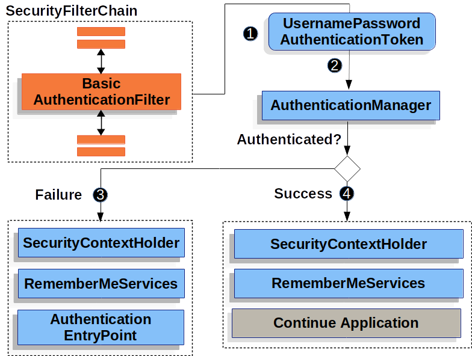

docker-compose로 mysql과 spring boot 앱을 같이 올려보려고 했는데, mysql은 정상적으로 초기화 되었지만 spring boot 앱이 자꾸 mysql과 연결되지 못해 에러를 내었다. 이 부분은 조금 더 공부해야겠다.

> mysql을 컨테이너에 올릴 때 테이블을 만들어야 하거나 데이터를 추가해야할 때 volume을 이용한다고 한다.
> 이 부분도 공부해야겠다.

# Spring Security

Spring Security는 여러가지 인증 방법(*Authentication*)과 허가 방법(*Authorization*)을 지원한다. 오늘 공부한 것은 Username+Password(Credential) 로그인 방법이다. 

Credential을 갖고 로그인하기 위해서는 서버가 미리 Credential을 기억하고 있어야 하는데, Spring Security는 InMemory, JDBC, LDAP와 같은 방법을 사용할 수 있도록 지원한다.

# Authentication

## Filter Chain

사용자로부터 요청이 들어오면 그 요청을 받아 처리하기 전에 여러가지 `Filter`를 거치게 된다. 이 `Filter`들은 Chaning 형태로 묶여있어, 어떤 `Filter`가 에러를 발생시키면 다음 `Filter`는 실행되지 않고 에러 핸들링으로 넘어간다.


Spring은 미리 구현된 `Filter`를 실행할 뿐만 아니라 다른 모듈이 정의한 `Filter`도 실행할 수 있게 `DelegatingFilterProxy`를 지원한다. 여기에 `SecurityFilterChain`이 담겨 있다. 결국 요청이 들어오면 여러 `Filter`를 거치게 되는데 중간에 `SecurityFilterChain`이 수행되어 인증 및 허가를 따지게 된다.


다수의 `FilterChain`을 걸어 URL패턴에 따라 다르게 수행할 수도 있다고 한다.

## Basic Login Flow


허가된 사용자만 접근 가능한 자원에 인증되지 않은 사용자가 접근한다면 `AuthorizationFilter`가 이 요청을 거부한다. 곧바로 AccessDeniedException을 일으키게 되고 이 예외는 `ExceptionTranslationFilter`로 전달되어 적절한 응답을 만든다.

`ExceptionTranslationFilter`는 인증되지 않은 사용자가 접근했으므로 인증을 요구하는 `WWW-Authenticate` 헤더가 담긴 응답을 반환한다.

따라서 사용자는 인증을 받아야 한다는걸 알게 된다. 다시 사용자는 Credential을 담아 로그인 요청을 보낸다.



이 요청은 `BasicAuthenticationFilter`에게 전달되어 Credential이 올바른지 검증을 한다. Credential은 `UsernamePasswordAuthenticationToken`이라는 인스턴스로 추출되어 `AuthenticationManager`에게 전달된다.

`AuthenticationManager`는 주어진 token을 인증하고, 계정이 잠겼다거나, 잘못된 Credential이라거나 하는 오류를 처리한다.

만약 로그인에 실패했다면, 다시 `WWW-Authenticate` 헤더가 담긴 응답이 반환된다.

만약 로그인에 성공했다면 연결된 `Filter`들을 호출한다.

## AuthenticationManager

인증을 수행하는 객체인 `AuthenticationManager`는 인터페이스다. 인증 요청이 들어왔을 때 요청을 처리하는 메서드를 갖는다.

```java
public interface AuthenticationManager {
	/**
	 * @param authentication the authentication request object
	 * @return a fully authenticated object including credentials
	 * @throws AuthenticationException if authentication fails
	 */
	Authentication authenticate(Authentication authentication) throws AuthenticationException;
}
```

## ProviderManager

`AuthenticationManager` 인터페이스를 구현한 것이 `ProviderManager`다. `ProviderManager`는 내부에 등록된 `AuthenticationProvider` 인스턴스들을 실행하여 인증을 진행한다. 하나라도 통과한다면 인증이 된 것으로 여기고, 그렇지 않았다면 `ProviderNotFoundException`을 발생시킨다. 즉, 인증을 할 수 있는 Provider가 없었다는 것이라고 볼 수 있다.


여러 개의 `AuthenticationProvider` 인스턴스를 갖는 이유는, 여러 가지의 로그인 방법을 지원하기 위해서다. id와 password뿐만 아니라 구글, 페이스북 로그인을 동시에 지원하는 것이 좋은 예시이다.

## AuthenticationProvider

여러 인증 방법을 지원하기 위해 각 방법마다 인스턴스를 나눠 구현하게 되는데, 그 구현을 위한 인터페이스다. 

username과 password로 인증을 하는 객체는 `DaoAuthenticationProvider`로, 이 인터페이스를 상속받고 있다.

`DaoAuthenticationProvider`는 `UserDetailsService`에서 `UserDetail` 즉, 계정 정보를 갖고 오는 역할을 갖는다. 따라서 단순히 username과 password로 인증을 한다면 단순히 이 객체가 요구하는 `UserDetailsService`와 `UserDetail`객체를 `Bean`으로 주입하면 된다.


`DaoAuthenticationProvider`는 전체 흐름 속에서 `ProviderManager`가 갖는 `AuthenticationProviders`에 속하므로, 인증 과정 속에서 Credential을 인증하게 된다.

저장되어 있는 계정 정보는 `UserDetailsService`로 얻어오고, 비밀번호를 암호화하는 방법은 정해진 `PasswordEncoder` 구현체를 실행함으로 정해진다. 기본적으로는 BCrypt를 사용한다. 이 방법으로 계정을 생성하면 이런 형태로 저장된다.


> 비밀번호를 저장할 때 {bcrypt}를 꼭 prefix로 붙여야 한다. 안 붙이면  `java.lang.IllegalArgumentException: There is no PasswordEncoder mapped for the id "null"` 이런 오류를 얻는다.
> 
> [:link:참조 블로그](https://taesan94.tistory.com/119)에서 자세히 설명해주고 있다.


# 구현

길게 얘기했는데 오늘 한건 정말 단순하다. SpringConfig 클래스를 생성해서 내가 직접 만든 `UserDetailsService`와 `UserDetails` 객체를 주입했다.

```java
// springconfig.java
import org.springframework.context.annotation.Bean;
import org.springframework.context.annotation.Configuration;
import org.springframework.security.config.annotation.web.configuration.EnableWebSecurity;
import org.springframework.security.crypto.bcrypt.BCryptPasswordEncoder;

@Configuration
@EnableWebSecurity
public class SecurityConfig {
    @Bean
    public CustomeUserDetailsService userDetailsService(){
        return new CustomeUserDetailsService();
    }
}
```

```java
// CustomUserDetailsService.java
import org.springframework.beans.factory.annotation.Autowired;
import org.springframework.context.annotation.Bean;
import org.springframework.security.core.userdetails.UserDetails;
import org.springframework.security.core.userdetails.UserDetailsService;
import org.springframework.security.core.userdetails.UsernameNotFoundException;

import java.util.Optional;

public class CustomeUserDetailsService implements UserDetailsService {
    @Autowired
    private CustomUserRepository userRepository;

    @Override
    public UserDetails loadUserByUsername(String username) throws UsernameNotFoundException {
        Optional<Users> user = userRepository.findByUsername(username);
        return user.get();
    }
}
```

```java
// CustomUserRepository.java
import org.springframework.data.jpa.repository.JpaRepository;
import org.springframework.stereotype.Repository;

import java.util.Optional;

@Repository
public interface CustomUserRepository extends JpaRepository<Users, Long> {
    Optional<Users> findByUsername(String name);
}
```

```java
// Users.java
import jakarta.persistence.Column;
import jakarta.persistence.Entity;
import jakarta.persistence.GeneratedValue;
import jakarta.persistence.Id;
import org.springframework.security.core.GrantedAuthority;
import org.springframework.security.core.userdetails.UserDetails;

import java.util.Collection;

@Entity
public class Users implements UserDetails {
    @Id
    @GeneratedValue
    private Long id;
    @Column(nullable = false)
    private String username;
    @Column(nullable = false)
    private String password;
    @Column(nullable = false)
    private boolean isEnabled;

    public Users() {
        isEnabled = true;
    }

    public Users(String username, String password) {
        this();
        this.username = username;
        this.password = password;
    }

    public Long getId() { return id; }

    // return null for test
    @Override
    public Collection<? extends GrantedAuthority> getAuthorities() { return null; }

    @Override
    public String getPassword() { return password; }

    @Override
    public String getUsername() { return username; }

    // return true for test
    @Override
    public boolean isAccountNonExpired() { return true; }

    @Override
    public boolean isAccountNonLocked() { return true; }

    @Override
    public boolean isCredentialsNonExpired() { return true; }

    @Override
    public boolean isEnabled() { return isEnabled; }
}
```

테스트를 위해 임의로 몇몇 필드는 생략했는데 잘 동작한다.