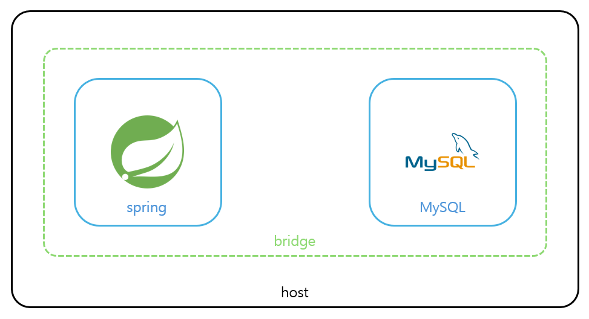
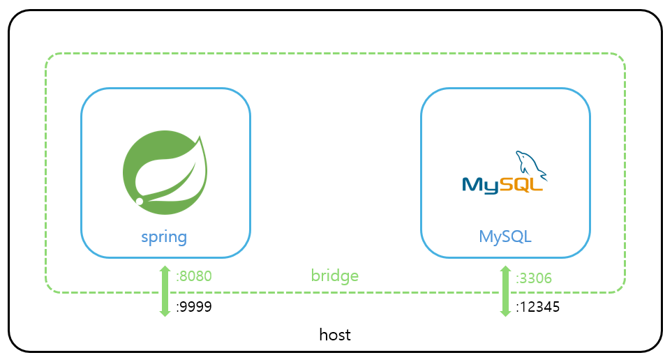

# docker network

각 컨테이너가 외부 또는 다른 컨테이너와 상호작용하려면 도커의 네트워크를 이해해야한다.

컨테이너가 생성될 때 네트워크 설정을 하지 않았다면 `bridge` 네트워크로 연결된다.

```bash
ubuntu@DESKTOP-GMH7007:~/workspace/learn-spring-security/jdbc$ docker run --name ubuntu_container -it -d ubuntu
dfb4cd7647eea3508210e07b82e61b58aa0f85d6d1c4a5b3cd9e21110ba5d4a9
ubuntu@DESKTOP-GMH7007:~/workspace/learn-spring-security/jdbc$ docker network inspect bridge
[
    {
        "Name": "bridge",
        "Scope": "local",
        "Driver": "bridge",
        # ...
        "Containers": {
            "dfb4cd7647eea3508210e07b82e61b58aa0f85d6d1c4a5b3cd9e21110ba5d4a9": {
                "Name": "ubuntu_container",
                "EndpointID": "8366e1486ff8a832881cb41d667bf0d70d5a17e8f7ecc43fab1c12e68d60b108",
                "MacAddress": "02:42:ac:11:00:02",
                "IPv4Address": "172.17.0.2/16",
                "IPv6Address": ""
            }
        },
        # ...
    }
]
```

각 네트워크는 Driver와 Scope속성을 갖는다. Driver는 네트워크간 연결 방식을 말하고, Scope는 네트워크의 범위를 의미한다.

vlan과 연관된 driver를 제외한 나머지 driver의 의미를 정리하면 이렇다.

| Driver  | 설명                                                              |
| ------- | ----------------------------------------------------------------- |
| bridge  | 기본 driver. 네트워크 내에 여러 컨테이너를 포함시켜 통신하게한다. |
| host    | 호스트와 네트워크간 격리를 제거하고 호스트의 네트워크를 사용한다. |
| none    | 호스트 및 다른 컨테이너와 같은 네트워크로 연결되지 않는다.        |
| overlay | 여러 도커 데몬 사이에서 통신할 수 있도록 만든다.                  |

# bridge 네트워크 다이어그램

spring과 mysql을 각각 도커에 띄운 후 두 컨테이너를 연결하려고 같은 네트워크에 두었는데 이상하게 자꾸 연결을 하지 못했다. 이유는 같은 네트워크에 있다면 로컬 포트를 이용해야하는데, 포트포워딩된 포트를 이용하려고 했었기 때문이었다.

먼저 `docker compose`를 사용해서 두 컨테이너에 각각 spring과 mysql을 올렸다. 그렇다면 네트워크 다이어그램은 아래 그림처럼 구성된다.



도커에서 이미지를 컨테이너에 올릴 때 포트포워딩 옵션을 설정할 수 있다. 만약 spring에 `-p 9999:8080`옵션을, mysql에 `-p 12345:3306`옵션을 주었다고 하면 다이어그램은 이렇게 변한다.



외부에서 spring 컨테이너에 접근하려면 호스트의 9999포트를 이용하여야 하고, bridge 네트워크 내에서 mysql에 접근하려면 **12345포트가 아닌 mysql의 3306포트를 이용해야한다.** 다시말해, 같은 네트워크에 속한 컨테이너는 모두 로컬로 볼 수 있다.

하지만 이 개념을 제대로 이해하지 못하고 계속 bridge 네트워크 속 spring 컨테이너를 mysql에 접근시키기 위해서 12345포트로 설정했었다. 로컬 네트워크에서 호스트로 포트포워딩된 포트번호로 찾으려하니 연결이 될 수가 없었던 것이다.