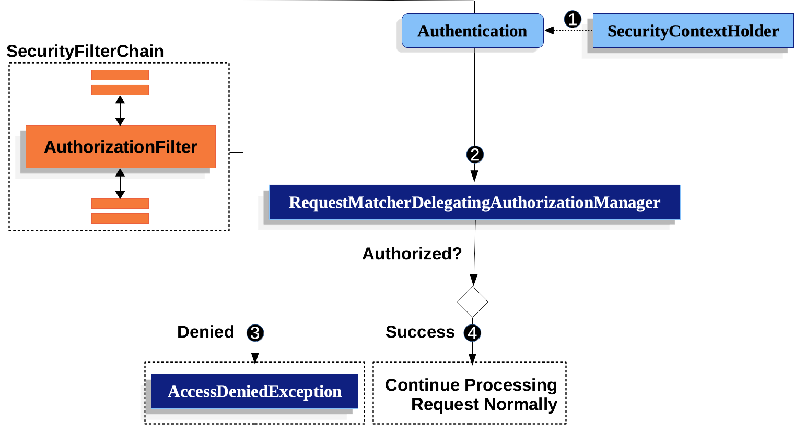

> Spring Security 6.2.1을 사용했습니다.

# Authorization

직역하면 허가, 인증 그런 뜻이다. 자원에 대한 접근 권한을 Authority라고 하고, 사용자가 그 권한을 갖고 있는지 검사하는걸 Authorization이라고 한다.

## GrantedAuthority

Authentication 과정에서 UserDetail에 담긴 정보가 전달된다. 여기에는 `GrantedAuthority`도 전달되는데, *부여된 권한*이라는 뜻의 인터페이스다. 

`GrantedAuthority`를 살펴보면 이렇다.

```java
public interface GrantedAuthority extends Serializable {
    /*
     * @return a representation of the granted authority (or <code>null</code> if the
     * granted authority cannot be expressed as a <code>String</code> with sufficient
     * precision).
     */
    String getAuthority();
}

```

권한을 반환하는 메서드의 반환 타입이 String이다. Spring Security에서 권한을 다룰 때에는 단순히 권한 이름을 반환하는 `GrantedAuthority`를 사용한다.

`UserDetails` 인터페이스를 살펴보면 사용자의 권한을 어떻게 반환하는지 알 수 있다.

```java
public interface UserDetails extends Serializable {

    /**
     * Returns the authorities granted to the user. Cannot return <code>null</code>.
     * @return the authorities, sorted by natural key (never <code>null</code>)
     */
    Collection<? extends GrantedAuthority> getAuthorities();

    // ...
}

```

아까 말했던 `GrantedAuthority`가 Collection형태로 반환되고 있다. 인증 과정에서 이 메서드를 호출함으로 사용자에게 부여된 권한을 갖고 오게 된다.

> `? extends GrantedAuthority`는 GrantedAuthority형 타입이 들어간다는 말이다.

## AuthorizationManager

이전에는 AccessDecisionManager, AccessDecisionVoter라는 객체를 사용해서 인가 여부를 결정했던것 같다. 하지만 현재는 AuthorizationManager가 그 두 객체의 역할을 대체한다고 한다.

```java
AuthorizationDecision check(Supplier<Authentication> authentication, Object secureObject);

default AuthorizationDecision verify(Supplier<Authentication> authentication, Object secureObject)
        throws AccessDeniedException {
    // ...
}
```

인증에 필요한 Authentication 객체 속에 `GrantedAuthority`가 들어있다. 이것은 [Authentication](https://docs.spring.io/spring-security/site/docs/6.2.1/api/org/springframework/security/core/Authentication.html) 인터페이스를 읽어보면 `getAuthorities()`가 명시되어있음으로 확인할 수 있다. AuthorizationManager는 `verify()`를 호출하여 정말 사용자가 권한을 갖고 있는지 검증한다. 

이 과정에서 `check()`를 호출하여 권한이 부여되었는지 검사한다. 권한이 부여되었다면 아무 에러도 일으키지 않고, 권한이 없다면 AccessDeniedException을 일으킨다.

Spring Security는 기본적으로 특정 권한을 갖고 있는지 확인하는 `AuthorityAuthorizationManager`를 사용한다. 또는 다른 방식을 사용하는 객체를 사용해도 된다.

# Authorization Flow



사용자의 요청은 SecurityFilterChain을 통과하게 되고, 권한을 검사하는 필터인 AuthorizationFilter에 도달한다. 

1. SecurityContextHolder로부터 인증 및 권한에 관한 정보가 담긴 `Authentication` 객체가 전달된다.

2. `Authentication`은 `HttpServletRequest`형태의 요청 객체와 함께 `RequestMatcherDelegatingAuthorizationManager`에게 전달되고, 권한을 갖고 있는지 검사한다. Manager객체는 Mapping된 URL 패턴 또는 HTTP Method 등 정해진 규칙에 따라 검사한다.

3. 검사 후 권한이 없다고 판별했다면 AccessDeniedException을 던진다. 이후 ExceptionTranslationFilter가 그 객체를 받아 처리한다.

4. 검사 후 권한이 있다고 판별했다면 계속 FilterChaining을 수행한다.

## Filter on Dispatch

AuthorizationFilter는 사용자가 요청할 때마다 일어날 뿐만 아니라 Dispatch가 발생할 때에도 일어난다. Dispatcher는 `FORWARD`, `INCLUDE`, `REQUEST`, `ASYNC`, `ERROR` 총 5가지가 있다. 특정 엔드포인트로 이동하는 `FORWARD`, 에러가 발생했을 때를 의미하는 `ERROR`를 허용하면 된다. 

> 솔직히 어떤 의미인지 찾지 못했다.

```java
http
    .authorizeHttpRequests(authorize -> authorize
        .dispatcherTypeMatchers(FORWARD, ERROR).permitAll());
```

# By Endpoint/Method/DispatchType

사용자가 자원에 접근하려는걸 허가하려면 SecurityFilterChain을 반환하는 함수를 Bean으로 주입하여야 한다. 기본적으로는 모든 요청에 `authenticated`가 붙기 때문에 어떤 자원을 공개하기 위해서는 사용자가 재정의하여야 한다.

```java
@Bean
SecurityFilterChain web(HttpSecurity http) throws Exception {
    http
        // ...
        .authorizeHttpRequests(authorize -> authorize                                  
            .dispatcherTypeMatchers(FORWARD, ERROR).permitAll()   // <-- 1
            .requestMatchers("/static/**", "/signup", "/about").permitAll()   // <-- 2
            .requestMatchers("/admin/**").hasRole("ADMIN")   // <-- 3
            .requestMatchers("/db/**").access(allOf(hasAuthority('db'), hasRole('ADMIN')))   // <-- 4
            .anyRequest().denyAll()   // <-- 5
        );

    return http.build();
}
```

authorizeHttpRequests의 인자로 **콜백함수**를 넣는다. 이 콜백함수는 **위에서부터 차례대로 matcher를 실행해 각 matcher가 명시한 조건에 해당하면 그 때 인가를 검증하는 방식**으로 진행된다. 즉, 위의 예시에서는 1번부터 순서대로 5번까지 검증하게 된다. 만약 `/admin/users`와 같은 자원에 접근하면 3번에서 `/admin/**` 패턴에 의해 *ADMIN* 역할인지 검사하게 된다.

1. `DispatchType`에 따라 결정한다. 여기선 `FORWARD`와 `ERROR` 타입의 dispatch들은 `permitAll()`을 함으로 Authorization을 안한다.

2. 특정 url 패턴을 대상으로 `permitAll()`을 한다. `/static/**`을 예시로 보면 `/static`, `/static/123`과 같은 패턴들은 모두 Authorization을 안한다.

3. 2번과 같지만 `hasRole("ADMIN")`을 호출함으로, *ADMIN* 역할을 가진 사람들만 해당 자원을 허가하고 있다.

4. 3번과 비슷하지만, `hasAuthority('db')`와 `hasRole("ADMIN)`를 호출함으로 *ADMIN*역할이면서 *db*권한을 가진 사용자만 해당 자원에 접근할 수 있게 된다.

5. `anyRequest`는 모든 요청을 의미하므로, 결과적으로는 1, 2, ... 4까지 해당되는 패턴이나 조건 외에 나머지 요청들을 처리하게 된다. 여기선 `denyAll()`을 사용하여 사용자가 인증되었든말든 허가하지 않는다.

# Role? Authority?

위에서 4번 항목에 Role과 Authority가 등장한다. 역할과 권한인데, 이 둘의 차이점을 찾다가 [다음과 같은 답변](https://stackoverflow.com/questions/19525380/difference-between-role-and-grantedauthority-in-spring-security/19542316#19542316)을 발견했다. 

요약하자면 둘 다 같은 의미이고 둘 다 `GrantedAuthority`를 사용한다. 단지 Role은 접두사로 `ROLE_`을 붙여야 한다는 게 다르다. 

# Role 계층

이병 위에 일병, 일병 위에 상병이 있듯 역할간에도 상위 계층이 존재한다. 예를 들어 관리자는 읽기, 쓰기, 삭제가 되지만 일반 사용자는 읽기, 쓰기만 되는 것처럼 말이다.

Spring Security에서는 계층을 나타내는 단순한 인터페이스인 `RoleHierarchy`가 있다. 그리고 이를 간단하게 구현한 `RoleHierarchyImpl`이 있다. 

`RoleHierarchyImpl`을 통해 계층 관계를 명시하려면 특이하게도 문자열 형태로 작성해야한다. 예를 들어 `"ROLE_PARENT > ROLE_CHILD"`화살괄호를 사용하여 상위 역할을 표현하면 된다.

만약 여러 계층을 나타내려면 `\n`과 `+` 기호를 조합하여 나타내면 된다.

```java
@Bean
static RoleHierarchy roleHierarchy() {
    RoleHierarchyImpl hierarchy = new RoleHierarchyImpl();
    hierarchy.setHierarchy("ROLE_ADMIN > ROLE_STAFF\n" +
            "ROLE_STAFF > ROLE_USER\n" +
            "ROLE_USER > ROLE_GUEST");
    return hierarchy;
}
```

# 구현

먼저 SecurityConfig을 다음과 같이 수정했다.

```java
// SecurityConfig.java

@Configuration
@EnableWebSecurity
public class SecurityConfig {
    @Bean
    public SecurityFilterChain web(HttpSecurity http) throws Exception {
        http
                .csrf(AbstractHttpConfigurer::disable)
                .formLogin(Customizer.withDefaults())
                .authorizeHttpRequests(authorize -> authorize
                        .dispatcherTypeMatchers(FORWARD, ERROR).permitAll()
                        .requestMatchers("/login/**").permitAll()
                        .requestMatchers("/users/**").hasAuthority("ROLE_USER")
                        .requestMatchers("/admin/**").hasRole("ADMIN")
                        .anyRequest().authenticated()());
        return http.build();
    }

    @Bean
    public CustomUserDetailsService userDetailsService() {
        return new CustomUserDetailsService();
    }

    @Bean
    static RoleHierarchy roleHierarchy() {
        // role간 계층을 정의한다.
        RoleHierarchyImpl hierarchy = new RoleHierarchyImpl();
        hierarchy.setHierarchy("ROLE_ADMIN > ROLE_USER");
        return hierarchy;
    }
}
```

`/login/**`으로 향하는 접근은 모두 허용, `/users/**`는 *ROLE_USER* 권한을 가진 사용자만 허용, `/admin/**`은 *ADMIN 역할을 가진 사용자만 허용, 그 외의 요청은 인증된 사용자만 허용하기로 했다.

역할간에 계층을 설정해서 ADMIN이 USER보다 상위에 있도록 설정했다.

```java
// Users.java

@Entity
public class Users implements UserDetails {
    @Id
    @GeneratedValue(strategy = GenerationType.IDENTITY)
    private Long id;
    @Column(nullable = false)
    private String username;
    @Column(nullable = false)
    private String password;
    @Column(nullable = false)
    private boolean isEnabled;
    @ManyToMany(fetch=FetchType.EAGER)
    @JoinTable(
            name = "user_roles",
            joinColumns = @JoinColumn(name = "users_id"),
            inverseJoinColumns = @JoinColumn(name = "roles_id")
    )
    private List<Roles> userRoles;

    @Override
    public Collection<? extends GrantedAuthority> getAuthorities() {
        return new ArrayList<Roles>(userRoles);
    }
	// ...
```

Users에서는 `Collection<? extends GrantedAuthority>`를 반환하는 메서드에 ManyToMany로 정의된 userRoles를 반환하도록 작성했다. 왜 ManyToMany로 정의되었냐면, 한 사용자가 여러 권한 또는 여러 역할을 맡을 수 있기 때문이다.

```java
// Roles.java

@Entity
public class Roles implements GrantedAuthority {
    @Id
    @GeneratedValue(strategy = GenerationType.IDENTITY)
    private Long id;

    @Column(nullable = false)
    private String name;

    @Override
    public String getAuthority() {
        return name;
    }
}
```

역할을 나타내는 Role은 `GrantedAuthority` 인터페이스를 구현하여 단순하게 문자열을 갖는 테이블이 되도록 구성했다.

사용자가 로그인하지 않았다면 로그인 페이지로 이동하게 된다.

로그인한 후 계정에 따라 *ROLE_ADMIN*권한이라면 `/admin`, `/users` 자원에 접근가능하고, *ROLE_USER*라면 `/users`에만 접근이 가능하다.
