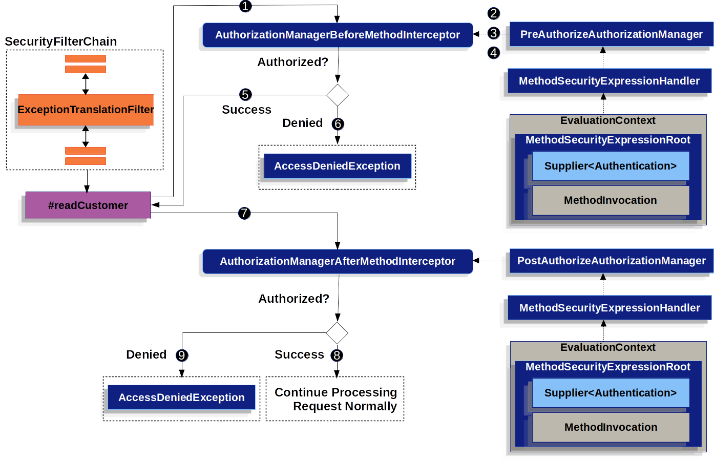

# Method Security

이전에 Authorization에 대해 공부했을 땐 `@Configuration`로 명시된 클래스에서 직접 모든 경로에 대해 authorization을 지정했다. 그러나 세세한 엔드포인트에 대해 authorization을 지정하려면 코드가 매우 길어지고 유지보수하기 까다로우므로, Spring Security에서는 메서드별로 authorization을 거는 방법을 제공하고 있다.

# Flow



그림에서는 `readCustomer`라는 자원에 접근하는 요청을 예시로 들고 있다.

1. 자원에 접근하기 전에 Spring AOP가 해당 자원의 프록시 메서드를 호출한다. 다시 말해 `@PreAuthorize`가 명시되어 있다면 `AuthorizationManagerBeforeMethodInterceptor`를 통해 프록시 메서드를 호출한다. 

2. `AuthorizationManagerBeforeMethodInterceptor`는 `@PreAuthorize`내에 명시된 메서드를 호출하기 위해 `PreAuthorizeAuthorizationManager`클래스를 생성자의 인자로 요구하는데, 그 클래스의 `check` 메서드를 호출한다.

3. `check` 메서드는 `@PreAuthorize`내에 명시된 메서드를 실행하기 위해 어떻게 명시되어있는지 해석해야 한다. 사용자는 **SeEL expression**으로 메서드를 표현했으므로 그 표현식을 해석하기 위해 `MethodSecurityExpressionHandler`를 필요로 요구한다.
  이 객체는 적절한 Context객체를 생성하여 반환한다. Context 객체에는 `Supplier<Authentication>`과 `MethodInvocation`이 담겨 있어 상위 객체에서 직접 Authorization을 할 수 있다.

4. 3번을 통해 얻은 Context를 이용하여 interceptor가 해당 사용자를 평가(인가)한다.

5. 인가되었다면 자원에 접근을 허용하고, 그렇지 않으면 AccessDeniedException을 던진다.

6. 6~10번 또한 같은 과정이지만 자원에 접근하고 난 후에 평가하는 과정이다.

# Multiple Annotations

자원에 접근하기 전, 접근한 후, 두 번에 걸쳐서 필터링을 걸 수 있기 때문에 서비스의 특정 메서드에 여러번 Annotation을 달 수 있다.

```java
@Service
public class CustomService {
    @PreAuthorize("hasRole('ADMIN')")
    @PostAuthorize("returnObject.name == 'user'")
    public Collection<Account> getAll() {
      // ...
    }
}
```

대신 같은 Annotation을 여러 번 달 수는 없다.

# SpEL 표현식

Annotation을 쓸 때 여러 조건을 같이 걸 수 있다.

```
@PreAuthorize("hasRole('USER') || hasAuthority('permission:db'))
```

위의 예시처럼 `USER`역할을 가진 사용자중 `permission:db`라는 권한을 가진 사람만 인가되도록 설정할 수 있다.

# @PostAuthorize

`@PostAuthorize`를 사용하면 메서드가 반환하는 데이터에 대해 인가를 결정할 수 있다.


```java
@Service
public class CustomService {
    @PostAuthorize("returnObject.createdDate < 946684800000")
    public Collection<Account> getAll() {
      // ...
    }
}
```


946684800000은 2000년 1월 1일을 나타내는 값으로, 위와 같이 설정하면 생년월일이 2000년 1월 1일 이후인 사용자가 반환되려고 할 때 403에러가 던져지게 된다.

# @PreFilter

인가뿐만 아니라 메서드 파라미터에 대해서도 필터링이 가능하다.

`@PreFilter`를 통해 파라미터에 대해 조건을 걸 수 있다.

```java
@Service
public class CustomService {
    @PreFilter("filterObject.birth_date > 946684800000")
    public Collection<Account> newAccounts(List<Accounts> accounts) {
      // ...
    }
}
```

946684800000은 2000년 1월 1일을 나타내는 값으로, 위와 같이 설정하면 생년월일이 2000년 1월 1일 이후인 사용자만 생성되도록 설정할 수 있다.

# @PostFilter

```java
@Service
public class CustomService {
    @PostAuthorize("returnObject.createdDate < 1704067200000")
    public Collection<Account> getAll() {
      // ...
    }
}
```

1704067200000은 2024년 1월 1일을 나타내는 값으로, 위와 같이 설정하면 결과값으로 반환되는 사용자들은 모두 2024년 1월 1일 이전에 생성된 사용자들이다.

# Class / Interface level Annotation

`@PreAuthorize`를 살펴보면 이렇다.

```java
@Target({ ElementType.METHOD, ElementType.TYPE })
@Retention(RetentionPolicy.RUNTIME)
@Inherited
@Documented
public @interface PreAuthorize {

	/**
	 * @return the Spring-EL expression to be evaluated before invoking the protected
	 * method
	 */
	String value();

}
```

`METHOD`와 `TYPE`이 명시되어 있다. 그러므로 클래스 또는 인터페이스 단위에서도 사용할 수 있다는 것이다.

```java
@RestController
@RequestMapping("/users")
@PreAuthorize("hasAuthority('permission:read')")
public class UserController {
    private final UserService userDetailsService;

    @Autowired
    public UserController(UserService userDetailsService) {
        this.userDetailsService = userDetailsService;
    }

    @GetMapping("")
    @ResponseBody
    public List<Users> getUsers() {
        return userDetailsService.findAll();
    }
    
    ...
}
```

위의 코드처럼 `/users`로 접근하면 UserController에게 dispatch되는데 이때 `@PreAuthorize("hasAuthority('permission:read')")`가 붙어있으므로 `permission:read` 권한을 가진 사용자만 UserController를 사용할 수(?) 있게 된다.

또한 인터페이스에도 사용가능하다.

```java
@Target({ ElementType.METHOD, ElementType.TYPE })
@Retention(RetentionPolicy.RUNTIME)
@PreAuthorize("hasRole('ADMIN')")
public @interface IsAdmin {}
```

이렇게 인터페이스를 정의하여 재사용가능하다.
