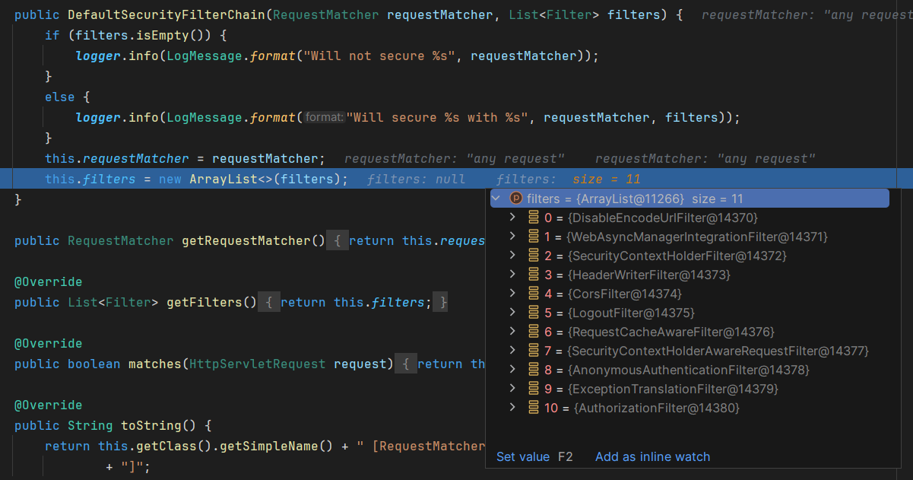
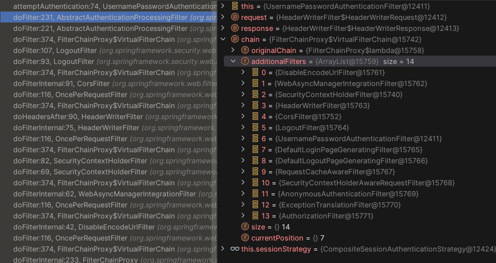
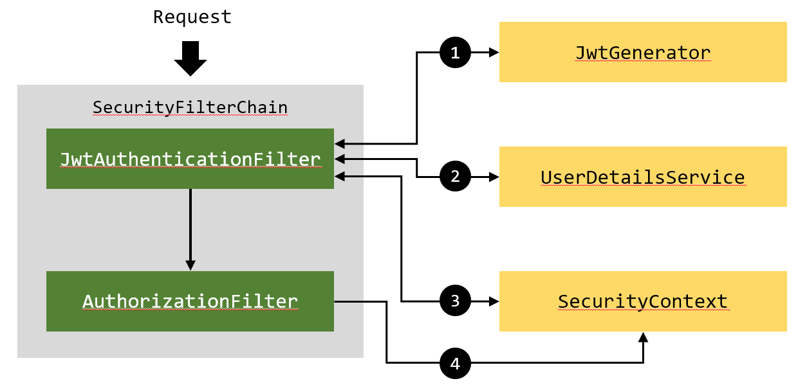

> JWTAuthenticationFilter는 [:link:유튜브 영상](https://www.youtube.com/watch?v=KiYo3f7Fggs&ab_channel=TeddySmith)을 보고 따라헀고, 이 게시글은 그 내용을 추가로 정리한 글입니다.

# JWT

## Header

토큰의 **타입**(대체로 JWT)과 선택한 **암호화 알고리즘**에 대해 명시하고 있다.

```json
{
  "alg": "HS256",
  "typ": "JWT"
}
```

암호화 알고리즘으로는 HS256과 RS256이 있다.

## Payload

**Claim**을 담고 있다. **Claim**이란 단순하게 토큰에 담긴 정보를 의미하는데 보통 사용자에 관한 정보를 담는다. **Claim**에는 3가지 종류가 있다.

- [Registered](https://datatracker.ietf.org/doc/html/rfc7519#section-4.1)

  미리 정해진 항목들이다. 필수는 아니지만 권장되는 항목들이다. **iss**, **exp**, **sub**, **aud** 등의 항목이다.

- [Public](https://www.iana.org/assignments/jwt/jwt.xhtml)

  자유롭게 설정할 수 있다. 하지만 다른 서비스와 충돌을 피하기 위해 웬만하면 표준에 해당하는 필드를 사용해 설정하도록 권장한다.

- Private

  토큰을 쓰는 애플리케이션 간에 정한 항목을 의미하고, Registered나 Public claim에 해당하지 않아야 한다.

```json
{
  "sub": "1234567890",
  "name": "John Doe",
  "admin": true
}
```

이곳에 유저명이나 관련된 정보들을 담을 수 있지만, 무결성을 보증하는 알고리즘 때문에 데이터가 공개되어 있으므로 민감한 정보를 담으면 안된다.

## Signature

Header와 Payload를 암호화하여 무결성을 보증한다. 이 때 사용하는 알고리즘은 Header에 정의되어 있다.

HS256는 대칭키 알고리즘으로, 두 송수신자 간에 공유되는 대칭키가 있어야 한다.

RS256는 비대칭키 알고리즘으로, 비밀키와 공개키가 존재한다. 비밀키는 노출되지 않아야 한다.

# JWT를 쓰는 이유

## 장점

- 서명된 토큰이므로, 다른 토큰보다 보안성이 높다.
- 토큰의 payload에 정보를 저장할 수 있다.
- 도메인과 애플리케이션에 관계없이 사용가능하다.
- 표준으로 지정되어 있다.

## 단점

- payload가 커질 경우 통신에 부하가 걸리게 된다.
- 토큰의 수명을 관리해야한다.

# DefaultSecurityFilterChain

Spring Security를 사용하면 기본적으로 적용되는 FilterChain은 `DefaultSecurityFilterChain`이다. 중단점을 찍고 디버깅을 해보면 아래 사진처럼 FilterChain에 담겨있는 여러 필터들을 볼 수 있다.



간단하게 어떤 필터들인지 정리해보았다.

| 필터                                    | 설명                                                                                                                                                    |
| --------------------------------------- | ------------------------------------------------------------------------------------------------------------------------------------------------------- |
| `DisableEncodeUrlFilter`                  | Url로 여겨지지 않는 Url에 세션 id가 포함되지 않도록 한다.                                                                                               |
| `WebAsyncManagerIntegrationFilter`        | `SecurityContext와` Spring의 `WebAsyncManager를` 통합한다.                                                                                                  |
| `SecurityContextHolderFilter`             | `SecurityContextRepository를` 사용하여 `SecurityContext를` 획득한 후 `SecurityContextHolder에` 저장한다. 이렇게 하면 다양한 인증과정에서 활용할 수 있게 된다. |
| `HeaderWriterFilter`                      | X-Frame-Options, X-Xss-Protection, X-Content-Type-Option과 같은 헤더를 추가한다.                                                                        |
| `CorsFilter`                              | pre-flight 요청과 CORS 요청을 처리하고 응답 헤더를 업데이트한다.                                                                                        |
| `LogoutFilter`                            | 로그아웃 처리를 한다. 실제로 로그아웃 처리가 되었다면 리다이렉트를 한다.                                                                                |
| `RequestCacheAwareFilter`                 | 현재 요청이 캐시된 요청과 일치하면 캐시된 요청을 대신 처리한다.                                                                                         |
| `SecurityContextHolderAwareRequestFilter` | ...                                                                                                                                                     |
| `AnonymousAuthenticationFilter`           | ...                                                                                                                                                     |
| `ExceptionTranslationFilter`              | ...                                                                                                                                                     |
| `AuthorizationFilter`                     | ...                                                                                                                                                     |

# Jwt Authentication Flow

초기화 과정에서 3개의 필터가 더 추가되는데, 아래 사진을 보면 `UsernamePasswordAuthenticationFilter와` `DefaultLoginPageGeneratingFilter`, `DefaultLogoutPageGeneratingFilter가` 추가되었다.



```java
    @Override
    public Authentication attemptAuthentication(HttpServletRequest request, HttpServletResponse response)
            throws AuthenticationException {
        if (this.postOnly && !request.getMethod().equals("POST")) {
            throw new AuthenticationServiceException("Authentication method not supported: " + request.getMethod());
        }
        String username = obtainUsername(request);
        username = (username != null) ? username.trim() : "";
        String password = obtainPassword(request);
        password = (password != null) ? password : "";
        UsernamePasswordAuthenticationToken authRequest = UsernamePasswordAuthenticationToken.unauthenticated(username,
                password);
        // Allow subclasses to set the "details" property
        setDetails(request, authRequest);
        return this.getAuthenticationManager().authenticate(authRequest);
    }
```

`UsernamePasswordAuthenticationFilter`을 통과할 때 `attemptAuthentication` 메서드가 실행된다. 이 메서드는 요청으로부터 Username, password를 획득한 후 `AuthenticationToken을` 생성하고 `AuthenticationManager`에게 인증을 맡긴다. 

Jwt로 인증을 진행한다면, 이 과정을 거치지 않으므로 이후에 실행되는 `AuthorizationFilter`에서 에러가 날 수밖에 없다(`Authentication` 객체가 없기 때문에 Role이나 Authority를 조회할 수 없다). 따라서 필터 내부에서 Jwt를 검증하고, 적절한 `Authentication` 객체를 찾아 `SecurityContext`에 등록해야 한다.



1. http 패킷 헤더에 담긴 토큰을 검증하여 유효한지 판단한다. 만약 유효하지 않은 토큰이라면 필터는 동작하지 않는다.
2. 토큰에 담긴 Payload를 파싱하여 토큰에 담긴 사용자명을 읽어온 후 미리 설정한 `UserDetailsService` Bean 객체를 통해 해당하는 사용자의 `UserDetails` 객체를 얻어온다.
3. `UserDetails를` `AutheticationToken`으로 가공하여 `SecurityContext`에 등록한다.
4. `AuthorizationFilter`에서 `SecurityContext`를 조회할 때, 3번에서 등록한 객체를 조회함으로 인증과 허가가 통과된다.

# 구현

```java
// JwtAuthenticationFilter.java

package com.learn.security;

import com.learn.security.service.UserService;
import jakarta.servlet.FilterChain;
import jakarta.servlet.ServletException;
import jakarta.servlet.http.HttpServletRequest;
import jakarta.servlet.http.HttpServletResponse;
import org.springframework.beans.factory.annotation.Autowired;
import org.springframework.lang.NonNull;
import org.springframework.security.authentication.UsernamePasswordAuthenticationToken;
import org.springframework.security.core.context.SecurityContextHolder;
import org.springframework.security.core.userdetails.UserDetails;
import org.springframework.security.web.authentication.WebAuthenticationDetailsSource;
import org.springframework.stereotype.Component;
import org.springframework.util.StringUtils;
import org.springframework.web.filter.OncePerRequestFilter;

import java.io.IOException;

@Component
public class JwtAuthenticationFilter extends OncePerRequestFilter {
    @Autowired
    private JwtGenerator jwtGenerator;

    @Autowired
    private UserService userService;

    @Override
    protected void doFilterInternal(
            @NonNull HttpServletRequest request,
            @NonNull HttpServletResponse response,
            @NonNull FilterChain filterChain) throws ServletException, IOException {
        String token = getJwtFromRequest(request);
        if (StringUtils.hasText(token) && jwtGenerator.validateToken(token)) {
            String username = jwtGenerator.getUsernameFromJWT(token);
            UserDetails userDetails = userService.loadUserByUsername(username);
            UsernamePasswordAuthenticationToken authenticationToken = new UsernamePasswordAuthenticationToken(
                    userDetails,
                    null,
                    userDetails.getAuthorities());
            authenticationToken.setDetails(new WebAuthenticationDetailsSource().buildDetails(request));
            SecurityContextHolder.getContext().setAuthentication(authenticationToken);
        }
        filterChain.doFilter(request, response);
    }

    private String getJwtFromRequest(HttpServletRequest request) {
        String bearerToken = request.getHeader("Authorization");
        if (StringUtils.hasText(bearerToken) && bearerToken.startsWith("bearer ")) {
            return bearerToken.substring(7, bearerToken.length());
        }
        return null;
    }
}
```

JwtAuthenticationFilter를 구현할 때에는 `OncePerRequestFilter`를 상속하여 구현한다. 이 클래스는 각 요청마다 한 번씩 꼭 실행되는 필터이므로, 매 요청마다 인증 처리를 거치게 된다.

```java
// JwtGenerator.java
package com.learn.security;

import io.jsonwebtoken.Claims;
import io.jsonwebtoken.Jwts;
import io.jsonwebtoken.SignatureAlgorithm;
import io.jsonwebtoken.io.CompressionAlgorithm;
import io.jsonwebtoken.security.Keys;
import org.springframework.security.authentication.AuthenticationCredentialsNotFoundException;
import org.springframework.security.core.Authentication;
import org.springframework.stereotype.Component;

import javax.crypto.SecretKey;
import java.util.Date;

import static com.learn.security.SecurityConstants.*;

@Component
public class JwtGenerator {
    public boolean validateToken(String token) {
        SecretKey key = getSecretKey();
        try {
            Jwts.parser().verifyWith(key).build().parseSignedClaims(token);
            return true;
        } catch (Exception e) {
            throw new AuthenticationCredentialsNotFoundException("Jwt was expired or incorrect.");
        }
    }

    public String getUsernameFromJWT(String token) {
        SecretKey key = getSecretKey();
        Claims claims = Jwts.parser().verifyWith(key).build().parseSignedClaims(token).getPayload();
        return claims.getSubject();
    }

    public String generateToken(Authentication authentication) {
        String username = authentication.getName();
        Date currentDate = new Date();
        Date expireDate = new Date(currentDate.getTime() + JWT_EXPIRATION);

        SecretKey key = getSecretKey();
        String token = Jwts.builder()
                .subject(username)
                .issuedAt(expireDate)
                .signWith(key, Jwts.SIG.HS512)
                .compact();
        return token;
    }

    public SecretKey getSecretKey() {
        // JWT_SECRET은 다른 클래스에 정의해둔 임의의 난수로 암호화에 사용된다.
        return Keys.hmacShaKeyFor(JWT_SECRET.getBytes());
    }
}
```

```java
// SecurityConfig.java

package com.learn.security;

import com.learn.security.service.UserService;
import org.springframework.context.annotation.Bean;
import org.springframework.context.annotation.Configuration;
import org.springframework.security.authentication.AuthenticationManager;
import org.springframework.security.config.annotation.authentication.configuration.AuthenticationConfiguration;
import org.springframework.security.config.annotation.web.builders.HttpSecurity;
import org.springframework.security.config.annotation.web.configuration.EnableWebSecurity;
import org.springframework.security.config.annotation.web.configurers.AbstractHttpConfigurer;
import org.springframework.security.config.http.SessionCreationPolicy;
import org.springframework.security.crypto.factory.PasswordEncoderFactories;
import org.springframework.security.crypto.password.PasswordEncoder;
import org.springframework.security.web.SecurityFilterChain;
import org.springframework.security.web.authentication.UsernamePasswordAuthenticationFilter;

import java.util.Objects;

@Configuration
@EnableWebSecurity
public class SecurityConfig {
    @Bean
    public SecurityFilterChain filterChain(HttpSecurity http) throws Exception {
        http
                .csrf(AbstractHttpConfigurer::disable)
                .exceptionHandling((exception) -> exception.authenticationEntryPoint(jwtAuthEntryPoint()))
                .sessionManagement((session) -> session.sessionCreationPolicy(SessionCreationPolicy.STATELESS))
                .authorizeHttpRequests((authorize) ->
                        authorize
                                .requestMatchers("/api/auth/**").permitAll()
                                .anyRequest().authenticated()
                );
        http.addFilterBefore(jwtAuthenticationFilter(), UsernamePasswordAuthenticationFilter.class);
        return http.build();
    }

    @Bean
    public AuthenticationManager authenticationManager(AuthenticationConfiguration authenticationConfiguration) throws Exception {
        return authenticationConfiguration.getAuthenticationManager();
    }


    @Bean
    public UserService userDetailsService() {
        return new UserService();
    }

    @Bean
    public PasswordEncoder passwordEncoder() {
        return PasswordEncoderFactories.createDelegatingPasswordEncoder();
    }

    @Bean
    public JwtAuthenticationFilter jwtAuthenticationFilter() {
        return new JwtAuthenticationFilter();
    }

    @Bean
    public JwtAuthEntryPoint jwtAuthEntryPoint() {
        return new JwtAuthEntryPoint();
    }
}

```

Jwt 인증방식은 세션을 사용하지 않기 때문에 세션의 상태를 STATELESS로 설정해야한다. 

구현한 `JwtAuthenticationFilter`를 등록할 때에는 `addFilterBefore`를 이용하여 `UsernamePasswordAuthenticationFilter`의 직전에 등록했다.

`/api/auth/**` 패턴에 부합하는 URL로 요청이 들어올 경우, 로그인 및 계정과 관련된 요청이기 때문에 `permitAll()`처리를 하여 인증을 요구하지 않도록 처리했다. 그리고 인증에 실패했을 때 예외처리를 하기 위해 `JwtAuthEntryPoint`를 등록하였다. 

```java
// LoginController.java

package com.learn.security.controller;

import com.learn.security.dto.AuthResponseDto;
import com.learn.security.JwtGenerator;
import com.learn.security.dto.LoginDto;
import com.learn.security.entity.User;
import com.learn.security.service.UserService;
import org.springframework.beans.factory.annotation.Autowired;
import org.springframework.http.HttpStatus;
import org.springframework.http.ResponseEntity;
import org.springframework.security.authentication.AuthenticationManager;
import org.springframework.security.authentication.UsernamePasswordAuthenticationToken;
import org.springframework.security.core.Authentication;
import org.springframework.security.core.context.SecurityContextHolder;
import org.springframework.web.bind.annotation.*;

import java.util.Optional;

@RequestMapping("/api/auth")
@RestController
public class LoginController {
    private final UserService userService;
    private final AuthenticationManager authenticationManager;
    private final JwtGenerator jwtGenerator;

    @Autowired
    public LoginController(UserService userService, AuthenticationManager authenticationManager, JwtGenerator jwtGenerator) {
        this.userService = userService;
        this.authenticationManager = authenticationManager;
        this.jwtGenerator = jwtGenerator;
    }

    // 201 코드를 반환하기 위해 ResponseEntity를 사용했다.
    @PostMapping("/signup")
    public ResponseEntity<User> signup(@RequestBody LoginDto loginDto) {
        Optional<User> joinedUser = userService.join(loginDto);
        return new ResponseEntity<>(joinedUser.get(), HttpStatus.CREATED);
    }

    @PostMapping("/signin")
    @ResponseBody
    public AuthResponseDto signIn(@RequestBody User user) {
        Authentication authentication = authenticationManager.authenticate(
                new UsernamePasswordAuthenticationToken(
                        user.getUsername(),
                        user.getPassword()
                ));
        SecurityContextHolder.getContext().setAuthentication(authentication);
        String token = jwtGenerator.generateToken(authentication);
        return new AuthResponseDto(token);
    }
}
```

로그인을 할 때에는 username과 password가 전달되기 때문에 이를 인증한 후 jwt를 생성해서 곧바로 반환하도록 처리했다. 

LoginController만 `permitAll()`이 되어있고 그 외에는 전부 `authenticated()`이므로, `JwtAuthenticationFilter`가 동작한다. 

> LoginDto, User, UserService 같은 클래스들은 깃허브 링크로 대체하겠습니다... 
> [github.com/10cheon00/learn-spring-security](https://github.com/10cheon00/learn-spring-security/tree/2f464cb138ef79514ec6989f45edc467137297db)
